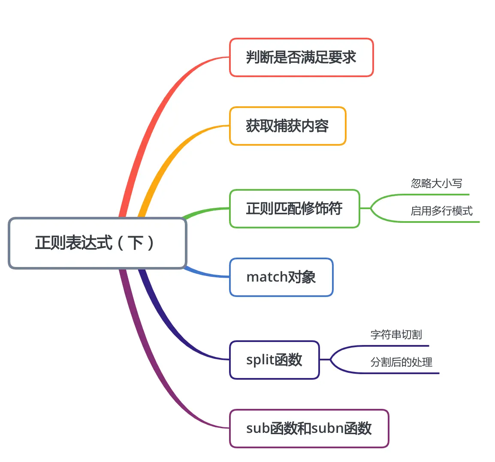
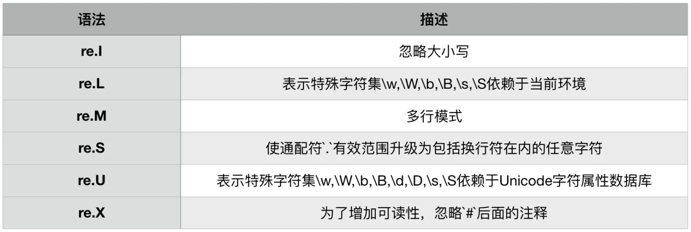

本节知识大纲：


### 一、判断是否满足要求
通过正则表达式判断文本是否符合要求，主要有两个函数：
（1）**match()**
从string首字母开始匹配，string如果包含pattern子串，则匹配成功，返回Match对象，失败则返回None；
一般用于：完全匹配，用于严格的校验
（2）**search()**
若string中 ***包含*** pattern子串，则返回Match对象，否则返回None，注意：如果string中存在多个pattern子串，只返回第一个；
一般用于:是否包含，用户判断内容是否存在。
案例01：
判断手机号是否符合规范？
```python
import re
pattern = re.compile(R"^1[3578]\d{9}$")
match_result = pattern.match(input_number)
if match_result is not None:
    print("手机号码有效，号码为:",input_number)
else:
    print("手机号码无效")
```
案例02：
查看文本中是否包含134开头的手机号码？
```python
import re
str01 = "hello had you thank you 13412345678 " \
        "13498765679 1821209776 good"
pattern = re.compile(r"134\d{8}")
match_result = pattern.search(str01)
if match_result:
    print("包含134开头的手机号，具体为:",match_result.group(0))
else:
    print("不包含")
```
输出结果：
```python
包含134开头的手机号，具体为: 13412345678
```
### 二、获取捕获内容
两种基本方法
（1）**findall()**
返回 string中所有与pattern相匹配的全部字符串，返回形式为集合；findall方法适用于没有分组或者非捕获分组的场景；
**案例01**：没有分组的场景
在长字符串中获取1开头或者9开头的数字
```python
import re
str01 = "Use this toggle to the 2234 9876765 9912 left to manage"
print(re.findall(r"\b[19]\d*\b",str01))
```
**案例02**：非捕获分组的场景
获取http或者https开头，cn或者com结尾的域名
```python
import re
str01 = "browser uses BBC’s https://www.apple.com If you’re  http://www.bt.cn thank you"
print(re.findall(r"\b(?:http|https)[:/\w.]*(?:cn|com)\b",str01))
```

（2）**finditer()**
返回string中所有与pattern相匹配match对象的迭代，finditer适用的场景为捕获分组的场景；
**案例**：获取4个数字其中前两个数字是一样的
```python
import re
str01 = "Use this toggle to the 2234 9876765 9912 left to manage" 
match_reslut = re.finditer(r"\b(\d)\1\d{2}\b",str01)
match_list = []
for i in match_reslut:
    match_list.append(i.group(0))
print(match_list)
```
获得的对象通过for进行迭代，获取内容通过group(0)，由此可见只要涉及了对捕获组的调用就不能使用findall()进行内容获取，只能通过finditer()进行迭代获取。
### 三、正则匹配修饰符
通过修饰符来简化我们对正则表达式的写法，正则匹配修饰符有：

我们主要掌握忽略大小写和多行模式的修饰符的用法就行了，这些正则匹配修饰符主要写在`findall(正则表达式,待匹配字符串,匹配修饰符)`
##### 1. 使用修饰符忽略大小写
**案例**：找出字符串中hello,忽略大小写
```python
import re
str01 = "Use this toggle to hello the 2234 9876765 Hello 9912 left to hEllO manage how your " \
        "browser heLlo uses BBC’s  https://www.apple.com "
print(re.findall(r"\bhello\b",str01,re.I))  # 忽略大小写
```
如果不使用正则匹配修饰符的话，忽略大小写，正则表达式写的麻烦一点，因为要把大小写的情况都写上。
输出结果：
```python
['hello', 'Hello', 'hEllO', 'heLlo']
```
##### 2. 使用修饰符启用多行模式
**案例**：找出多行字符串中的hello
```python
import re
str01 = "hello\nhello\nhello\nHello"
print(re.findall(r"^hello",str01))  # 虽然str01是多行，但是开始位置只有一个
print(re.findall(r"^hello",str01,re.M))  # 每一行都进行匹配
```
输出结果：
```python
['hello']
['hello', 'hello', 'hello']
```
### 四、match对象
通过match()和search()返回match对象，通过finditer()返回的是迭代的match对象
重要：match()是从string字符串的开头开始匹配，search()只有string字符串中包含了pattern就可以匹配到。比如`re.march(r"\d+","abcde123abc")`因为string字符串中数字123不是在开头，所以匹配不到，如果换成search方法就可以匹配到数字123了。
**常见方法**：
（1）`group()`获得一个或多个分组截获的字符串，编号0代表整个匹配的子串；不填写参数时，返回group(0)；没有截获字符串的组返回None；

案例：
```python
import re
match_result = re.search(r"\d+","abcde123abc")
print(match_result)
# 1. group() 可以空参数也可以写0，因为默认参数就是0
print(match_result.group(0))
```
输出结果即为匹配的数字：123
疑问:在正则匹配过程中，我们没有做任何分组，为何能通过group能访问到结果呢？
回答:正则中默认整体就是一个分组，编号为0，group(0)返回整个匹配的结果。
（2）`groups()`以元组的形式返回全部分组截获的字符串，default表示没有截获字符串的组以这个值替代，默认为None
代码示例：
```python
import re
str01 = "my name is abc123abc"
match_result = re.search(R"\b([a-z]+)([0-9]+)([a-z]+)\b",str01)
print(match_result.groups())
```
输出结果：
```python
('abc', '123', 'abc')
```
（3）`start()`匹配开始的索引；
返回指定的组截获的子串在string中的起始索引(子串第一个字符的索引)。group默认值为0。
（4）`end()`匹配结束索引；
返回指定的组的子串在string中的结束索引(子串第一个字符的索引)group默认值为0。
（5）`span()`返回开始索引和结束索引；
(start(group),end(group)).
代码示例：
```python
import re
str01 = "my name is abc123abc"
match_result = re.search(R"\b([a-z]+)([0-9]+)([a-z]+)\b",str01)
print(match_result.start())
print(match_result.end())
print(match_result.span())
```
输出结果:
```python
11
20
(11, 20)
```
### 五、split函数
在字符串处理中我们经常使用split方法来进行字符串的切割，同样在正则表达式中也有用split方法来进行切割
##### 1. 字符串的切割
如果我们希望根据字符串中的逗号将字符串切割，`tomi,abby,aliy,peter,joel`，在传统的字符串处理方法中使用split方法就可以实现：
```
str01 = "steven,abby,aliy,peter"
name_list = str01.split(",")
print(name_list)
```
输出结果：
```python
['tomi', 'abby', 'aliy','peter','joel']
```
但是字符串中的split方法传入的分隔符只能有一个，对于这种`tomi,abby|aliy-peter;joel`分割符有很多种符字符串该怎么分割呢？
实际上，可以使用正则表达式的split方法，它可以支持多个分割符，只要用`|`分开就可以了
```python
import re
str01 = "tomi,abby|aliy-peter;joel"
name_list = re.split(",|;|-|\|",str01)
print(name_list)
```
输出结果：
```python
['tomi', 'abby', 'aliy','peter','joel']
```
##### 2. 分割后的处理
如果我们要处理的字符串分隔符有多个，类似这样`tomi,,,abby|||aliy-peter;;;;joel`，分割处理后会出现这样的结果：
```python
['tomi', '', '', 'abby', '', '', 'aliy', 'peter', '', '', '', 'joel']
```
不利于我们对后期数据的一个总结，所以我们可以去除空的内容，我们可以这样写：
```python
name_list =[i for i in re.split(",|;|-|\|",str01) if i]  # 如果i非空则保存
```
这样就去除了空格输出的结果就好看了
```python
['tomi', 'abby', 'aliy', 'peter', 'joel']
```
### 六、sub函数和subn函数
这两个函数主要用于文本中符合我们正则表达式的内容进行替换;
sub()函数主要有四个重要的参数：
`sub(pattern,repl,str,count)`
* pattern 正则表达式编译后的对象
* repl  想要替换成的文本
* str 替换前的文本
* count 替换的次数，如果不写的话全部替换
返回的是替换成功后的文本
案例演示：
把str01中M开头的手机号码后四位替换成****
```python
import re
str01 = "Use this toggle to the M:13912342234 9876765 9912 left to manage how your " \
        "outside the UK M:13789871234 you can also use http://www.bt.cn the toggle to set "
print(re.sub(R"(?<=M:[1][3578]\d{5})\d{4}","****",str01,2))
```
如果在替换的过程中想使用正则修饰符，可以在四个参数旁载添加参数`flags=re.I`表示忽略大小写。
使用subn()函数，其传入的参数和sub()一样，只不过它返回的是一个元组，包含了两个元素，一个是替换后的文本，还有一个是替换的次数。