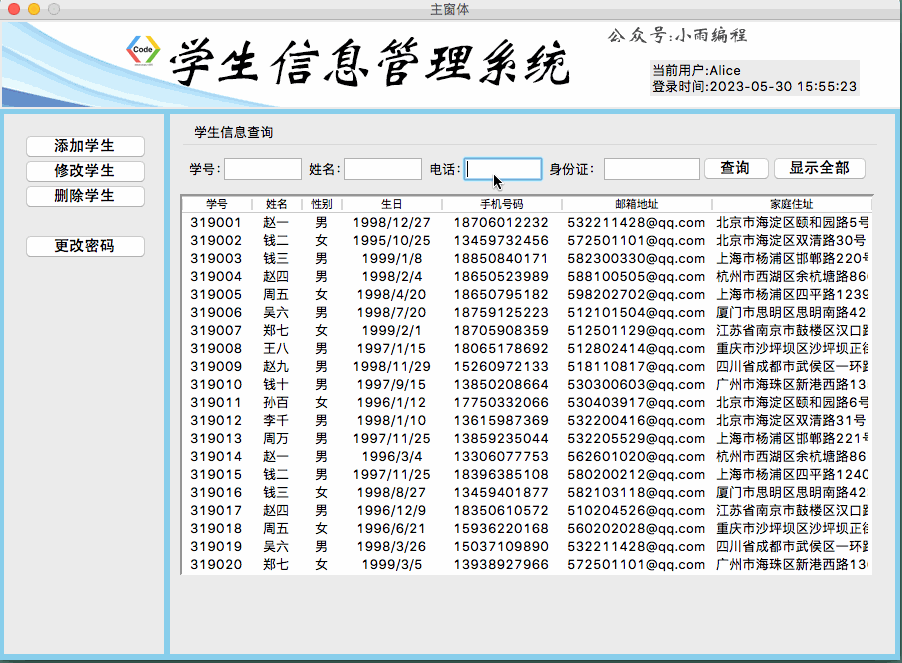
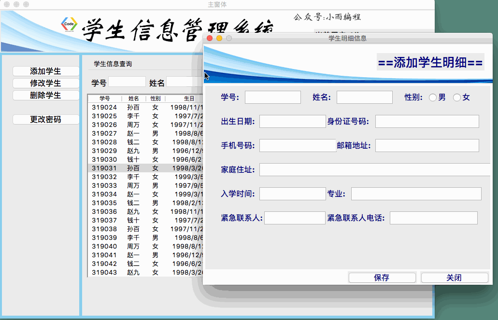
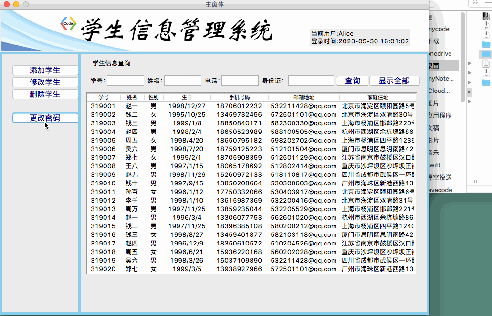

### 前言
前面我们学习了Python GUI 图像化界面Tkinter的基础知识，为了检测我们的学习成果，学以致用。我们从今天开始做一个综合Tkinter案例--基于Tkinter的学生信息管理系统，一方面熟悉Tkinter项目的开发，另一方面可以把我们前面的《Python基础学习笔记》的知识综合在一起。
### 基础功能介绍
##### 说明：
由于我们尚未学习数据库的内容，所以我们这个应用程序开发的过程中，暂时通过文件的读写方式来存储数据。等到后面我们介绍了关系数据库的知识，整个项目对接到数据库中也是很方便的。
> 感兴趣的小伙伴们，可以直接私信我免费获取项目使用到的素材和源码，我们一起手把手搭建这个项目！
##### 1.登录功能

本项目支持用户名和密码的验证登录，支持密码输入三次自动锁定等功能；
##### 2. 主窗体
（1）显示当前登录用户名、登录时间
（2）支持添加学生信息、修改学生信息、删除学生信息、更改当前账号密码
（2）支持多条件查询学生信息

这里我们查询所有学号以31901开头的学生，在这些学生中再次筛选手机号码中有138号段的学生。

###### 3. 添加并查看学生信息

点击添加按钮可以添加学生信息，保存后，可查看明细信息。同时也支持修改与删除。
##### 4. 更改当前账户的密码

支持更改当前账户密码，同时具备密码校验功能。
---
好啦，从现在开始正式进入项目的开发吧，今天我们要做的内容是登录界面框架GUI的设计与功能实现！

### 一、 登录界面的实现
```python
from tkinter import *
from tkinter.ttk import *
import os

class LoginWindow(Tk):
    """
    创建登录窗体的GUI界面已经登录的方法
    """
    def __init__(self):
        super().__init__()  # 先执行tk这个类的初始化
        self.title("登录界面")
        # self.geometry("620x420")
        self.resizable(0,0) # 窗体大小不允许变，两个参数分别代表x轴和y轴
        self.iconbitmap("."+os.sep+"img"+os.sep+"student.ico")
        # self["bg"] = "royalblue"
        # 加载窗体
        self.setup_UI()

    def setup_UI(self):
        # ttk中控件使用style对象设定
        self.Style01 = Style()
        self.Style01.configure("user.TLabel",font = ("华文黑体",20,"bold"),foreground = "royalblue")
        self.Style01.configure("TEntry",font = ("华文黑体",20,"bold"))
        self.Style01.configure("TButton",font = ("华文黑体",20,"bold"),foreground = "royalblue")
        # 创建一个Label标签展示图片
        self.Login_image = PhotoImage(file = "."+os.sep+"img"+os.sep+"logingui.png")
        self.Label_image = Label(self,image = self.Login_image)
        self.Label_image.pack(padx = 10,pady = 10)
        # 创建一个Label标签 + Entry   --- 用户名
        self.Label_user = Label(self,text = "用户名:", style = "user.TLabel")
        self.Label_user.pack(side = LEFT,padx = 10,pady = 10)
        self.Entry_user = Entry(self,width = 12)
        self.Entry_user.pack(side = LEFT,padx = 10,pady = 10)
        # 创建一个Label标签 + Entry   --- 密码
        self.Label_password = Label(self, text = "密码:", style = "user.TLabel")
        self.Label_password.pack(side = LEFT,padx = 10,pady = 10)
        self.Entry_password = Entry(self, width=12,show = "*")
        self.Entry_password.pack(side = LEFT,padx = 10,pady = 10)
        # 创建一个按钮    --- 登录
        self.Button_login = Button(self,text = "登录",width = 4)
        self.Button_login.pack(side = LEFT,padx = 20,pady = 10)
if __name__ == '__main__':
    this_login = LoginWindow()
    this_login.mainloop()
```
##### 效果：


### 二、读取文件
读取文本中的的用户信息，记得先判断文件路径是否存在，如果文件不存在就弹一个弹窗，如果存在继续做异常处理是否能打开文件读取内容。按行读取，每一行再分割，分割后存储到user_list[]用户列表中。
```
def load_file_info(self):
    if not os.path.exists(self.file_path):
            showinfo("系统消息","提供的文件名不存在！")
    else:
        try:
            with open(file = self.file_path,mode = "r") as fd:
               # 一次读一行
                current_line = fd.readline()
                while current_line:
                    temp_list = current_line.split(",") # 长字符串分割层三个
                    self.user_list.append(temp_list)
                    # 读取下一行,读完了循环就结束了
                    current_line = fd.readline()
        except:
            showinfo("系统消息","文件读取出现异常！")
```
存储用户信息的文本文件路径作为全局变量存储，这样后面还会调用的时候就不需要重写方法，其它方法调用也会方便一些。
我们在初始化方法中定义全局变量：
```
# 定义变量（定义全局变量，后面的函数都能访问到）
self.file_path = "/Users/yushengtan/Desktop/Demo/Studentmgr/User.txt"   # 文件路劲
self.user_list = [] # 存储用户信息
# 自动执行文件中账号的加载
self.load_file_info()
```
### 三、获取输入账号的信息
需要在控件里捆绑变量，再定义一个login()方法，通过控件变量.get()方法获取输入的值,再给登录按钮添加一个command事件
```
def login(self):
    # 获取用户的用户名和密码
    user = self.var_user.get()
    password = self.var_password.get()
    showinfo(message="用户名："+user+"密码："+password)  # 暂时用弹窗测试一下内容获取是否正常
```
### 四、实现基本的身份验证
关于登录验证，要求如下：
（1）如果用户名不对，提示：用户名不存在
（2）如果密码不对，提示：密码错误
（3）如果密码连续输错三次，提示：账号已锁定，请联系管理员
（4）如果用户名和密码正确，加载主窗体
实现基本身份验证的框架：
```
# 实现身份验证，遍历用户信息列表
for index in range(len(self.user_list)):
    # 用户名是否正确
    if user.strip().lower() == str(self.user_list[index][0]).strip().lower():
        # 判断账号是否被禁用
        if "0" in str(self.user_list[index][2]).strip().lower():
            showinfo("系统消息", "账号已禁用,请联系管理员")
            break
        # 密码是否正确
        if password != str(self.user_list[index][1]).strip().lower():
            showinfo("系统消息", "输入的密码错误")
            # 判断成功后整个循环退出，不要执行后面的判断用户名不存在的语句了
            break
        else:
            showinfo("系统消息", "登录成功！")
            break
    # 如果校验到最后都没有相同的用户名,则用户名不存在
    if index == len(self.user_list) - 1:
        showinfo("系统消息","输入的用户名不存在")
```
### 五、密码输错三次锁定账号
首先我们需要使用全局变量记录密码输错多少次，
```
def login(self):
    # 获取用户的用户名和密码
    user = self.var_user.get()
    password = self.var_password.get()
    # 实现身份验证，遍历用户信息列表
    for index in range(len(self.user_list)):
        # 用户名是否正确
        if user.strip().lower() == str(self.user_list[index][0]).strip().lower():
            # 判断账号是否被禁用
            if "0" in str(self.user_list[index][2]).strip().lower():
                showinfo("系统消息", "账号已禁用,请联系管理员")
                break
            # 密码是否正确
            if password != str(self.user_list[index][1]).strip().lower():
                self.var_password_error_times += 1

                # 判读错误是否到三次
                if self.var_password_error_times >= 3:
                    showinfo("系统消息","密码错误已达三次，账号已锁定！")
                    # 改变状态
                    self.user_list[index][2] = "0\n"
                    # 信息写入到文件
                    self.write_file_info()

                else:
                    showinfo("系统消息", "输入的密码错误")
                # 判断成功后整个循环退出，不要执行后面的判断用户名不存在的语句了
                break
            else:
                # 如果在三次之内输入正确了，把错误次数归零
                self.var_password_error_times = 0
                showinfo("系统消息", "登录成功！")
                break
        # 如果校验到最后都没有相同的用户名,则用户名不存在
        if index == len(self.user_list) - 1:
            showinfo("系统消息","输入的用户名不存在")
```
将用户信息写入文件：
```
def write_file_info(self):
    # 1.清空文件；2.写入
    try:
        with open(file = self.file_path,mode="w") as fd:
            fd.write("")
        with open(file = self.file_path,mode="a") as fd:
            for item in self.user_list:
                fd.write(",".join(item))
    except:
        showinfo("系统消息","写入文件出现异常")
```
### 六、完成主窗体的加载
创建一个主窗体maingui.py
```
from tkinter import *
from tkinter.ttk import *

class MainWindow(Tk):
    def __init__(self):
        super().__init__()
        self.title("主窗体")
        self.geometry("900x640+180+80")
        self.resizable(0,0)
        self["bg"]="royalblue"
```
在登录窗体中再定义一个登录主窗体跳转方法：
```
def load_main(self):
    # 关闭当前窗体
    self.destroy()
    # 加载新窗体
    if __name__ == '__main__':
        main_window = maingui.MainWindow()
```
在登录方法login()中，用户密码验证成功后，调用跳转主窗体的方法即可；
至此，我们登录窗体就已经搭建完成了！


### 最后

本节我们先整体介绍了一下该项目的主要功能，然后就开始了项目的第一步：登录窗体的实现，实现了用户名和密码的校验功能，完成了登录窗体我们点击登录按钮希望能加载主窗体界面，这该如何实现呢？下一节，我们将介绍主窗体的界面的搭建和功能的实现。