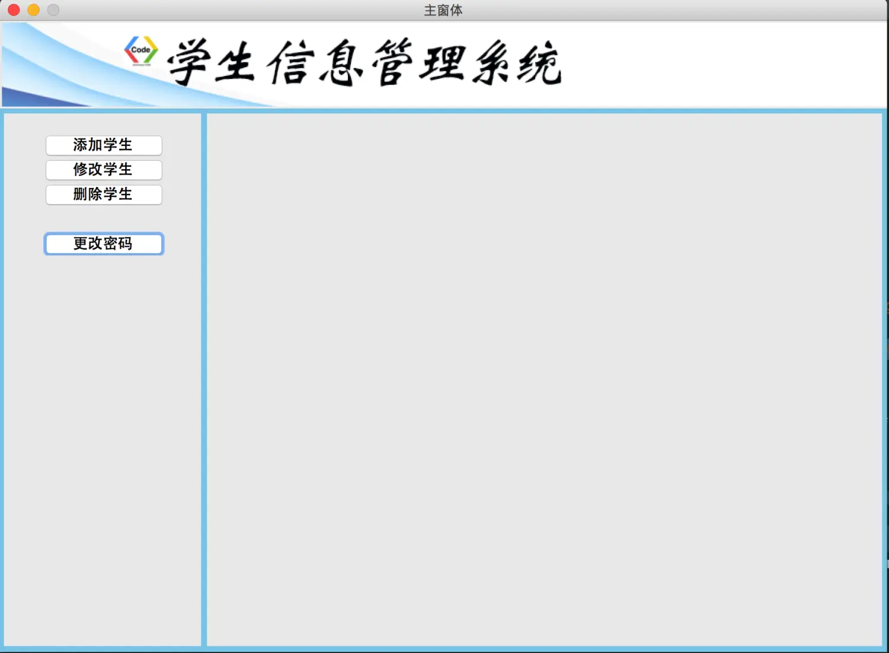
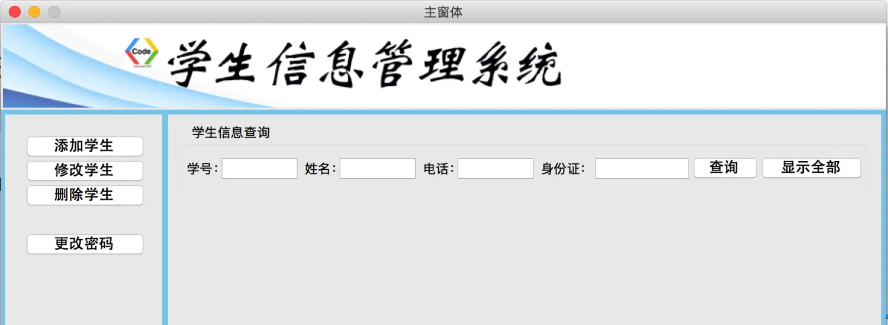
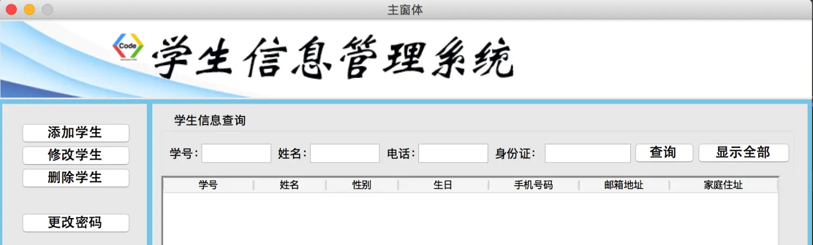
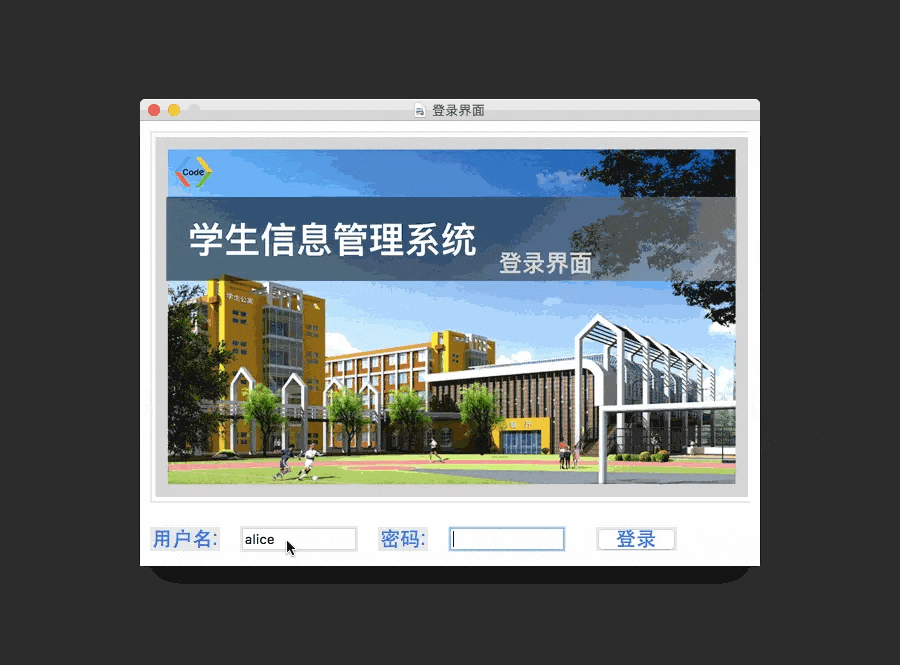
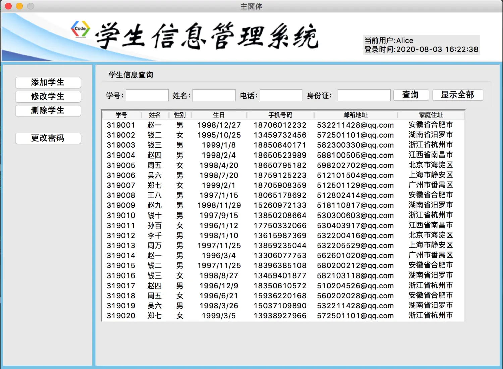

### 前言
上一节我们介绍了登录窗体的GUI设计与功能实现，用户的账号和密码校验完成后应当跳转到主窗体内容，这一节我们将具体介绍主窗体界面的设计与功能实现！
### 一、基础界面设计
我们新建一个900x640的窗口，顶部加入图片，下面主体部分创建两个Panedwindow容器，左边添加按钮，右边作为TreeView显示界面；
```python
from tkinter import *
from tkinter.ttk import *
import os

class MainWindow(Tk):

    def __init__(self):
        super().__init__()
        self.title("主窗体")
        self.geometry("900x640+180+80")
        self.resizable(0,0)
        self["bg"]="skyblue"

        # 加载gui
        self.setup_UI()
    def setup_UI(self):
        # 设定Style
        self.Style01 = Style()
        self.Style01.configure("left.TPanedwindow",background = "navy")
        self.Style01.configure("right.TPanedwindow", background="skyblue")
        self.Style01.configure("TButton",width = 10,font = ("华文黑体",15,"bold"))

        # Top_banner
        self.Login_image = PhotoImage(file = "."+os.sep+"img"+os.sep+"stu_main_top_banner.png")
        self.Lable_image = Label(self,image = self.Login_image)
        self.Lable_image.pack()

        # 左边：按钮区域,创建一个容器
        self.Pane_left = PanedWindow(width = 200,height = 540,style = "left.TPanedwindow")
        self.Pane_left.place(x = 4,y = 94)
        self.Pane_right = PanedWindow(width=685, height=540,style = "right.TPanedwindow")
        self.Pane_right.place(x = 210,y = 94)

        # 添加左边按钮
        self.Button_add = Button(self.Pane_left,text = "添加学生",style = "TButton")
        self.Button_add.place(x = 40,y = 20)
        self.Button_update = Button(self.Pane_left, text="修改学生", style="TButton")
        self.Button_update.place(x=40, y=45)
        self.Button_delete = Button(self.Pane_left, text="删除学生", style="TButton")
        self.Button_delete.place(x=40, y=70)
        self.Button_modify = Button(self.Pane_left, text="更改密码", style="TButton")
        self.Button_modify.place(x=40, y=120)

        # 右边：查询、TreeView

if __name__ == '__main__':
    this_main = MainWindow()
    this_main.mainloop()
```
显示效果：(注意：tkinter在Mac上Panedwindow不支持修改前景色背景色)


### 二、添加查询区域
在右边的Pannedwindow容器中，添加一个LabelFrame容器作为查询区域，在LabelFrame容器中添加一系列的Label、Entry、Button控件，可以输入学号、姓名、电话、身份证、查询、和显示全部信息：
```python
self.Pane_right = PanedWindow(width=725, height=540, style="right.TPanedwindow")
self.Pane_right.place(x=170, y=94)
# LabelFrame
self.LabelFrame_query = LabelFrame(self.Pane_right,text = "学生信息查询",width = 700,height = 70)
self.LabelFrame_query.place(x = 10 , y = 10)
# 添加控件
self.Label_sno = Label(self.LabelFrame_query,text = "学号：")
self.Label_sno.place(x = 5,y = 13)
self.Entry_sno = Entry(self.LabelFrame_query,width = 8)
self.Entry_sno.place(x = 40,y = 10)

self.Label_name = Label(self.LabelFrame_query, text="姓名：")
self.Label_name.place(x=125, y=13)
self.Entry_name = Entry(self.LabelFrame_query, width=8)
self.Entry_name.place(x=160, y=10)

self.Label_mobile = Label(self.LabelFrame_query, text="电话：")
self.Label_mobile.place(x=245, y=13)
self.Entry_mobile = Entry(self.LabelFrame_query, width=8)
self.Entry_mobile.place(x=280, y=10)

self.Label_id = Label(self.LabelFrame_query, text="身份证：")
self.Label_id.place(x=365, y=13)
self.Entry_id = Entry(self.LabelFrame_query, width=10)
self.Entry_id.place(x=420, y=10)

self.Button_query = Button(self.LabelFrame_query, text="查询",width = 4)
self.Button_query.place(x=520, y=10)
self.Button_all = Button(self.LabelFrame_query, text="显示全部",width = 8)
self.Button_all.place(x=590, y=10)
```
显示效果：


### 三、加载Treeview控件

创建控件、设置对齐方式和每个列的标题
```python
# 添加TreeView控件
self.Tree = Treeview(self.Pane_right,columns=("sno","names",
    "gender","birthday","mobile","email","address"),show="headings",height=20)

# 设置每一个列的宽度和对齐的方式
self.Tree.column("sno",width=100,anchor="center")
self.Tree.column("names",width=80,anchor="center")
self.Tree.column("gender",width=80,anchor="center")
self.Tree.column("birthday",width=100,anchor="center")
self.Tree.column("mobile",width=100,anchor="center")
self.Tree.column("email", width=100, anchor="center")
self.Tree.column("address",width=120,anchor="center")

# 设置每个列的标题
self.Tree.heading("sno",text="学号")
self.Tree.heading("names", text="姓名")
self.Tree.heading("gender", text="性别")
self.Tree.heading("birthday", text="生日")
self.Tree.heading("mobile", text="手机号码")
self.Tree.heading("email", text="邮箱地址")
self.Tree.heading("address", text="家庭住址")

self.Tree.place(x=10,y=80)
```
显示效果：


### 四、实现登录用户登录信息加载
登录成功后，在顶部显示用户姓名和登录时间，用户姓名是怎么来的？是我们在登录窗口输入的，所以这就涉及到了跨窗体数据的传递。这一点非常重要！
登录窗体（登录信息）==>主窗体
传递的基本方式：构造函数
在主窗体的构造函数中添加一个接收参数`current_user`,在登录窗体加载新窗体时将参数传递进去;
但是我们登录窗体的登录函数`login()`中用户名的变量`user`是局部变量，函数调用完了之后就变量就没有了，那怎么调用呢？
我们需要在登录窗体的构造函数中定义全局变量：
```python
self.user = ""   # 当前的用户
```
为了获取用户登录的时间，我们定义一个获取当前时间的方法：
```python
def get_now_time(self):
    today = datetime.today()
    return ("%04d-%02d-%02d %02d:%02d:%02d"%(today.year,
            today.month,today.day,today.hour,today.minute,today.second))
```
然后在加载主窗体时将参数`self.user`和`self.get_now_time()`作为参数传递进去
```python
main_window = maingui.MainWindow(self.user,self.get_now_time())
```
另一边，我们在主窗体中，在构造函数中添加全局变量
```python
self.login_user = current_user
self.login_time = current_time
```
之后，我们在Top_banner中通过标签将user信息展示出来：
```python
self.Label_login_user = Label(self,text = "当前用户:"+str(self.login_user).title()
                              +"\n登录时间:"+self.login_time)
self.Label_login_user.place(x = 650,y = 40)
```
这样主窗口就会显示通过登录窗口登录的用户名（首字母自动转大写）和登录时间：
效果演示：


### 五、加载学生信息到TreeView中
##### 1. 我们在主窗体中定义全局变量来存储学生信息：
```python
self.all_student_list = []
self.file_path = "/Users/yushengtan/Desktop/Demo/Studentmgr/Student.txt"
```
##### 2. 定义方法读取文件中的学生信息
```python
def load_file_student_info(self):
    if not os.path.exists(self.file_path):
        showinfo("系统消息","提供的文件名不存在！")
    else:
        try:
            with open(file = self.file_path,mode = "r") as fd:
                # 一次读一行
                current_line = fd.readline()
                while current_line:
                    temp_list = current_line.split(",") # 长字符串分割层三个
                    self.all_student_list.append(temp_list)
                    # 读取下一行,读完了循环就结束了
                    current_line = fd.readline()
        except:
            showinfo("系统消息","文件读取出现异常！")
```
然后我们在构造方法中把这个函数写入，以实现自动把学生信息写入到all_student_list中
```
self.load_file_student_info()
```
##### 3. 定义加载TreeView信息的方法
文件中读取到的学生信息存储到all_student_list列表，以此作为参数传入加载TreeView的方法中；
```python
def load_treeview(self,current_list:list):
    # 判断是否有数据：
    if len(current_list) == 0:
        showinfo("系统消息","没有数据加载")
    else:
        for index in range(len(current_list)):
            self.Tree.insert("",index,values=(current_list[index][0],current_list[index][1],
                current_list[index][2],current_list[index][3],current_list[index][4],
                                              current_list[index][5],current_list[index][6]))
```
在构造方法中调用该方法,自动把所有学生信息加载到TreeView中
```
self.load_treeview(self.all_student_list)   
```
运行效果：


### 后记
这一节我们实现了主窗体的搭建，从界面的布局到TreeView加载全部学生信息。学生数据如此之多，如果我们想精确查看具体某个学生的信息该怎么做呢？下一讲，我们将实现学生信息的查询功能，敬请期待吧~