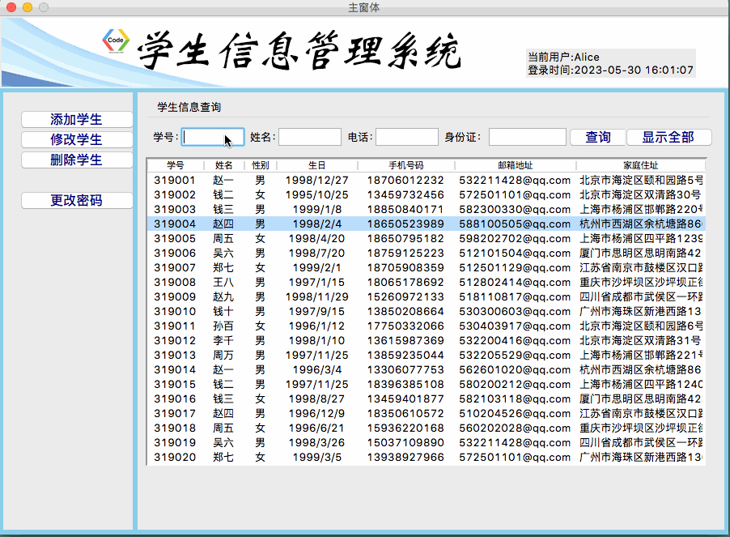
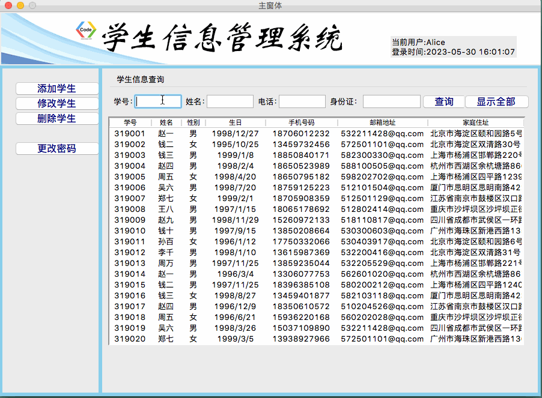

### 前言
上一讲我们实现了主窗体的搭建，在Treeview中显示所有学生的概要信息，为了能够快速的找到具体的某个学生信息，我们需要实现学生信息的查询功能。本节我们将介绍如何实现单条件查询和多条件筛选，快速找到指定的学生信息！
### 一、单条件查询
##### 分析：
首先我们所有的学生信息在：all_student_list这个列表中，我们先需要获取条件，然后将符合条件的数据存储到一个新的list中query_result_list
##### 1. 数据准备
新建一个存储查询结果的列表
```python
self.query_result_list = []
```
由于我们要实现通过输入学号来查询学生信息的功能，所以我们需要给输入框添加一个变量
```python
self.var_sno = StringVar()
```
在原有的构建学号输入框的Entry_sno中，添加参数`textvariable = self.var_sno`
##### 2. 写一个查询的方法
然后我们写一个独立的方法`get_query_result()`，来实现获取查询结果;
```python
def get_query_result(self):
    # 准备查询条件：获取学号
    query_condition = self.Entry_sno.get()
    # 遍历List获取符合条件的学生信息
    for item in self.all_student_list:
        if query_condition in item[0]:
            # 满足条件的学生
            self.query_result_list.append(item)
    # 把结果加载的TreeView中
    self.load_treeview(self.query_result_list)
```
##### 3. 清空处理
每次调用load_treeciew()方法都会将列表中的数据存入Tree中，所以我们在使用函数load_treeview()方法之前，需要把当前TreeView中的内容清空，清空的方法如下：
```python
for i in self.Tree.get_children():
    self.Tree.delete(i)
```
然后把条件捆绑到Button_query上
```python
command = self.get_query_result
```
于此同时，我们的`query_result_list`存储了每次查询的结果，每次查询前如果不对其清空，则每次查询结果都有上次的记录。所以我们每次查询操作前都要对`query_result_list`列表做清空处理:
```python
self.query_result_list.clear()
```
##### 4. 实现显示全部数据的功能
实现显示全部学生信息的功能很简单，我们写一个独立的方法load_all_student()，我们可以把之前自动执行的函数添加进来就可以了
```python
def load_all_student(self):
    # 加载所有的学生信息到treeview
    self.load_treeview(self.all_student_list)
```
然后我们把load_all_student()函数捆绑到，Button_all这个按钮上即可,同样我们只需添加参数`command = self.load_all_student`即可。
至此我们便实现了单条件查询功能，通过输入学号点击查询按钮便可以在结果中查询到数据项；点击显示全部按钮便可显示全部的学生信息。
##### 效果如下：


### 二、多条件组合查询
##### 分析：
多条件查询的难点：如果有的条件没有填写，在手机查询条件的时候到底是否采集？  
我们采用的方案是：无论是否填写，都采集数据。主要判断逻辑为：
```python
if sno in list and name in list and mobile in list and id in list
```
因为，如果没有填写采集到的数据为空，`"" in list`不影响结果的判断。
那么如何把这些条件组合起来呢？一个条件我们上面用的是字符串，那么多个条件我们用列表即可。
##### 1. 数据准备
在`setup_UI()`这个函数中，对每个Entry控件，添加`textvariable`变量
```python
# 准备查询条件，去空格后往列表中添加数据
query_condition = []
query_condition.append(self.Entry_sno.get().strip())    #采集学号信息
query_condition.append(self.Entry_name.get().strip())  # 采集姓名信息
query_condition.append(self.Entry_mobile.get().strip())  # 采集手机号码信息
query_condition.append(self.Entry_id.get().strip())  # 采集身份证号码信息
```
##### 2. 修改遍历方法
因为我们现在的查询条件`query_condition`已经不是字符串了，所以对应的遍历方法就要做相应的修改,query_condition列表中的下标为0、1、2、3分别是学号、姓名、手机号、身份证号，对应的数据源中的单个数据列表的位置是`0、1、4、7`
```python
# 遍历List获取符合条件的学生信息
for item in self.all_student_list:
    if query_condition[0] in item[0] and query_condition[1] in item[1] and  \
        query_condition[2] in item[4] and query_condition[3] in item[7]:
        # 满足条件的学生
        self.query_result_list.append(item)
```
##### 3. 点击显示全部按钮后输入框清空
我们在获得查询结果后，点击了显示全部按钮，此时各个Entry框里的数值应当清空。所以在`load_all_student`函数中，将各个组件的数值清空，我们可以使用set()方法：
```python
def load_all_student(self):
    # 把所有条件文本框清空
    self.var_sno.set("")
    self.var_name.set("")
    self.var_mobile.set("")
    self.var_id.set("")
    # 加载所有的学生信息到treeview
    self.load_treeview(self.all_student_list)
```
##### 显示效果


### 最后
本节我们已经实现了学生信息的查询包括单条件查询和组合查询，但是我们还想点击指定条目查看学生具体的明细信息该怎么实现呢？下一节我们将介绍如何实现学生明细信息的查看。