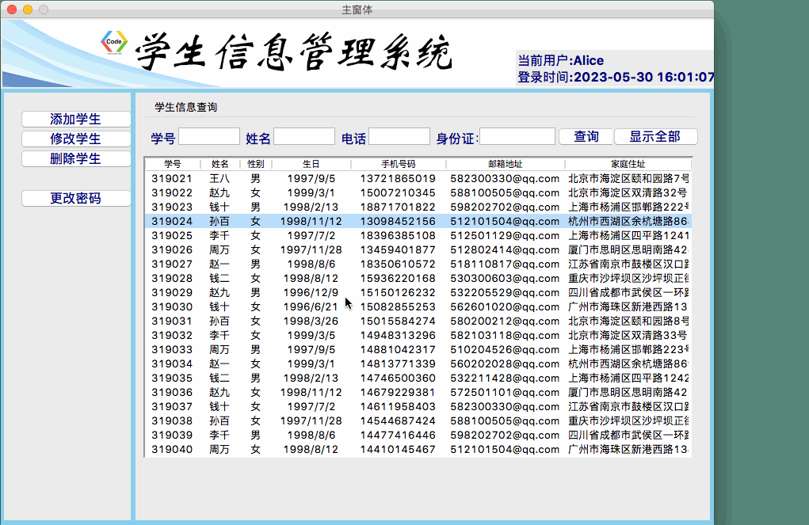

### 前言

上一节我们实现了明细窗体GUI的搭建，并且设置了查看、修改、添加三种不同的状态，框架搭建好了，内容并没有填充，本节我们继续完善这个项目，将学生信息填充进明细窗体中。

---
### 一、填充当前学生信息
##### 1.需求
目前我们已经实现的功能是在主窗体双击表格任一行，弹出明细窗体。我们我们需要做的是：将主窗体中对应的学生信息传递到明细窗体中并显示在明细窗体中。
##### 2.思路
既然要设计主窗体向子窗体的数据传递功能，就要准备好主窗体的传递和子窗体的接收。
#####（1）子窗体部分
子窗体（明细窗体）做好接收参数的准备
我们首先在明细窗体的构造函数中添加一个参数`current_student`类型为`list`类型,再定义一个全局变量来接收这个参数传来的值。
```python
self.current_student_list = current_student
```
然后定义一个加载学生明细信息的函数（如果获取到的当前学生信息为空，则通过弹出对话框提醒用户没有任何数据需要展示，否则将传递过来的学生信息列表依次传递给当前界面的字符变量）：
```python
def load_student_detail(self):
    if len(self.current_student_list) == 0:
        showinfo("系统消息","没有任何数据需要展示!")
    else:
        self.var_sno.set(self.current_student_list[0])  # 学号
        self.var_name.set(self.current_student_list[1])  # 姓名
        if "男" in self.current_student_list[2]:         # 性别
            self.var_gender.set(1)
        else:
            self.var_gender.set(2)
        self.var_age.set(self.current_student_list[3])  # 生日
        self.var_mobile.set(self.current_student_list[4])  # 电话号码
        self.var_email.set(self.current_student_list[5])  # 邮箱
        self.var_address.set(self.current_student_list[6])  # 地址
        self.var_id.set(self.current_student_list[7])  # 身份证号
        self.var_studyin.set(self.current_student_list[8])  # 入学时间
        self.var_pro.set(self.current_student_list[9])  # 专业
        self.var_emcon.set(self.current_student_list[10])  # 紧急联系人
        self.var_emtel.set(self.current_student_list[11])  # 紧急联系号码
```
在载入窗体标记的函数中，将`load_student_detail()`函数添加进去。
好了，明细窗体这边的接收已经准备得差不多了，我们开始动手修改主窗体的传递部分的代码：
#####（2）主窗体部分
主窗体要准确获取在treeview中选中的学生信息数据
我们主窗体这边调用明细窗体的函数参数要与明细窗体的构造函数保持一致，所以我们先添加一个全局变量
```python
self.current_student_list = []
```
用来存储在主窗口中，选中的学生明细信息。
我们点击TreeView中的学生信息表格，怎么样让系统知道我们点击了，那一个呢？
其实我们可以设置双击某一行的触发条件，所以在主窗体的setup_UI函数结尾添加点击事件
```python
self.Tree.bind("<Double-1>", self.view_student)
```
这里的`<Double-1>`表示监听鼠标左键双击，通过`bind`方法绑定执行view_student()方法。
这里我们再完善一下view_student()方法，首先因为设置了点击事件，所以view_student()需要再添加一个参数`event`,然后我们使用selection()方法获取所选某行的标识符。
由于主窗体的TreeView表格只显示了学生明细信息的部分内容，而我们明细窗体则需要显示全部内容。所以我们设计下面这个方法：
> 通过鼠标双击表格中的某一行，获取该行的标识符，然后使用item()方法通过标识符获取该行的所有数据。我们把这些数据的第一个元素（学号）与`all_student_list`(全部学生信息)的每一项进行逐个遍历，如果匹配到了，则返回`all_student_list `中的该项学生信息，并将该学生信息存储在全局变量`self.current_student_list`中。

这样，在调用子窗体时，加上`self.all_student_list`参数，那么子窗体的构造函数就能正确接收到列表，这样就能实现学生明细窗体信息的显示。
代码如下：
```python
def view_student(self,event):
    self.action_flag = 1
    # 获取Tree表格双击某一行的数据,selection()如果没有指定参数，则表明以列表形式返回所有的item
    item = self.Tree.selection()[0] # 获取双击某一行的项目标识符
    # 这个Tree表格中的数据，只是显示了部分数据,为了显示明细窗体，我们需要加载文件中的读取出来的完整信息
    Temp_student_list = self.Tree.item(item,"values")   # 通过item方法，获取该列的所有元素，以元组的形式返回
    # 遍历获得完整学生明细信息
    for item in self.all_student_list:
        if item[0] == Temp_student_list[0]:
            self.current_student_list = item
    self.load_detail_window()
def load_detail_window(self):
    detail_window = detailgui.DetailWindow(self.action_flag,self.current_student_list)
```
##### 效果展示：


### 二、控制控件的状态
##### 1. 问题的引出
前面我们已经实现了学生明细窗体的数据填充，但是仍有一些不合理的地方，比如，我们在查看学生信息的时候，输入框都是可编辑状态，这是不合理的，只有在编辑模式下才可以修改信息，在查看状态下输入框应该设置为只读模式，且保存按钮为不可以状态。我们该如何实现呢？
##### 2. 解决思路
和前面设置不同状态下明细窗体标题一样，我们在`load_windows_flag()`方法下,添加属性控制控件的状态。
（1）隐藏按钮可用使用对应的布局名称加forget方法来实现。
（2）使输入框设置为不可用状态，可用设置`state`参数值为`DISABLED`
代码如下：
```python
# 控制控件的状态
self.Button_save.place_forget()
self.Entry_sno["state"] = DISABLED
self.Entry_name["state"] = DISABLED
self.Radio_man["state"] = DISABLED
self.Radio_woman["state"] = DISABLED
self.Entry_age["state"] = DISABLED
self.Entry_id["state"] = DISABLED
self.Entry_mobile["state"] = DISABLED
self.Entry_email["state"] = DISABLED
self.Entry_home["state"] = DISABLED
self.Entry_studyin["state"] = DISABLED
self.Entry_pro["state"] = DISABLED
self.Entry_emcon["state"] = DISABLED
self.Entry_emtel["state"] = DISABLED
```
> 注意：控件的构建和布局不要图方便写在一条语句里，否则如果后面要对这个控件的属性进行修改的话系统就会报错！

现在我们的明细窗体的搭建已经基本完成了：
* 学生明细信息数据全部填充完毕；
* 保存按钮处于消失状态；
* 各个输入框都是只读状态
##### 效果演示

### 最后
本节我们实现了明细窗体学生信息的自动填充显示的功能，以及一些符合常规逻辑的控件设定。我们需要思考的是：学生信息存储的形式以及数据是如何传递的还有显示信息的时候是怎么遍历的？这种方法有什么缺陷，有没有更好的方法？还有一点我们需要注意的是：布局时不要图方便直接在构建控件后就使用布局，这样会导致后面对控件的属性进行修改时，系统报错。这些都是我们需要注意的地方。
好啦，目前为止，我们主窗体左边栏的按钮基本都没有完善，下一节我们将实现点击添加按钮，实现添加学生信息的功能，并直接在主窗体的TreeView中立即刷新，敬请期待吧~