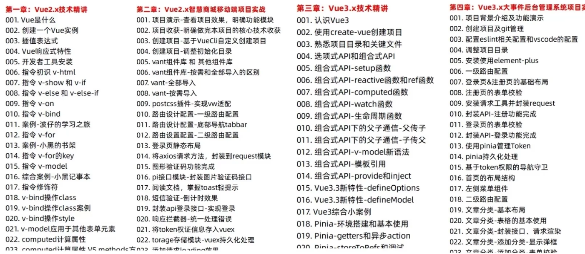
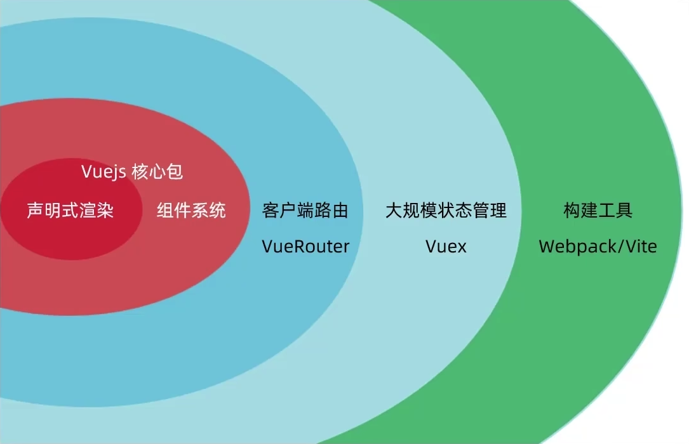

### 

## 一、vue是什么

vue是一个用于构建用户界面的渐进式框架



## 二、vue核心步骤

1. 准备容器；

2. 引入包（开发版本、生产版本；

3. 创建vue实例 new Vue()；

4. 指定配置项，渲染数据；

   el指定挂载点、data提供数据

   ```vue
   <body>
       <!-- 1.创建容器 -->
       <div id="app">
           <h1>{{msg}}</h1>
           <a href="https://www.bing.com">{{count}}</a>
       </div>
   <!-- 2.引入vue2.js -->
   <script src="https://cdn.jsdelivr.net/npm/vue@2.7.14/dist/vue.js"></script>
   <script>
       // 3.创建vue实例
       const app = new Vue({
           // 4.指定配置
           el:'#app',
           data:{
               msg:'你好,这是vue',
               count:'bing123'
           } 
       })
   </script>
   ```

## 三、插值表达式

插值表达式是一种Vue的模板语法`{{}}`

作用：利用表达式进行插值，渲染到页面中；

   ### 注意事项

   1. 使用的数据必须存在
   2. 支持的是表达式，而非语句

   ```vue
   <p>{{ if ... }}</p>
   ```

   3. 不能再标签属性中使用插值表达式

   ```vue
   <p title="{{username}}">我是标签</p>
   ```

## 四、Vue的核心特性：响应式

数据的响应式处理：数据变化，视图自动更新；

访问数据：实例名.属性名

修改数据：实例.属性名 = 值 

推荐使用Vue开发者插件Vue.js devtools

## 五、Vue指令

带有`v-前缀`的特殊标签属性，Vue会根据不同的指令，针对标签实现不同的功能。

```vue
<!-- Vue指令: v- 前缀的标签属性 -->
<div v-html="str"></div>
<!-- 普通标签属性 -->
<div class="box"></div>
<div title="xiaoyu"></div>
```

### v-html

作用：显示html标签

### v-show

作用：控制元素显示隐藏

语法：v-show="表达式" 表达式值为true时显示，为false时隐藏；

### v-if

作用：控制元素显示隐藏（条件渲染）

语法：v-if="表达式" 表达式值为true时显示，为false时隐藏；

> v-show与v-if的区别：
>
> v-show底层原理是切换css的display属性来控制显示隐藏；
>
> v-if底层原理是根据判断条件控制元素的创建和移除；
