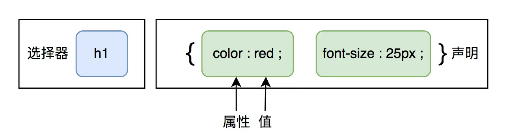

css是用来装饰HTML的工具
### 一、css基础
##### 1.css语法规范

css是层叠样式表，也成为级联样式表，要想熟练地使用css对网页进行修饰，首先需要了解css样式规则。
css规则主要由两个部分构成：选择器和声明。

选择器是用于指定CSS样式的HTML标签，花括号内是该对象设置的具体样式。属性的属性值以“键值对”的形式出现。
css写在<head></head>的<style></style>中

```
p {
    color: red;
    font-size: 18px;
}
```
##### 2.引入css的三种方式：
* 内联样式表：在标签内使用style属性
* 内嵌样式表：在head标签内使用style属性
* 外部样式表：通过link标签引入外部css文件。
```
<link type="text/css" rel="stylesheet" href="css/basic.css">
```
##### 3. css代码风格
（1）多行展开
（2）小写
（3）冒号后面保留一个空格
（4）选择器与大括号之间保留一个空格

### 二、css元素属性
##### 1. 字体
（1）字体类型
css使用`font-family`属性定义文本字体系列，浏览器依次选择自己所具备的字体来显示，多个字体之间用英文单引号隔开，如果字体名有多个单词则用引号包括起来。
```
body { 
    font-family:"Microsoft Yahei", Arial;
}
```
（2）定义字体的大小
css使用`font-size`属性定义字体的大小
```
body {
    font-size: 20px;
}
```
单位有px、em、rem
* px表示绝对大小
* em 表示相对父容器的大小比例
* rem 表示相对根容器`<html>`标签的大小比例，这里的r是root的意思。


（3）定义字体粗细
css使用`font-weight`属性定义字体粗细，
* normal 默认正常粗细
* bold 粗体
* lighter 细体

font-weight的属性值可以设置为数字，不用添加单位；
400等价于normal；
700等价于bold;
（4）文字样式
css使用`font-style`属性设置文本的风格,
* normal 正常
* italic 斜体

实际使用场景是将原本倾斜的文字变得不倾斜。
（5）其它设置
使用`line-height`设置字体行高，与容器行高保持一致就可以使字体纵向居中。
使用`text-align: center`使字体在容器中横向居中
##### 2. 设置颜色
可以使用`#`使用十六进制颜色
也可以使用`rgb(11,22,33)`表示十进制表示的颜色；
还可以使用`rgba(11,22,33,0.5)`表示带透明度的颜色，最后一个参数alpha值取0-1之间。
##### 3. 设置背景
* background-color 设置背景颜色
* background-image 设置背景图片
* background-repeat 设置比背景小的图片是否重复排列显示
* background-position 设置背景图片的位置
* background-attachment 设置背景图片是否固定不动
值`fixed`表示背景图片固定不动
* background-size 设置图片填充模式


我们可以为整个页面设置背景，也可以为某个容器(div)设置背景。
background-position设置背景图片的位置，可以设置两个参数，横向偏移量、纵向偏移量。可以设置为：
```
background-position: 300px 400px;
background-position: 30% 40%
background-position: left、center、right  top、center、bottom
```
如果想让图片完全填满容器可以使用`background-size: 100%`或者`background-size: cover`，如果设置为`contain`可以让图片随着容器的大小编号自适应变化。
注意：以上属性都可以使用background一个关键字来设置，但是格式与顺序有要求：
```css
background: bg-color bg-image position/bg-size bg-repeat bg-origin bg-clip bg-attachment initial|inherit;
```

##### 4. 段落

css段落有如下属性需要重点了解：

```css
letter-spacing: 5px; /* 设置字间距 */
word-spacing: 5px;	/* 英文单词之间的间距 */
direction: ltr,rtl;	/* 设置文字排列的方向从左到右和从右到左 */
text-decoration:none,line-through,overline,unerline; /* 文字无线、删除线、上划线、下划线*/
text-align: center,left,right,justify;	/* 文字的对齐，justify两边对齐 */
text-indent: 60px; /* 段落开始位置空格*/
text-transform:uppercase,lowercase,capitalize; /*设置大小写*/
width: 300px;
while-space: nowrap;/*超过容器的部分不换行*/
overflow:hidden;	/*隐藏超过容器的部分*/
text-overflow: ellipsis; /*用省略号代替超过的部分*/
vertical-align:top,middle,bottom; /*设置图片旁文字的位置*/
```

---

##### 5.列表

无论是有序列表还是无序列表都可以进行样式设置：

```css
list-style-type: none,disc,cirlce,square; /*无序列表前标识，无、实心圆、空心圆、方块*/
list-style-type:decimal,low-roman; /*有序列表前标识，阿拉伯数字、小写罗马字*/
list-style-position: indside,outside; /*设置列表图标与文字在同一个表格内或表格外*/
```

---

##### 6.链接

链接就是我们HTML里的a标签，这里我们主要将关于链接的几种状态

```css
a:link {    /* 链接初始配置的css*/
    color:blue;
}
a:hover {   /* 鼠标悬停时响应的css*/
    color: green;
    font-weight: bold;
}
a:active {  /* 鼠标点击完成时响应的css*/
    color: red;
}
a:visited {
    color: black;   {  /* 完成访问后响应的css*/
}
```

设置鼠标光标样式

```css
cursor:hand; /* 手指 */
cursor:crosshair; /* 十字体 */
cursor:move; /* 十字箭头 */
cursor:text; /* 可编辑文字光标 */
cursor:wait; /* 漏斗或者加载时出现的环 */
```

---
### 三、 css选择器
css选择器用来指定网页中需要用来样式化的元素，下面依次介绍css中的各种选择器：
##### 1. 基本选择器
（1）标签选择器
标签选择器可以把一类标签全部选择出来，比如把所有的<div>标签，所有的<p>标签。
（2）类选择器
差异化选择不同的标签，单独选择一个或者几个标签，可以使用类选择器。
语法: 
```
.类名: {
    属性: 值；
}
```
使用方法：直接在标签中使用class来调用属性；
> 注意:
> 一个标签可以使用多个类；
> 基础选择器的优先级与标签内的顺序无关，只与从上往下的顺序有关，css是从上往下依次执行，如果属性设置冲突，系统最终执行的是最靠下的属性。
```
<li class="类名">文字</li>
```
标签中可以使用多类名，只需要使用空格隔开即可。
（3）id选择器
id选择器可以为标定特定id的html元素指定特定的样式。
html元素以id属性来设置id选择器，css中id选择器以`#`来定义。
语法：
```html
#id名 {
    属性: 值；
}
```
id选择器与类选择器的区别是，id选择器只能调用一次。
（4）通配符选择器
在css中，通配符选择使用`*`定义，它表示选取页面中所有的元素(标签)
语法：
```
* {
    属性: 值；
}
```
通配符选择器不需要调用，自动给所有元素使用样式。
##### 2.组合选择器
组合选择器就是基本选择器中加上特殊符号，具备特殊含义。

|  举例  |      名称      |             功能             |                 备注                 |
| :----: | :------------: | :--------------------------: | :----------------------------------: |
| div,p  |   分组选择器   |   选择所有的div元素和p元素   |           同时响应多个标签           |
| div p  |   后代选择器   |   选中div元素内部所有p元素   | div标签的子子孙孙中的p标签都可以响应 |
| div>p  |    子选择器    |  选择父元素为div的所有p元素  |    div标签的子标签p元素才可以响应    |
| div+p  | 相邻兄弟选择器 | 选择紧接在div元素之后的p元素 |     某一个选择器后面的第一个兄弟     |
| div~ul | 普通兄弟选择器 | 选择前面有p元素的每个ul元素  |      某一个选择器后面的所有兄弟      |

##### 3.属性选择器

|             举例             |                  功能                   |                 备注                 |
| :--------------------------: | :-------------------------------------: | :----------------------------------: |
|           [target]           |     选择带有`target`属性的所有元素      | 有这个属性的标签就响应，没有就不响应 |
|       [target=_blank]        |     选择属性为`target=_blan`的元素      |                                      |
|       [title~=flower]        | 选择title属性包含单词`flower`的所有元素 |     这是css2的写法，css3使用`*=`     |
|       a[src^="https"]        |   选择src属性以`https`开头的所有元素    |         以什么结尾就写成`$=`         |
| html中，如果有标签有如下属性 |                                         |                                      |
```
<a href="192.168.1.1">后台</a>
```
我们可以用属性选择器把这个标签选中；

```
a[href]{
    color: red;
}
```
##### 4.伪类选择器
伪类选择器主要分为两类:状态伪类和结构伪类。
状态伪类主要有：
* a:hover
* a:link
* a:active
* a:visited
结构伪类主要有：
* first-child 第一个子元素
* last-child 最后一个子元素
* nth-child(n) 从前往后数，第n个子元素
* nth-last-child(n) 从后往前数，第n个子元素
* nth-child(even) 奇数行个元素
* nth-child(odd) 偶数行和元素
结构伪类选择器适合用于表格的格式化：
```
.table>tbody>tr:first-child{
    color: red;
}
.table>tbody>tr:last-child{
    color: green;
}
.table>tbody>tr:nth-child(odd){
    background-color: olivedrab;
}
.table>tbody>tr:nth-child(even){
    background-color: orchid;
}
```
##### 5.伪元素选择器
伪元素也是一种标签，是系统自动添加的。调用伪元素选择器最好使用两个冒号；
|     属性      |              描述              | css类型 |
| :-----------: | :----------------------------: | :-----: |
| :first-letter | 向文本的第一个字母添加特殊样式 |    1    |
|  :first-line  |    向文本的首行添加特殊格式    |    1    |
|    :before    |       在元素之前添加内容       |    2    |
|    :after     |       在元素之后添加内容       |    2    |

```
<div class="div01">
    学习css<br>
    学习css<br>
    学习css<br>
</div>
```
使用伪元素选择器：
```
.div01::first-letter{
    color: royalblue;
    font-size: 20px;
}
```
将首字选择出来格式化
##### 6.选择器优先级

选择器优先级从低到高的顺序是：

> 通配符选择器->标签选择器->类选择器->属性选择器->伪类选择器->id选择器->内联样式->!important

如果在选择器后面添加一个`!important`，那么该选择器的优先级立马变成最高优先级；
```
div{
    color: green !important;
}
```