#  JavaScript进阶知识（BOM、DOM）

## 一、DOM

### I、DOM简介

文档对象类型（Document Object Model）简称`DOM`

*  一个页面就是一个文档，DOM中使用document表示；
* 页面中的所有标签都是元素，DOM中使用element表示；
* 页面中所有内容的都是节点，DOM中使用node表示；

#### 1.创建

document.write

innerHTML

createElement

#### 2.新增

appendChild

insertBefore

#### 3.删除

removeChild

#### 4.修改

修改元素属性：src、href、title

修改元素内容：innerHTML、innerText

修改表单元素：value、type、disabled

修改元素样式：style、className

#### 5.查询

DOM提供的API：getElementById、getElementByTagName

H5新方法：querySeletor、querySelectorAll

利用节点操作：parentNode、children、previousElementSibling、nextElementSibling

#### 6.属性操作

setAttribute

getAttribute

removeAttribute

#### 7.事件操作

onclick

onmouseover

onmouseout

onfocus

onblur

### II、获取元素

#### 1.根据ID获取

使用`getElementByID()`方法可以获取带有ID的元素对象； 

> 注意事项：
>
> * 解释性语言脚本要写在待操作的标签下面；
> * 参数id是大小写敏感的字符串；
> * 返回的是DOM的element对象；

可以使用`console.dir`打印返回的元素对象，可以更好的查看里面的属性和方法；

#### 2.通过标签名获取

使用`getElementByTagName()`方法可以返回带有指定标签名的对象集合；

#### 3.通过类名获取

使用`getElementByClassName()`根据类名获得某些元素集合；注意这是HTML5才具备的属性；

#### 4.通过querySelector()获取

也可以通过`querySelector()`返回指定选择器的第一个元素对象；

> 注意事项：
>
> * 类选择器使用`.`
> * id选择器使用`#`
> * 如果要选择全部，则使用`querySelectorAll()`

#### 5.获取body元素、获取html元素

使用`document.body`获取body元素;

使用`document.documentElement`获取html元素；

---
### III、事件

#### 事件的三要素

事件由三部分组成：`事件源`、`事件类型`、`事件处理程序`

```javascript
var btnObject = document.getElementById('btn');
btnObject.onclick = function(){
    alert('good job!');
}
```

执行事件的步骤：

（1）获取事件源；

（2）注册事件；

（3）添加事件处理程序；

常见的鼠标事件有：

|  鼠标事件   |     触发事件     |
| :---------: | :--------------: |
|   onclick   | 鼠标点击左键触发 |
| onmouseover |   鼠标经过触发   |
| onmouseout  |   鼠标离开触发   |
|   onfocus   | 获得鼠标焦点触发 |
|   onblur    | 失去鼠标焦点触发 |
| onmousemove |   鼠标移动触发   |
|  onmouseup  |   鼠标弹起触发   |
| onmousedown |   鼠标按下触发   |

---
###  IV.操作元素

#### 1.改变元素内容

```js
element.innerText
```

从起始位置到终止位置的内容，但它不识别HTML标签，并去除空格和换行；

innerText可以看成是对应元素的文字内容属性，可以对其进行赋值操作；

```js
element.innerHTML
```

起始位置到终止位置的全部内容，可以识别HTML标签，同时保留空格和换行；

```html
<p>
    我是文字
    <span>123</span>
</p>
```

```js
var p = document.querySelector('p');
console.log(p.innerText);
console.log(p.innerHTML);
```

使用innerText效果:

```
我是文字 123
```

使用innerHTM效果：

```
        我是文字
        <span>123</span>
```

#### 2.常用元素的属性操作

innerText、innerHTML改变元素内容；

除此之外src可以更换图片的路径、href更换元素的字符串转化器信息、id更换元素的ID、alt更换图片的替换文本、title更换图片的提示文本

#### 3.表单元素的属性操作

利用DOM可以操作如下表单元素的属性：type、value、checked、selected、disabled，

在注册事件的处理程序时，可以食用关键字`this`代表事件的调用者；

```js
// 获取元素
var btn_obj = document.querySelector('#btn');
var input_obj = document.querySelector('input');
// 注册事件，处理程序
btn_obj.onclick = function(){
    input_obj.value = '输入完成';
    // 执行完成后，按钮被禁用,this指向的是事件的调用者，这里是btn_obj
    this.disabled = true;
}
```

> 案例：模拟密码输入框，点击图标，输入框由明文显示转为密文显示，并且可以通过按钮来回切换；

```js
var password_obj = document.querySelector('#password_input');
var eye_obj = document.querySelector('#eye');
var flag = false;
eye_obj.onclick = function(){
    if(flag == false){
        password_obj.type = 'text';
        this.src = "img/open.jpg";
        flag = true;
    }else{
        password_obj.type = 'password';
        this.src = "img/close.jpg";
        flag = false;
    }
}
```

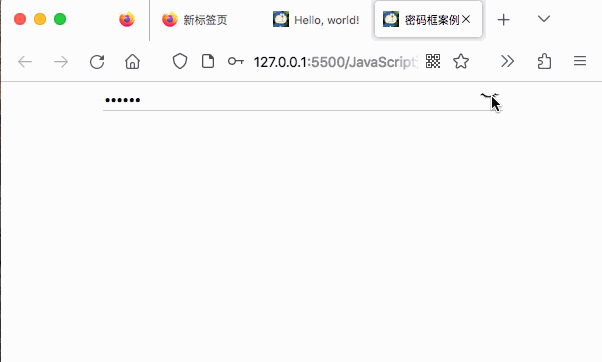

#### 4.样式属性操作

可以通过JS修改元素的大小、颜色、位置等样式；

方法一：`element.style.属性 `行内样式操作

> 注意：
>
> 1. JavaScript里面的样式采取驼峰命名法，如fontSize、backgroundColor与css里的background-color不同；
>
> 2. JavaScript修改style样式操作，产生的是行内样式，JavaScript的权重比css高；

示例代码：

```javascript
var obj = document.querySelector('div');
obj.onclick = function(){
    this.style.backgroundColor = 'purple';
    this.style.width = '400px';
}
```

方法二：`element.className	` 类名样式操作

可以手动设置元素是否加载某个css样式类

```css
.change {
    background-color: purple;
    color: #fff;
    font-size: 24px;
    margin-top: 10px;
}
```

```js
var obj = document.querySelector('div');
obj.onclick = function(){
    this.className = 'change';
}
```

> 注意：
>
> 1. 如果样式修改较多，可以采取操作类名的方式更改元素样式；
> 2. class是一个保留字，因此使用className来操作元素类名属性；
> 3. className会直接更改元素的样式类名，有时需要再原有样式类的基础上叠加样式，赋值时可以给出多个样式类，用空格隔开即可。

#### 5.操作元素总结

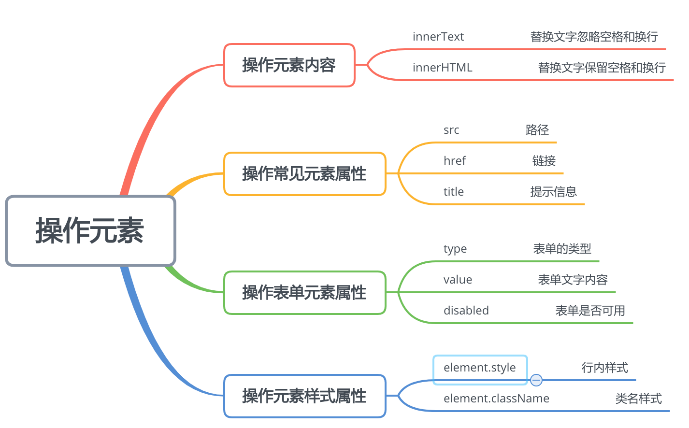

---
###  V、排他思想案例

如果有同一组元素，我们想要某一个元素实现某种样式，需要用到循环的排他思想算法。

在设置某个属性之前，循环删除同组的其他属性。

#### 案例1：一组按钮，只有被点击的按钮，其颜色才会发生变化；

```js
var btns = document.getElementsByTagName('button');
for(var i = 0; i < btns.length; i++){
    btns[i].onclick = function(){
        for(var j = 0; j < btns.length; j++){
            btns[j].style.backgroundColor = '';
        }
        this.style.backgroundColor = 'pink';
    }
}
```

#### 案例2：点击图片预览框，实现对网页背景的修改；

```js
// 获取元素
var body_obj = document.body;
var imgs = document.querySelector('.box').querySelectorAll('img');
// 定义事件
for(var i = 0; i < imgs.length; i++){
    imgs[i].onclick = function(){
        body_obj.style.backgroundImage = `url(`+this.src+`)`;
    }
}
```

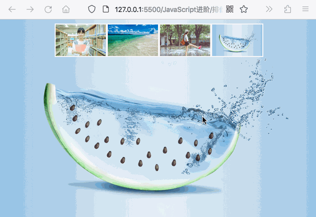

#### 案例3：高亮显示表格中鼠标滑过的某一行

```css
<style>
    .bg {
        background-color: pink;
    }
</style>
```

```js
var trs = document.querySelector('tbody').querySelectorAll('tr');
for(var i = 0; i < trs.length; i++){
    trs[i].onmouseover = function(){
        this.className = 'bg';
    }
    trs[i].onmouseleave = function(){
        this.className = '';
    }
}
```

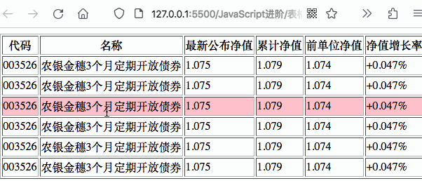

#### 案例4：实现表单全选和取消全选功能

这里主要实现两个需求，

需求1：点击全选能够实现对子项全部选中，如果取消全选则子项全部取消选中；

需求2：子项的全部选中与否可以对汇总项的选中情况产生影响。

> 实现思路：需求1很简单，遍历一次就可以了；需求2的思路为：首先对每一个子项绑定点击事件，每一次点击都会产生一次都所有子项的遍历，如果存在一个未选中的状态，则全选按钮为未选中；否则全选按钮为选中状态；
>

```js
var checkboxSum = document.getElementById('j_cbAll');
var checks = document.querySelector('tbody').querySelectorAll('input');
//实现全选与取消全选
checkboxSum.onclick = function(){
    for(var i = 0; i < checks.length; i++){
        checks[i].checked = checkboxSum.checked;
    }
}
// 实现子项对汇总的控制
for(var i = 0; i < checks.length; i++){
    checks[i].onclick = function(){
        var flag = true;
        for(var j = 0; j < checks.length; j++){
            if(!checks[j].checked){
                flag = false;
            }
        } 
        checkboxSum.checked = flag;   
    }
}
```

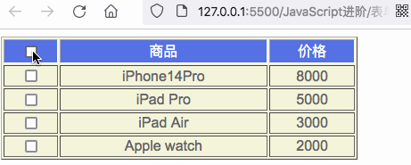

---
### VI、元素属性的获取与设置

#### 1.获取元素属性的方法：

（1）`element.属性`用于获取元素的内置属性（元素本身自带的属性）；

（2）`element.getAttribute('属性')`用于获得元素的自定义属性；

#### 2.设置元素属性的方法：

（1）`element.属性 ='值' `设置内置属性；

（2）`element.setAttribute('属性'，'值')`主要用于设置元素的自定义属性；

#### 3.移除元素属性的方法：

`element.removeAttribute('属性')`

#### 案例：tab栏切换

错误写法：

```js
var lis = document.querySelectorAll('li');
var contents = document.querySelectorAll('.item');
for(var i = 0; i < lis.length; i++){
    lis[i].onclick = function(){
        for(var j = 0; j < lis.length; j++){
            lis[j].removeAttribute('class');
            contents[j].display = 'none';    
        }
        this.setAttribute('class','current');
        contents[i].display = 'block';
    }
}
```

正确写法：

```js
// 获取元素
var lis = document.querySelectorAll('li');
var contents = document.querySelectorAll('.item');
for(var i = 0; i < lis.length; i++){
    // 在绑定事件之前就需要给li创建一个索引；
    lis[i].setAttribute('index',i);
    lis[i].onclick = function(){
        for(var j = 0; j < lis.length; j++){
            lis[j].removeAttribute('class'); 
        }
        this.setAttribute('class','current');
        var idx = this.getAttribute('index');
        for(var i = 0; i < contents.length; i++){
            contents[i].style.display = 'none';
        }
        contents[idx].style.display = 'block';
    }
}
```

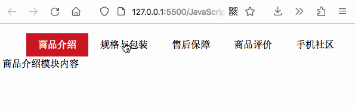

#### 4.区分自定义属性与内置属性

在H5中规定了自定义属性的名称使用`data-`开头,读取属性可以通过`dataset`集合来读取；

```html
<div data-index="2">hello</div>
```

```js
var res = document.querySelector('div');
console.log(res.getAttribute('data-index'));//兼容性比较好
console.log(res.dataset.index); //照样能读出data-index的属性值为2
console.log(res.dataset['index']); //由于dataset是一个集合，用这种方式也能读取出属性值
```
---
### VII、节点操作

#### 1.为什么使用节点操作

利用DO提供的方法获取元素逻辑性不强，而利用节点的层级关系获取元素可以利用父子兄关系来获取；

#### 2.节点属性

节点至少拥有`nodeType`、`nodeName`、`nodeValue`这三个属性，

* 元素节点nodeType为1
* 属性节点nodeType为2
* 文本节点nodeType为3（文本节点包含了文字、空格、换行等）

#### 3.节点层级

获取父级节点`node.parentNode`

获取子节点`parentNode.childNodes`包含了元素节点以及文本节点；如果只需要获取里面的元素节点则需要专门处理（筛选出nodeType位1的节点）故一般不提倡使用childNodes；

获取子节点`parentNode.children`返回所有的字元素节点，该方法是一个非标准用法，但是得到了各个浏览器的支持；

获取第一个子节点`parentNode.firstChild`,文本节点也会被获取。如果只获取第一个元素节点则使用`parentNode.fristElementChild`

获取最后一个子节点`parentNode.lastChild`,同样也会获取子节点中的文本节点，使用`parentNode.lastElementChild`获取最后一个元素节点，但是该方法存在兼容性问题，ie9以上才支持，实际应用中可以使用`parentNode.children[index]`的方法获取第一个元素或者最后一个元素。

获取下一个兄弟节点`node.nextSibling`包含元素节点以及文本节点，如果要指定下一个元素节点则使用`node.nextElementSibling`

获取上一个兄弟节点`node.previousSibling`包含元素节点以及文本节点,如果要获取上一个元素节点则使用`node.previousElementSibling`

#### 案例：新浪下拉菜单

```js
var nav = document.querySelector('.nav');
var lis = nav.children;
for(var i = 0; i < lis.length; i++){
    lis[i].onmouseover = function(){
        this.children[1].style.display = 'block';
    }
    lis[i].onmouseout = function(){
        this.children[1].style.display = 'none';
    }
}
```

#### 4.添加新元素

（1）创建节点：

`document.createElement('tagName')`由tagName指定HTML元素，由于这些元素原先不存在，是根据我们的需求动态生成的，所以我们也称为`动态创建元素节点`；

（2）添加节点：

`node.appendChild(child)`可以将一个节点添加到指定父节点的子节点列表结尾，类似于css里的after伪元素；

如果需要再指定元素的前面插入元素可以使用`node.insertBefore(child,指定元素)`来实现。

> 动态创建元素主要有三种方式：
>
> * `document.write()`直接将内容写入页面的内容流，但是文档流执行完毕，会导致页面全部重绘；(在事件中使用会导致页面中的其他元素被清空)
> * `element.innerHTML`将内容写入DOM节点，不用担心页面全部重绘制。如果采用拼接字符串的方式效率会很低，但是采用数组的方式进行拼接，则效率很高。
> * `doucument.createElement()`效率比拼接数组的方式低一点，但是结构更清晰。

#### 案例：简单留言板功能

```js
var input = document.querySelector('textarea');
var button = document.querySelector('button');
var box = document.querySelector('.reply');
// 定义一个li对象
var li = document.createElement('li');
button.onclick = function(){
    if(input.value == ''){
        alert('请输入内容')
    }else{
        // 定义一个li对象
        var li = document.createElement('li');
        li.innerHTML = input.value;
        box.insertBefore(li,box.children[0]);
        input.value = '';
    }
    
}
```

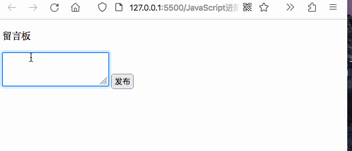

#### 5.删除元素

`node.removeChild(child)`方法可以从DOM中删除一个子节点，并返回删除的节点；

#### 6.复制元素

`node.cloneNode()`返回调用该方法的节点的一个副本；

> 注意：
>
> 1. 如果括号参数为空或者false，则是浅拷贝，只会复制节点本身，不会克隆里面的文本内容或者子节点；
> 2. 如果括号里面为true，则为深拷贝，会克隆里面的文本内容以及子节点；

#### 案例：动态生成和删除表格

```js
// 根据数据动态生成tbody里的行和单元格
var tbody = document.querySelector('tbody');
var tr = document.querySelector('tr');
// 数据填充
for(var i = 0; i < dates.length; i++){
    var stu_tr = tr.cloneNode();
    for(var k in dates[i]){
        var td = document.createElement('td');
        td.innerHTML = dates[i][k];
        stu_tr.appendChild(td);
    }
    // 添加超链接
    var td_a = document.createElement('td');
    td_a.innerHTML = '<a href="javascript:;">删除</a>'
    stu_tr.appendChild(td_a);
    tbody.appendChild(stu_tr);
}
// 删除操作
var a_objs = document.querySelectorAll('a');
for(var i = 0; i < a_objs.length; i++){
    a_objs[i].onclick = function(){
        tbody.removeChild(this.parentNode.parentNode);
    }
}
```

效果：

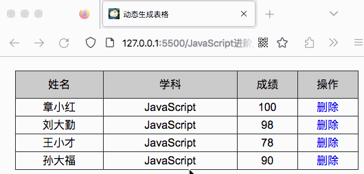

---
### VIII、事件高级

#### 目标：

- 元素注册的两种方式
- 删除事件的两种方式
- DOM事件流的三个阶段
- 利用事件对象完成跟随鼠标
- 封装组织冒泡的兼容性函数
- 事件委托原理
- 常用的鼠标和键盘事件

####  1.注册事件

*传统注册方式*：

称为`绑定事件`同一个元素只能设置一个处理函数，最后注册的出来函数会覆盖前面注册的处理函数；

```js
btn[0].onclick = function(){
    alert('11');
}
```

*监听注册方式*：

方式一：

`addEventListener()`，同一个元素**可以注册多个监听器**，并且**按注册顺序依次执行**；

```js
envenTarget.addEventListener(type,listener[,useCapture])
```

将指定监听器注册到目标对象上，当该对象触发指定事件时，就会执行事件处理函数；

- type：事件类型字符串，比如click、mouseover,注意不要带on
- listener：事件处理函数，事件发生时，会调用该监听函数；
- useCapture：可选函数，是一个布尔值，默认是false;

```js
var btn = document.querySelectorAll('button');
btn[1].addEventListener('click',function(){
    alert('22');
});
btn[1].addEventListener('click',function(){
    alert('33');
});
```

方式二：（ie9以前使用的方法，不建议使用） 

`attachEvent()`将指定的监听器注册到eventTarget目标对象上，当该对象触发指定事件时，指定的回调函数就会被执行；

```js
eventTarget.attachEvent(eventNameWithOn,callback)
```

该方法接收两个参数：

* eventNamewithOn:事件类型字符串，比如onclick、onmouseover
* callback:事件处理函数，当目标触发事件回调函数时被调用；

#### 2.删除事件

传统方式注册的事件解绑可以使用`eventTarget.onclick = null`

```js
div.onclick = function(){
    alert('11');
    this.onclick = null;
}
```

方法监听注册方式的解绑可以使用`evnetTarget.removeEventListener(type,listener[,useCapture])`

```js
div.addEventListener('click',fn);
function fn(){
    alert('22');
    div.removeEventListener('click',fn);
}
```

这里面考虑到要移除事件，所有addEventListener里面就不要用匿名函数的方式了，直接绑定函数的引用即可。

#### 3.DOM事件流

事件流描述的是从页面中接收事件的顺序，事件发生时会在元素节点间按照特定的顺序进行顺序传播，这个传播的过程即DOM事件流。

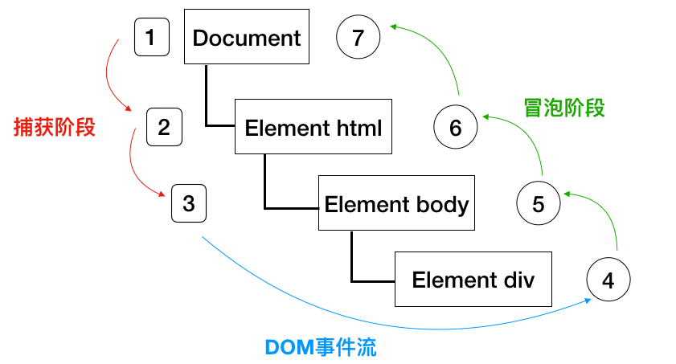

> 注意：
>
> 1. JS代码只能执行捕获或者冒泡其中的一个阶段；
> 2. `onclick`和`attachEvent`只能得到冒泡阶段；
> 3. `addEventListener(type,listener[,useCapture])`第三个参数如果是`true`，表示事件捕获阶段调用事件处理程序；如果是`false`（默认为false)，表示在冒泡阶段处理事件处理程序；
> 4. 在实际开发中很少使用事件捕获，我们更关注事件冒泡；
> 5. 有些事件时没有冒泡阶段的：`onbulr`、`onfocus`、`onmouseenter`、`onmouseleave`
> 6. 事件冒泡有时候会带来麻烦，有时候会巧妙的帮助做某些事情；

```js
var father = document.querySelector('.father');
var son = document.querySelector('.son');
father.addEventListener('click',function(){
    alert('father');
});
son.addEventListener('click',function(){
    alert('son');
});
```

例如以上代码，在father div里面嵌套了son div的例子中，点击son div会根据时间捕获的顺序，先弹出father提示框后弹出son提示框；

#### 4.事件对象

event对象代表事件的状态，比如键盘按键的状态、鼠标的位置、鼠标按钮的状态；事件发生后，跟事件相关的一系列信息数据的集合会放到这个对象里面，这个对象就是事件对象event,它有很多属性和方法；

event就是一个事件对象，写到监听函数的小括号里面当形参来看；只有有了事件才会存在事件对象，它是系统自动创建的，不需要传递参数；

```js
var son = document.querySelector('.son');son.onclick = function(event){
    console.log(event);
}
```

```js
var son = document.querySelector('.son');
son.addEventListener('click',function(e){
    console.log(e);
})
```

> 如果需要处理兼容性问题，IE678需要到window.event中查找，可以使用方法`e = e || window.event`

#### 5.事件对象的常见属性和方法

| 事件对象属性方法   | 说明                                  |
| ------------------ | ------------------------------------- |
| e.target           | 返回触发事件的对象（标准用法）        |
| e.srcElement       | 返回触发事件的对象（非标准ie6~8使用） |
| e.type             | 返回事件的类型                        |
| e.cancelBubble     | 该属性阻止冒泡（非标准ie6~8使用）     |
| e.stopPropgation() | 该属性阻止冒泡（标准用法）            |
| e.returnValue      | 该属性阻止默认事件（非标准ie6~8使用） |
| e.preventDefault() | 该方法阻止默认事件（标准用法）        |
| e.currentTarget    | 返回绑定事件的对象（标准用法）        |

e.target与this的区别是：e.target返回的是触发事件的对象，this返回的是绑定事件的对象； 

阻止默认事件，（让连接不跳转，或者让提交按钮不提交）

```js
var a = document.querySelector('a');
a.addEventListener('click',function (e) {
    e.preventDefault();
})
```

#### 6.阻止事件冒泡

事件冒泡：开始由最具体的元素接收，然后逐级向上传播到DOM顶层节点；

标准写法：利用事件对象里的`stopPropagation()`写法；

```js
var father = document.querySelector('.father');
var son = document.querySelector('.son');
father.addEventListener('click',function(){
    alert('father');
});
son.addEventListener('click',function(e){
    e.stopPropagation();
    alert('son');
});
```

阻止事件冒泡的兼容性方案：

```js
if(e && e.stopPropagation){
  e.stopPropagation();
}else{
  window.event.cancelBubble = true;
}
```

#### 7.事件委托

事件委托也称为事件代理，在jQuery里面称为事件委派；

事件委托的原理：**不是给每个子节点单独设置事件监听器，而是时间监听器设置在其父节点上，利用冒泡原理影响设置每个子节点。**

实际用法：**给ul注册点击事件，然后利用事件对象的target来找到当前点击的li,因为点击li,事件会冒泡到ul上，ul有注册事件，就会触发事件监听器。**

#### 8.常用的鼠标事件

（1）禁止鼠标右键菜单，`contextmenu`主要控制应该如何显示上下文菜单；

```js
document.addEventListener('contextmenu',function(e){
    e.preventDefault();
})
```

（2）禁用鼠标选中`selectstart`

```js
document.addEventListener('selectstart',function(e){
    e.preventDefault();
})
```

鼠标事件对象`MouseEvent`键盘事件对象`KeyboardEvent`

```js
var mouse = document.querySelector('img');
document.addEventListener('mousemove',function(e){
    mouse.style.left = e.pageX + 'px';
    mouse.style.top = e.pageY + 'px';
})
```

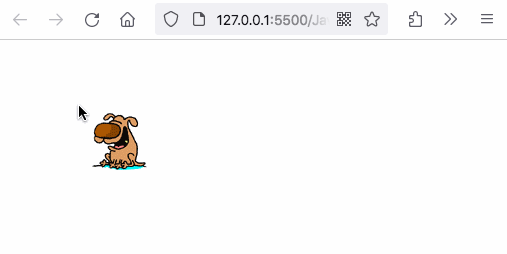

#### 9.常用键盘事件

| 键盘事件   | 触发事件                 | 备注                              |
| ---------- | ------------------------ | --------------------------------- |
| onkeyup    | 某个键盘按键被松开时触发 |                                   |
| onkeydown  | 某个键盘按键被按下时触发 | 识别功能键                        |
| onkeypress | 某个键盘按键被按下时触发 | 不识别功能键(ctrl、shift、方向键) |

> 注意：
>
> 如果同时添加三个监听事件，则三个事件的执行顺序是：keydown --> keypress --> keyup
>
> keyup和keydown事件是不区分字母大小写，a和A得到的keyCode都是65
>
> keypress事件是区分字母大小写的；a是97，A是65

#### 案例：检测按键光标定位到搜索框；

思路：使用keyCode判断用户按键，搜索框获取焦点使用`focus()`方法

```js
var input = document.querySelector('input');
document.addEventListener('keyup',function(e){
    if(e.keyCode === 83){
        input.focus();
    }
})
```

案例：模拟快递单号查询效果

在输入框中输入文字，会显示放大框； 若输入框中的文字为空，则隐藏输入框。移入输入框，若为空，则不显示放大框；若不为空，则显示放大框 

```js
var input = document.querySelector("input");
var con = document.querySelector(".con");
// ♥ 注意:这里不能使用keydown和keypress。因为我们的需求是输入进去后再进行判断里面的值是否为空。
// 而keydown事件触发后文字才会被键入输入框，此时是监测不到最新键入的数据的。
input.addEventListener("keyup", function () {
  // 键入文字，为空时隐藏放大镜，不会空则显示放大镜
  if (this.value.trim() === "") {
    con.style.display = "none";
  } else {
    con.style.display = "block";
    con.innerHTML = this.value;
  }
});
// 焦点移出输入框，隐藏放大镜
input.addEventListener("blur", function () {
  con.style.display = "none";
});
// 点击输入框，若有内容则显示放大镜
input.addEventListener("focus", function () {
  if (this.value != "") {
    con.style.display = "block";
  }
});
```

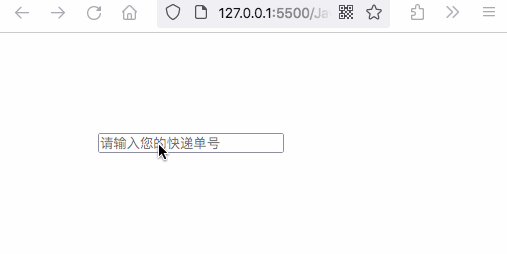

## 二、BOM

#### 学习目标

- 了解BOM的概念；
- 浏览器的顶级对象window
- 页面加载事件以及注意事项
- 两种定时器函数及区别
- JS执行机制
- 使用location对象完成页面之间的跳转
- 了解navigator对象及其属性
- 使用history提供的方法实现页面刷新

### I、BOM概述

BOM（Browser Object Model）浏览器对象模型，它提供了独立于内容而与浏览器窗口进行交互的对象，核心对象是`window`；

### II、window对象

window对象是浏览器的顶级对象，它是JS访问浏览器窗口的一个接口。是一个全局对象，定义在全局作用域中的变量、函数都会变成window对象的属性和方法；

#### 1.窗口加载事件

（1）窗口页面加载事件

```js
window.onload = function(){}
```

```js
window.addEventListener("load",function(){})
```

window.onload是窗口页面加载事件，当文档内容(包括css、图片)完全加载完成会触发该事件；

window.onload传统注册事件方式只能写一个，如果有多个，会以最后一个window.onload为准；如果使用addEventListener则没有限制；

（2）DOM加载

```js
document.addEventListener('DOMContentLoaded',function(){})
```

只需要DOM加载完成，（不包括CSS、图片、flash等）即可触发，对于图片内容较多的的网站，可以加快相应速度；

#### 2.调整窗口大小

```js
window.onresize = function(){}
window.addEventListener('resize',function(){})
```

> 注意：
>
> 当窗口大小发生变化时，就会触发这个事件；
>
> 利用这个事件完成响应式布局，可以通过`window.innerWidth`获取当前屏幕的宽度；

#### 3.定时器

window对象提供了两个非常好的定时器

- setTimeout()
- setInterval() 

（1）setTimeout()定时器,该定时器在定时器到期后执行调用函数；

```js
window.setTimeout(调用函数,[延迟的毫秒数]); 
```

> 注意：
>
> - 这个window调用的时候可以省略；
>
> - 定时器里的调用函数可以直接使用函数名调用，也可以使用`'函数名()'`来调用；
>
> - 页面中可能有很多定时器，通常给定时器添加标识符；

#### 案例：5S自动关闭广告

```js
setTimeout(callback,5000);
var div = document.querySelector('div');
function callback(){
    div.style.display = 'none';
}
```

停止定时器：timeoutID为定时器的标识符

```js
window.clearTimeout(timeoutID);
```

（2）setInterval()定时器，重复调用一个函数，每隔一段时间，就会调用这个回调函数；

```js
window.setInterval(调用函数,[延迟的毫秒数]); 
```

#### 案例：倒计时效果

```js
var showHours = document.querySelector('.hour');
var showMinutes = document.querySelector('.minute');
var showSeconds = document.querySelector('.second');
// ❤ 注意：setInterval的回调函数带不了参数，故把输入时间作为全局变量写在了函数外面
var inputTime = +new Date('2023-06-01 19:00:00');
// 先调用一次这个函数，防止定时器刷新产生空白
countDown(); 
// 开启定时器
function countDown(){
    var nowTime = +new Date();
    var times = (inputTime - nowTime) / 1000;
    var s = parseInt(times % 60);
    s = s < 10 ? '0' + s : s;
    var m = parseInt(times / 60 % 60);
    m = m < 10 ? '0' + m : m;
    var h = parseInt(times / 60 / 60 % 24);
    h = h < 10 ? '0' + h : h;
    // 修改值
    showHours.innerHTML = h;
    showMinutes.innerHTML = m;
    showSeconds.innerHTML = s;
}
// ------ 刷新时间 ---------
window.setInterval(countDown,1000);
```

停止定时器：可以取消先前通过setInterval()建立的定时器；

```js
window.clearInterval(intervalID);
```

#### 案例：设置两个按钮，点击开始按钮开始定时器，点击停止按钮停止定时器；

```js
var btn_start = document.querySelector('.start');
var btn_end = document.querySelector('.stop');
// 停止定时器需要ID，因此time1设置成全局变量；
var time1 = null;
function boom(){
    var date = new Date();
    console.log(date);
}

btn_start.addEventListener('click',function(){
    time1 = setInterval(boom,1000);
});
btn_end.addEventListener('click',function(){
    clearInterval(time1);
})
```

#### 案例：发送短信按钮-设置10秒冷却时间

```js
var btn = document.querySelector('button');
btn.addEventListener('click',countDown);
function countDown() {
    btn.disabled = true;
    // 定义冷却时间
    var i = 10; 
    // 给定时器命名，方便后续清除定时器
    var timer = setInterval(function(){
        if(i == 0){
            // 清除定时器，复原按钮
            clearInterval(timer);
            btn.disabled = false;
            btn.innerHTML = '发送';
        }else{
            btn.innerHTML = '还剩'+i+'s再次点击';
            i--;
        }   
    },1000);
}
```

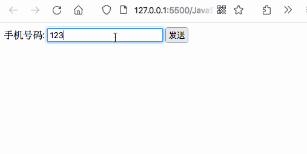

#### 4.this

this的指向在函数定义的时候是确定不了的，只有在函数执行的时候才能确定this到底指向谁，一般情况下this的最终指向是那个调用它的对象；

> 注意：
>
> （1）全局作用域中，普通函数中或者定时器中this指向全局对象window
>
> （2）在方法调用中，谁调用this，this就指向谁；
>
> （3）在构造函数中，this指向构造函数的实例；

### III、JS执行机制

#### 1. JS是单线程

JS是为处理页面中的用户交互以及操作DOM而诞生的，在`同一时间只能做一件事情`，也就是`单线程`；这样会导致的问题是：如果JS执行时间过长，就会造成页面渲染不连贯，导致页面渲染加载阻塞。

为了解决这个问题，利用多核CPU计算能力，H5提出Web Worker标准，允许JS脚本创建多个线程，于是JS中出现了同步和异步；

#### 2.同步任务

同步任务都是在主线程上执行，形成一个`执行栈`；

#### 3.异步任务

JS的异步是通过回调函数实现的，异步任务有以下三种类型：

（1）普通事件，如click、resize

（2）资源加载，load、error

（3）定时器：setInterval、setTimeout

异步任务放到任务队列(消息队列)中；

#### 4.执行机制

先执行执行栈中的同步任务，异步任务（回调函数）放到任务队列中，一旦执行栈中的同步任务执行完毕，系统就会按次序读取任务队列中的异步任务，于是被读取的异步任务结束等待状态进入执行栈，开始执行。

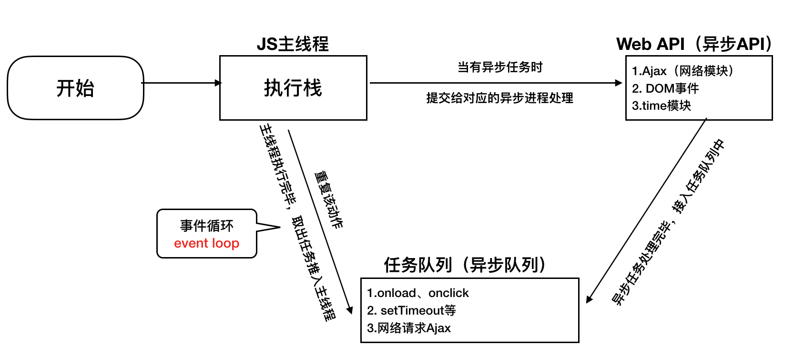

### IV、location对象

#### 1.概念

window对象提供了一个location属性用于获取或设置窗体的URL,并且可以用于解析URL，应为这个属性返回的是一个对象，故将这个属性称为location对象；

#### 2.URL

统一资源定位符是互联网上标准资源的地址，互联网上每个文件都有一个唯一的URL，它包含的信息指出文件的位置以及浏览器该怎么处理它。

URL的一般语法格式为：

```
protocal://host[:port]/path/[?query]#fragment
```

#### 3.location对象的属性

| location对象属性  | 返回值                  |
| :---------------- | :---------------------- |
| location.href     | 获取或设置整个URL       |
| location.host     | 返回z主机（域名）       |
| location.port     | 返回端口号              |
| location.pathname | 返回l路径               |
| location.search   | 返回参数                |
| location.hash     | 返回片段#常见与链接锚点 |

#### 案例：5S后自动跳转页面

```js
var div = document.querySelector('div');
var time = 5;
var timer = setInterval(function(){
    if(time == 0){
        clearInterval(timer);
        location.href = 'http://www.bing.com';
    }else{
        div.innerHTML = '您将在'+time+'s内跳转到主页面';
        time--;
    }
},1000);
```

#### 案例：获取URL参数

定义两个页面，登录页面login.html和主页index.html,登录页面输入用户名登录后会在主页显示，用户名欢迎您！

思路：login页面定义一个表单，name定义为uname，在action中把内容提交给index，index.html页面中通过location.search拿到字符串`?uname=用户名`,对该字符串进行分割和提取即可。

```html
<div>用户登录</div>
    <div>
        <form action="index.html">
            <span>请输入用户名:</span>
            <input type="text" name="uname">
            <input type="submit" id="" value="登录">
        </form>
    </div>
```

```js
var user = document.querySelector('span');
var res = location.search;
var uname = res.substr('1').split('=')[1];
console.log(uname);
user.innerHTML = uname;
```

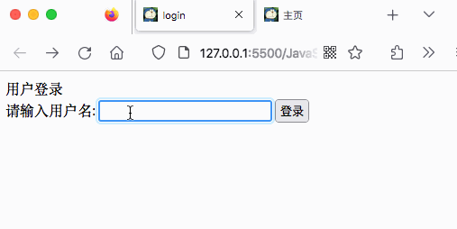

#### 4.location对象的方法

| location对象方法   | 返回值       | 备注                              |
| ------------------ | ------------ | --------------------------------- |
| location.assign()  | 跳转页面     | 也称为重定向页面                  |
| location.replace() | 替换当前页面 | 不记录历史，不能后退              |
| location.reload()  | 重新加载页面 | 刷新，如果参数为true,则为强制刷新 |

### V、navigator对象

navigator对象包含了有关浏览器的信息，有很多属性，最常用的是`userAgent`，该属性可以返回由客户机发送服务器的`user-agent`头部的值；

### VI、history对象

history对象与浏览器历史记录进行交互，记录用户访问过的URL

| history对象方法 | 作用         | 备注                                    |
| --------------- | ------------ | --------------------------------------- |
| back()          | 可以后退功能 |                                         |
| forward()       | 前进功能     |                                         |
| go(参数)        | 前进后退     | 参数1前进一个页面，如果是-1后退一个页面 |

## 三、PC端网页特效

### 学习目标

* offset的属性与作用
* client的属性与作用
* scroll的属性与作用
* 封装简单动画函数
* 网页轮播图

### I、元素偏移量

获得元素距离带有定位父元素的位置

获得元素自身的width和height

#### 1.offset常用的属性

| offset系列属性       | 作用                                                    | 备注                                   |
| -------------------- | ------------------------------------------------------- | -------------------------------------- |
| element.offsetParent | 返回该元素带有定位的父级元素,如果父级没有定位则返回body | parentNode不管父级有没有定位都可以获取 |
| element.offsetTop    | 返回该元素相对带有定位父元素上方的偏移                  |                                        |
| element.offsetLeft   | 返回该元素相对带有定位父元素做边框的偏移                |                                        |
| element.offsetWidth  | 返回自身包括padding、border、width的宽度                | 不带单位                               |
| element.offsetHeight | 返回自身包括padding、border、height的高度               | 不带单位                               |

#### 2.offset与style的区别

| offset                                             | style                           |
| -------------------------------------------------- | ------------------------------- |
| offset可以得到任意样式表中的样式值（内嵌、行内等） | style只能得到行内样式表的样式值 |
| 获得的值是没有单位的                               | 获得的值有单位                  |
| offsetWidth包含padding+border+width                | 不包含padding+border            |
| 可读                                               | 可读可写                        |

#### 案例：获取鼠标在盒子内的坐标

思路：盒子内的坐标可以通过鼠标事件的e.pageX获取到页面坐标再减去element.offsetLeft来得到；

```js
var box = document.querySelector('.box');
box.addEventListener('click',function(e){
    var x = e.pageX - this.offsetLeft;
    var y = e.pageY - this.offsetTop;
    console.log('x:'+x+',y:'+y);
})
```

#### 案例：模态框拖拽

需求：

（1）点击弹出层，会淡出模块框，并且显示灰色半透明的遮挡层；

（2）点击关闭按钮，可以关闭模态框，并且同时关闭灰色半透明遮挡层；

（3）鼠标放到模态框最上面一行，可以按住鼠标拖拽模态框在页面中移动；

（4）鼠标松开，可以停止拖动模态框移动；

分析：

（1）拖拽事件，鼠标是按着的状态，故`mousemove`和`mouseup`须卸载`mousedown`事件里面；

（2）在拖拽的过程中，鼠标的位置相对于组件的坐标是不变的，因此为了改变组件的位置，需要将页面坐标减去相对组件坐标来获取；

```js
var link = document.querySelector('#link');
var login_window = document.querySelector('#login');
var close_button = document.querySelector('#closeBtn');
var bg = document.querySelector('#bg');
link.addEventListener('click',function(){
    login_window.style.display = 'block';
    bg.style.display = 'block';
})
close_button.addEventListener('click',function(){
    login_window.style.display = 'none';
    bg.style.display = 'none';
})
// 拖动事件三个过程：mousedown、mousemove、mouseup
var title = document.querySelector('#title');
title.addEventListener('mousedown',function(e){
    var x = e.pageX - login_window.offsetLeft;
    var y = e.pageY - login_window.offsetTop;
    document.addEventListener('mousemove',move);
    function move(e){
        login_window.style.left = e.pageX - x + 'px';
        login_window.style.top = e.pageY -y + 'px';
    }
    document.addEventListener('mouseup',function (e) {
        document.removeEventListener('mousemove',move);
    });
});
```

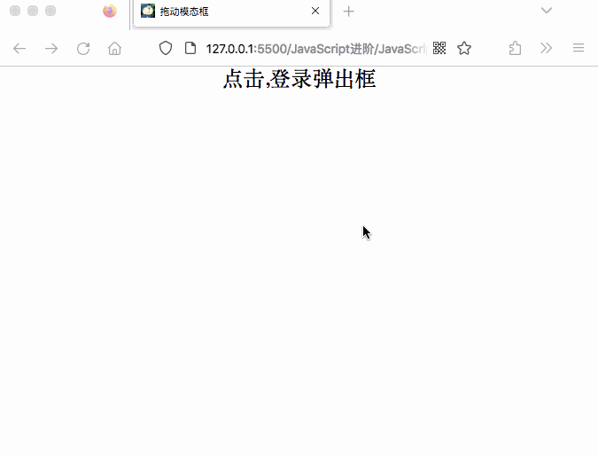

#### 案例:仿京东放大镜效果

分析：

（1）mask界面与big界面可以通过鼠标事件设置dispaly属性即可；`mouseover`显示mask，`mouseleave`隐藏mask、`mousemove`移动mask

（2）mask的left与top的值可以通过鼠标在prew_img中的位置来获取；

（3）为了让mask界面中央跟着鼠标指针走，则需要减去mask尺寸一半的偏移量；

（4）防止mask页面跑出prew_img，需要对偏移量进行判断；

（5）大图片移动距离怎么计算？mask移动距离/mask最大移动距离 = 大图片移动距离/大图片最大移动距离；所以大图片移动距离 = mask移动距离 * 大图片移动最大距离 / 遮挡层最大移动距离；

```js
window.addEventListener('load',function(){
    var prew_img = document.querySelector('.preview_img');
    var mask = document.querySelector('.mask');
    var big = document.querySelector('.big');
    prew_img.addEventListener('mouseover',function(){
        mask.style.display = 'block';
        big.style.display = 'block';
    })
    prew_img.addEventListener('mousemove',function(e){
        // 获取鼠标在prew_img元素内的坐标
        var x = e.pageX - this.offsetLeft;
        var y = e.pageY - this.offsetTop;
        // 防止mask页面跑出prew_img盒子
        var maskX = x - mask.offsetWidth / 2;
        // 遮挡层的最大移动距离maskMax
        var maskMax = this.offsetWidth - mask.offsetWidth;
        if(maskX <= 0){
            maskX = 0;
        }else if(maskX >= maskMax){
            maskX = maskMax;
        }
        var maskY = y - mask.offsetHeight / 2;
        if(maskY <= 0){
            maskY = 0;
        }else if(maskY >= maskMax){
            maskY = maskMax;
        }
        // 让mask界面中央跟着鼠标指针走
        mask.style.left = maskX + 'px';
        mask.style.top = maskY + 'px';
        // 让big界面内容跟着mask位置移动，
        // 大图片移动距离 = mask移动距离 * 大图片移动最大距离 / mask最大移动距离
        var big_img = document.querySelector('.bigImg');
        var bigMax = big_img.offsetWidth - big.offsetWidth;
        // 大图片移动距离
        var bigMoveX = maskX * bigMax / maskMax;
        var bigMoveY = maskY * bigMax / maskMax;
        big_img.style.left = -bigMoveX + 'px';
        big_img.style.top = -bigMoveY + 'px';
    });

    prew_img.addEventListener('mouseleave',function(){
        mask.style.display = 'none';
        big.style.display = 'none';
    });
});
```

### II、元素的可视区

| client系列属性       | 作用                                        | 备注     |
| -------------------- | ------------------------------------------- | -------- |
| element.clientTop    | 返回该元素上边框的大小                      |          |
| element.clientLeft   | 返回该元素左边框的大小                      |          |
| element.clientWidth  | 返回自身包括padding、content的宽度,不含边框 | 不带单位 |
| element.clientHeight | 返回自身包括padding、content的高度,不含边框 | 不带单位 |

##### 立即执行函数

不需要调用，立马能自己执行的函数; 

```js
// 写法一：
(function(){})()
// 写法二：
(function(){}())
```

立即执行函数也可以传递参数：

```js
(function(a,b){
console.log(a+b);
})(1,2)
```

> 立即执行函数的作用是独立创建了一个作用域，里面所有的变量都是局部变量，不会有命名冲突的情况；

### III、元素滚动scroll

使用scroll系列相关属性可以动态得到元素的大小、滚动距离；

| scroll系列属性       | 作用                         | 备注               |
| -------------------- | ---------------------------- | ------------------ |
| element.scrollTop    | 返回被卷去的上侧距离         | 返回的数值不带单位 |
| element.scrollLeft   | 返回被卷去的左侧距离         | 返回的数值不带单位 |
| element.scrollWidth  | 返回自身的实际宽度，不含边框 | 返回的数值不带单位 |
| element.scrollHeight | 返回自身的实际高度，不含边框 | 返回的数值不带单位 |

##### 案例：仿淘宝固定侧边栏

- 1.原先侧边栏是绝对定位
- 2.当页面滚动到一定的位置，侧边栏改为固定定位
- 3.页面继续滚动，会让顶部显示出来

页面被卷去的头部可以通过：`window.pageYOffset`来获得

```js
// 1.获取元素
var sliderBar = document.querySelector('.slider-bar');
var topBar = document.querySelector('.header');
var banner = document.querySelector('.banner');
var main = document.querySelector('.main');
var goBack = document.querySelector('.goBack');

var barHeight = banner.offsetTop;
var sliderBarTop = sliderBar.offsetTop;
var fixTop = sliderBarTop - barHeight;
var mainTop = main.offsetTop;
// 2.页面滚动事件
document.addEventListener('scroll',function(){

    if(window.pageYOffset >= barHeight){
        sliderBar.style.position = 'fixed';
        sliderBar.style.top = fixTop + 'px';
    }else{
        sliderBar.style.position = 'absolute';
        sliderBar.style.top = sliderBarTop + 'px';
    }
    if(window.pageYOffset >= mainTop){
        goBack.style.display = 'block';
    }else{
        goBack.style.display = 'none';
    }
})
```

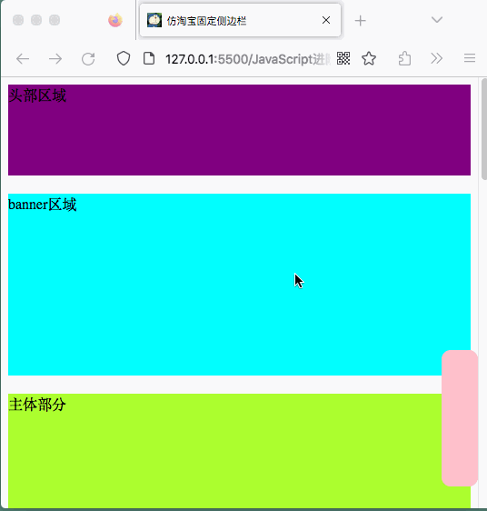

### IV、鼠标事件

当鼠标移动到元素上时就会触发`mouseenter`事件，类似`mouseenter`

两者的区别是：mouseover鼠标经过自身盒子会触发、经过子盒子也会触发；而`mouseenter`只有经过自身盒子才会触发；

原因是`mouseenter`不会冒泡；跟`mouseenter`搭配的通常是`mouseleave`

### V、动画函数

##### 1.动画实现的原理：

通过定时器`setInterval()`不断移动盒子位置；

实现步骤：

* 获得盒子当前位置
* 让盒子在当前位置加上一个移动距离
* 加上一个结束定时器的条件
* 盒子需要添加定位，才能使用`element.style.left`

```js
//利用setInterval设置一个box元素从左向右移动400像素的动画
var box = document.querySelector('.box');
var timer = setInterval(function(){
    if(box.offsetLeft > 200){
        // 停止动画，本质上是清除定时器
        clearInterval(timer);
    }
    box.style.left = box.offsetLeft + 5 + 'px';
},50);
```

##### 2.动画函数的封装

将动画函数封装起来，利用JS是动态语言的特性，通过设置对象的方式，给每个不同的元素指定不同的定时器；

```js
// 简单动画函数的封装,目标对象obj,目标位置target
function animate(obj,target){
    // 如果设置一个按钮启动动画，会存在一个bug,只要不断点击按钮，动画会越走越快；
    // 原因是启动了太多定时器，解决方案是，让元素只有一个定时器执行
    clearInterval(obj.timer);
    obj.timer = setInterval(function(){
    if(obj.offsetLeft > target){
        // 停止动画，本质上是清除定时器
        clearInterval(obj.timer);
    }
    obj.style.left = obj.offsetLeft + 5 + 'px';
},50);
}
//利用setInterval设置动画
var btn = document.querySelector('button');
var box1 = document.querySelector('.box1');
btn.addEventListener('click',function(){
    animate(box1,400);
});
```

##### 3.缓动动画原理

缓动动画就是让元素运动速度有所变换，最常见的就是让速度慢慢停下来；

**思路**：让盒子每次移动的距离慢慢变小；

**核心算法**：`每次移动的步长 = (目标值-现在的位置)/10`这里的10是份数可以是9也可以是8；

停止的条件是：当前盒子的位置等于目标位置就停止定时器；

```js
// 缓动动画
function animate(obj,target){
    // 清除定时器
    clearInterval(obj.timer);
    obj.timer = setInterval(function() {
        // 每次运行定时器都要重新计算步长值，所以步长值写在定时器里面
        var step = (target - obj.offsetLeft)/10;
        // 如果step是正值则往大取整，如果step是负值则往小取整
        step = step >= 0 ? Math.ceil(step) : Math.floor(step);
        if(obj.offsetLeft == target){
            clearInterval(obj.timer);
        }
        // 缓动动画核心算法：前进步长=（目标-当前）/ 10
        obj.style.left = obj.offsetLeft + step + 'px';
    },50);
}
```

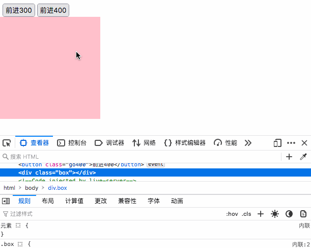

##### 动画函数添加回调函数

回调函数原理：函数可以作为一个参数，将这个函数作为参数传入到另一个函数里面，当这个函数执行完成后，再执行传进去的这个函数，这个过程叫做回调。

回调函数位置：写到定时器结束的位置

```js
// 缓动动画
function animate(obj,target,callback){
    // 清除定时器
    clearInterval(obj.timer);
    obj.timer = setInterval(function() {
        // 每次运行定时器都要重新计算步长值，所以步长值写在定时器里面
        var step = (target - obj.offsetLeft)/10;
        // 如果step是正值则往大取整，如果step是负值则往小取整
        step = step >= 0 ? Math.ceil(step) : Math.floor(step);
        if(obj.offsetLeft == target){
            clearInterval(obj.timer);
            if(callback){
                // 调用函数
                callback();
            }
        }
        // 缓动动画核心算法：前进步长=（目标-当前）/ 10
        obj.style.left = obj.offsetLeft + step + 'px';
    },50);
}
```

##### 将动画函数封装到单独的JS文件

在head里引入JS文件

```html
<script src="animate.js"></script>
```

实际调用过程中可以直接调用JS中定义的函数

```js
var sliderbar = document.querySelector('.sliderbar');
var con = document.querySelector('.con');
sliderbar.addEventListener('mouseenter',function(){
    animate(con,-160,function () {
        // 动画执行完毕，将左箭头转为右箭头
        sliderbar.children[1].innerHTML = '→';
    });
})
sliderbar.addEventListener('mouseleave',function(){
    animate(con,0,function () {
        sliderbar.children[1].innerHTML = '←';
    });
})
```

##### 案例：网页轮播图

功能需求：

- 鼠标经过轮播图模块，左右按钮显示，离开隐藏左右按钮；
- 鼠标点击右侧按钮一次，图片往左播放一张，以此内推，左侧按钮同理；
- 图标播放的同时，下面小圆圈模块跟随一起变化；
- 点击小圆圈，可以播放相应图片；
- 鼠标不经过轮播图，轮播图也会自动播放图片；
- 鼠标经过，轮播图模块，自动播放停止

```js
window.addEventListener('load', function () {
    // === 0.定义变量，获取元素
    var focus = document.querySelector('.focus');
    var arrowL = document.querySelector('.arrow-l');
    var arrowR = document.querySelector('.arrow-r');

    // === 1.鼠标经过轮播图模块，左右按钮显示，离开隐藏左右按钮；=====
    focus.addEventListener('mouseenter', function () {
        arrowL.style.display = 'block';
        arrowR.style.display = 'block';
        clearInterval(timer);
        timer = null;
    });
    focus.addEventListener('mouseleave', function () {
        arrowL.style.display = 'none';
        arrowR.style.display = 'none';
        timer = window.setInterval(function () {
            arrowR.click();
        }, 3000);
    });
    // === 2.根据轮播图的数量自动生成小圆圈
    var ul = focus.querySelector('ul');
    var ol = focus.querySelector('.circle');
    var pictureWidth = focus.offsetWidth;
    // 获取到轮播图图片的数量length
    var length = ul.children.length;
    // 显示当前图片的索引
    var circle = 0;
    // 显示当前图片的索引
    var num = 0;
    // 创建元素插入到ol中
    for (var i = 0; i < length; i++) {
        var li = document.createElement('li');
        // 给没一个小圆圈添加一个index属性，方便点击事件的ul移动长度的确定
        li.setAttribute('index', i);
        // 给每一个小圆圈添加点击事件
        li.addEventListener('click', function () {
            // 移除其他小圆圈的选中属性
            for (var i = 0; i < length; i++) {
                ol.children[i].className = '';
            }
            // 设置当前选中小圆圈的选中属性
            this.className = 'current';
            // 定义选中的小圆圈的索引
            var index = this.getAttribute('index');
            num = index;
            circle = index;
            animate(ul, -pictureWidth * index);
        });
        ol.appendChild(li);
    }
    ol.children[0].className = 'current';

    // === 3.鼠标点击右侧按钮一次，图片往左播放一张，以此内推，左侧按钮同理；==
    // 为了实现无缝滚动，需要将第一张图添加到最后一张图中
    var lastLi = ul.children[0].cloneNode(true);
    ul.appendChild(lastLi);
    // 设置一个节流阀，防止按钮在短时间内点击过多
    var flag = true;
    arrowR.addEventListener('click', function () {
        if (flag) {
            flag = false;
            if (num == ul.children.length - 1) {
                ul.style.left = 0;
                num = 0;
            }
            num++;
            animate(ul, -pictureWidth * num, function () {
                flag = true;
            });
            circle++;
            if (circle == ol.children.length) {
                circle = 0;
            }
            activateCircle(circle);
        }
    });

    arrowL.addEventListener('click', function () {
        if (flag) {
            flag = false;
            if (num == 0) {
                num = ul.children.length - 1;
                ul.style.left = -num * pictureWidth + 'px';
            }
            num--;
            animate(ul, -num * pictureWidth, function () {
                flag = true;
            });
            if (circle == 0) {
                circle = ol.children.length;
            }
            circle--;
            activateCircle(circle);
        }
    });

    // 排他法思想点亮小圆圈
    function activateCircle(index) {
        for (var i = 0; i < ol.children.length; i++) {
            ol.children[i].className = '';
        }
        ol.children[index].className = 'current';
    }

    // 实现轮播图自动播放
    var timer = window.setInterval(function () {
        arrowR.click();
    }, 3000);
});
```

轮播图自动播放的原理是：设置一个定时器使用`click（）`函数模拟按钮点击事件；

轮播图实现无缝滚动的原理是：将第一个图动态加在最后一张图上，当切到最后一张图时，重新设置元素布局距离，再执行滑动动画。

防止同一个按钮在短时间内点击次数过多，可以设置一个节流阀，将启动节流阀的操作写在动画回调函数里，这样只有当动画执行完毕后才才可以重新恢复按钮的点击功能；

页面滚动动画可以使用函数：`window.scroll(x,y)`可以滚动至页面的指定坐标位置；

## 四、移动端网页特效

### I、触屏事件touch

#### 1 触屏事件概述

| 触屏touch事件 | 说明                          | 备注 |
| ------------- | ----------------------------- | ---- |
| touchstart    | 手指触摸到一个DOM元素时触发   |      |
| touchmove     | 手指在一个DOM元素上滑动时触发 |      |
| touchend      | 手指在一个DOM元素上移开时触发 |      |

#### 2 触摸事件对象

| touch事件对象  | 说明                                           | 备注 |
| -------------- | ---------------------------------------------- | ---- |
| touches        | 正在触摸屏幕所有的手指列表                     |      |
| targetTouches  | 正在触摸当前DOM元素上的手指的一个列表          |      |
| changedTouches | 手指状态发生了改变的列表（从无到有，从有到无） |      |

#### 3 案例：跟踪触摸点的小方块

```JavaScript
var red = document.querySelector('.red');
// 盒子触摸位置boxstartx、boxstarty
var boxstartx = 0;
var boxstarty = 0;
// 盒子本身位置
var x = 0;
var y = 0;    
red.addEventListener('touchstart',function(e){
    boxstartx = e.targetTouches[0].pageX;
    boxstarty = e.targetTouches[0].pageY;
    x = this.offsetLeft;
    y = this.offsetTop;
});
red.addEventListener('touchmove',function(e){
    // 盒子移动的距离 = 盒子的最新位置 - 盒子的初始触摸位置
    var boxmoveX = e.targetTouches[0].pageX - boxstartx;
    var boxmoveY = e.targetTouches[0].pageY - boxstarty;
    // 盒子移动到的位置 = 盒子本身的位置 + 盒子移动的距离
    this.style.left = x + boxmoveX + 'px';
    this.style.top = y + boxmoveY + 'px';
    e.preventDefault(); //阻止屏幕向上滚动的默认行为
});
```

### II、移动端常见特效

#### 1.classList的使用

classList可以返回一个元素的类名列表，对类名的操作具备以下方法：

- 添加类名add()
- 删除类名remove()
- 切换类名toggle() 对于元素来说，如果有这个类就删除这个类，没有这个类就添加这个类；

```js
var btn = document.querySelector('button');
btn.addEventListener('click',function(){
    document.body.classList.toggle('dark');
})
```

#### 2.移动的点击事件有300ms延迟

原因是：移动端设备浏览网页有一个双击缩放的功能，浏览器需要等待用户300ms以判断用户是否再次点击了屏幕；

主要有三种解决方案：

(1)禁止网页缩放

```html
<meta name="viewport" content="width=device-width user-scalable= 'no'">
```

(2)自行封装touch事件，减少点击事件的延迟；

(3)使用`fastclick.js`插件,[项目地址](https://github.com/ftlabs/fastclick)

```js
window.addEventListener(function(){ 
    FastClick.attach( document.body );
},false );
```

### III、移动端常用开发插件

#### 1.Swiper

#### 2.TouchSlide

#### 3.zy.media.js

## 五、本地存储	

本地存储的特性：

数据存储在用户浏览器中，刷新页面不丢失数据

sessionStorage约5M、localStorage约20M；

只能存储字符串，可以将对象JSON.stringify()编码后存储.

### I、sessionStorage

window.sessionStorage

生命周期为关闭浏览器窗口，同一个窗口（页面）下数据可以共享，以键值对的形式存储使用；

```js
// 存储数据：
sessionStorage.setItem(key,value)
// 获取数据：
sessionStorage.getItem(key)
// 删除数据
sessionStorage.removeItem(key)
// 删除所有数据
sessionStorage.clear()
```

### II、localStorage

生命周期永久生效，除非手动删除否则关闭页面也在；

多窗口(页面)共享；以键值对的形式存储；

```js
// 存储数据
localStorage.setItem(key,value)
// 获取数据
localStorage.getItem(key)
// 删除数据
localStorage.removeItem(key)
// 删除所有数据
localStorage.clear()
```

