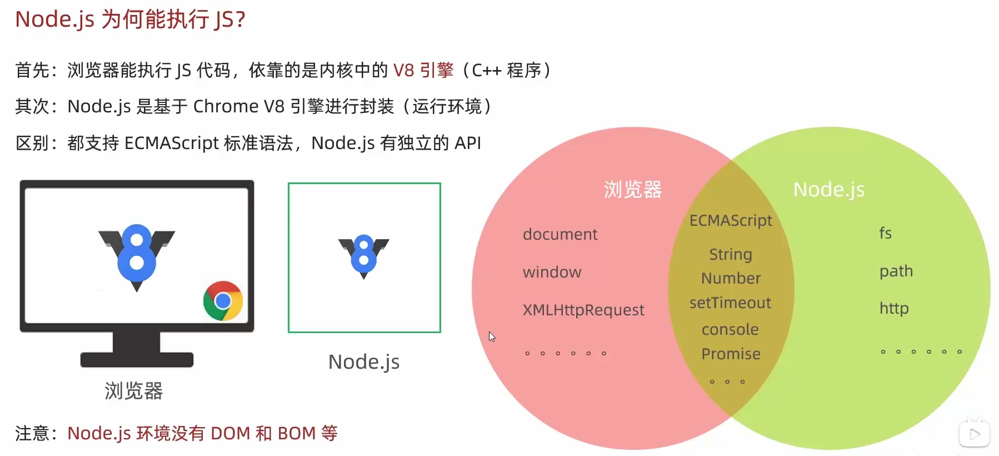
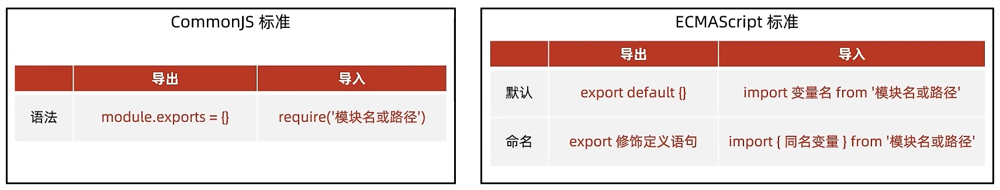
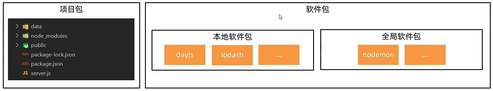

## Node.js的概念与使用

Node.js是一个跨平台的JavaScript运行环境，使得开发者可以搭建服务器端的JavaScript应用程序；



### 通过nvm管理nodejs版本

1. Mac安装nvm

```shell
brew install nvm
```

2. 配置nvm环境变量，在`~/.zshrc`下添加以下内容

```shell
export NVM_DIR=~/.nvm
source $(brew --prefix nvm)/nvm.sh
```

如果是Linux系统可以使用命令：

```shell
curl -o- https://raw.githubusercontent.com/nvm-sh/nvm/v0.38.0/install.sh | zsh
```

执行命令`source ~/.zshrc`使得环境变量生效

3. 安装node.js指定版本(16.19.0兼容vue-admin-template)

```shell
nvm install 16.19.0
```

如果要安装稳定版本则使用命令：nvm install stable

## 二、nodejs模块

### 1. fs模块-读写文件

封装了与本机文件系统进行交互的方法与属性；

语法：

```js
const fs = require('fs') // fs是读写模块的标识符
fs.writeFile('文件路径','写入内容'，err => {
     // 写入后的回调函数
 })
fs.readFile('文件路径',(err,data) => {
  // 读取后的回调函数
  // data是文件内容的Buffer数据流，可以通过toString方法转为字符串
})
```

案例：

使用fs模块写入字符串到文件以及从文件中读取内容

```js
// 导入fs模块
const fs = require('fs');
// 文件写入
fs.writeFile('./1.txt','hello, this is javascript',error => {
    if(error){
        console.log(err);
    }else{
        console.log('写入成功');
    }
})
// 文件读取
fs.readFile('./1.txt',(err,data)=>{
    if(err){
        console.log(err);
    }else{
        console.log(data.toString());
    }
})
```

### 2.path模块-路径处理

建议在Node.js中使用绝对路径；

js中可以使用`--dirname`获取当前程序运行的绝对路径；

使用`path.join()`可以生成作用于当前平台的分隔符将路径片段连接在一起；

语法：

```js
const path = require('path')
path.join('path1','path2',...)
```

案例：

压缩前端html文件，去掉回车符`\r`和`\n`,写入到新的HTML文件中；

```js
const fs = require('fs');
const path = require('path');

fs.readFile(path.join(__dirname,'public/index.html'),(error,data) => {
    if(error){
        console.log(error);
    }else{
        const str = data.toString();
        // 利用正则表达式去除回车与换行
        const resStr = str.replace(/[\r\n]/g,'');
        console.log(resStr);
        // 写入新的文件中
        fs.writeFile(path.join(__dirname,'dist/index.html'),resStr,error => {
            if(error){
                console.log(error);
            }else{
                console.log('写入成功!');
            }
        })
    }
})
```

> 1. 正则表达式中[ ]代表的是一个字符串类，使用g代表全局匹配；
> 2. 如果使用这种正则删除回车与换行，那么HTML中如果写了JavaScript就需要删除双斜杠注释内容，否则这种方式压缩会导致注释符号将所有JavaScript代码注释掉；

### 3.Http模块

URL是统一资源定位符，端口号标记服务器里不同功能的服务程序，端口号范围0-65535，Http协议默认访问80端口；

案例：创建web服务并相应内容给服务器；

语法：

```js
const http = require('http')
const server = http.createServer()

server.on('request',(req,res) => {
  // 设置响应头：内容类型，普通文本；编码格式为utf-8
  res.setHeader('Content-Type','text/plain;charset=utf-8')
  // 设置响应体
  res.end('您好，欢迎使用Nodejs创建的web服务')
})

server.listen(3000,() => {
  console.log('web服务已经启动')
})
```

案例：创建一个web服务，浏览器访问`/index.html`时，返回指定网页内容；

```js
const http = require('http');
const fs = require('fs');
const path = require('path');
const server = http.createServer()

server.on('request', (req, res) => {
    if (req.url === '/ ') {
        fs.readFile(path.join(__dirname, 'dist/index.html'), (err, data) => {
            res.setHeader('Content-Type', 'text/html;charset=utf-8');
            res.end(data.toString());
        })
    } else {
        res.setHeader('Content-Type', 'text/html;charset=utf-8');
        res.end('您访问的路径不存在');
    }
})

server.listen(80, () => {
    console.log('web服务已经启动');
})
```

### 4.项目模块化



#### 4.1 CommonJS标准

定义：在Nodejs中，每个文件都被视为一个单独的模块；

CommonJS标准语法 ：

导出 `model.exports={}`

导入` require('模块名或路径')`

```js
const obj = require('模块名或路径')
// obj 等于module.exports导出的对象
```

```js
const baseURL = 'http://hmajax.itheima.net'
const getArraySum = arr => arr.reduce((sum,val) => sum += val, 0)

module.exports={
  对外属性名1: baseURL,
  对外属性名2: getArraySum
}
```

案例：写一个util.js工具模块，使用CommonJS的语法，定义返回baseURL和数组求和的方法，在另一个JS模块中导入并应用该方法；

```js
// util.js
const baseURL = 'http://hmajax.itheima.net'
const getArraySum = array => array.reduce((sum,val)=>sum += val,0)

module.exports = {
    url:baseURL,
    arraySum: getArraySum
}
```
```js
// demo.js
const obj = require('./util.js');
console.log(obj);
const res = obj.arraySum([1,2,3,4]);
console.log(res);
```

#### 4.2 ECMAScript标准

##### 4.2.1 默认导出导入用法：

```js
const baseURL = 'http://hmajax.itheima.net'
const getArraySum = arr => arr.reduce((sum,val) => sum += val, 0)

export default {
  对外属性名1: baseURL,
  对外属性名2: getArraySum
}
```

导出`export default {}`

导入`import 变量名 from '模块名或路径'`

> Node.js默认支持CommonJS标准语法，如果需要使用ECMAScript语法，在运行模块所在文件夹新建package.json文件，并写入{"type":"module"}

案例：写一个util.js工具模块，使用ECMAScript的语法，定义返回baseURL和数组求和的方法，在另一个JS模块中导入并应用该方法；

```js
// utils.js
const baseURL = 'http://hmajax.itheima.net'
const getArraySum = arr => arr.reduce((sum,val) => sum += val, 0)

export default {
  url: baseURL,
  arraySum: getArraySum
}
```
```json
// package.json
{
  "type":"module"
}
```
```js
// demo.js
import obj from './util.js'

console.log(obj);
const res = obj.arraySum([1,2,3,4]);
console.log(res);
```

##### 4.2.2 命名导出和导入用法：

导出：`export 修饰定义语句`

```js
export const baseURL = 'http://hmajax.itheima.net'
export const getArraySum = arr => arr.reduce((sum,val) => sum += val, 0)
```

导入：`import {同名变量} from '模块名或者路径'`

```js
import {baseURL,getArraySum} from '模块名或路径'
```

案例：使用命名导出的方式，定义返回baseURL和数组求和的方法，在另一个JS模块中导入并应用该方法；

```js
// utils.js
export const baseURL = 'http://hmajax.itheima.net'
export const getArraySum = arr => arr.reduce((sum,val) => sum += val, 0)
```
```js
// package.json
{
  "type":"module"
}
```
```js
// demo.js
import {baseURL,getArraySum} from './util.js'

console.log(baseURL);
console.log(getArraySum([1,2,3,4]));
```

### 5. Nodejs中的包



#### 5.1 包的概念

概念：将模块、代码、和其他资料聚合成一个文件夹；

分类：主要分为**项目包**(编写项目和业务逻辑)和软件包（封装工具和方法）

> 根目录有`package.json`文件用于记录包的清单信息（作者、入口文件、包名）
>
> 导入一个包文件夹时，默认导入的是`index.js`文件，如果没有这个文件，就去`package.json`里找`main`定义的文件；

一个包的项目文件结构：:point_down:

```
├── server.js 				 // 实际写的业务逻辑代码，在这里导入包utils
└── utils							 // 包文件夹📂
    ├── index.js 		   // 这里将arr.js和str.js导出的功能函数进行聚合，导包实际导的是这个js文件
    ├── lib				     // 功能函数文件夹📂
    │   ├── arr.js	   // 实现具体功能
    │   └── str.js	   // 实现具体功能
    └── package.json	 // 记录包的清单信息,定义入口js文件是谁，默认是index.js
```

案例：

```js
// server.js
const obj = require('./utils') 

const res = obj.getArraySum([1,2,3,3]);
console.log(res);
```

```js
// index.js
// 不解构会得到嵌套对象，这里直接解构赋值
const {getArraySum} = require('./lib/arr.js');
const {checkUser,checkPwd} = require('./lib/str.js');

module.exports={
    getArraySum,
    checkUser,
    checkPwd
}
```

```js
// arr.js
const getArraySum = arr => arr.reduce((sum,val) => sum += val,0)

module.exports = {
    getArraySum
}
```

```js
// str.js
const checkUserName = username => {
    return username.length >= 8;
}

const checkPassWord = password => {
    return password.length >= 6;
}

module.exports = {
    checkUser:checkUserName,
    checkPwd:checkPassWord,
}
```

#### 5.2 npm包管理器

**安装本地软件包**

初始化清单文件`npm init -y`,会在当前文件夹下生成一个package.json文件

下载软件包：`npm i 软件包名`，下载包的同时会继续生成`package-lock.json`文件用于固化软件包的版本，防止最新版本更新影响本地；

安装所有依赖：`npm -i`会将`package.json`中声明的包名以及对应版本号都下载到，`node-modules`文件夹里；

删除软件包：`npm uni 软件包名`；

**安装全局软件包**

本地软件包在当前项目中使用，存在于`node_modules`中；

全局软件包对于本机所有项目都可用，存在于系统设置的位置；

这里以安装nodemon为例：

nodemon可以实时检测代码的更改，自动启动程序；

使用：

安装`npm i nodemon -g`;

运行` nodemon 待启动的js文件`
