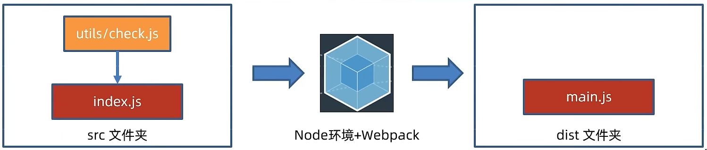

## 一、概念

webpack是一个静态模块打包工具，会从内部构件一个依赖图，将项目中的模块组合成一个或多个bundles，用于展示内容；

打包：把静态模块内容，压缩整合转译，前端工程化；

### 1.1 用法



a. 创建并初始化项目，编写业务源代码；

b. 下载webpack到当前项目中，`npm i webpack webpack-cli --save-dev`,虽然webpack是一个全局工具包但是为了版本独立，这是为项目单独配置，参数`--save-dev`表明当前项目为开发模式；

c. 在项目的package.json文件中，修改以下信息，这里的build是自定义命令，实际运行的命令是webpack

```json
"scripts":{
  "build":"webpack"
}
```

d.运行打包命令，自动生成dist分发文件夹（压缩和优化后最终运行的代码）`npm run build`

### 1.2 修改webpack打包的入口和出口

a.项目根目录新建`webpack.config.js`配置文件；

b. 导出配置对象，配置入口、出口文件的路径；

c. 重新打包盒观察；

```js
const path = require('path')

module.exports ={
    entry: path.resolve(__dirname,'src/login/index.js'),
    output: {
        path: path.resolve(__dirname,'dist'),
        filename: './login/index.js',
        clean: true // 生成打包内容之前，清空目录
    }
}
```

重新打包只需要执行命令`npm run build`即可；

