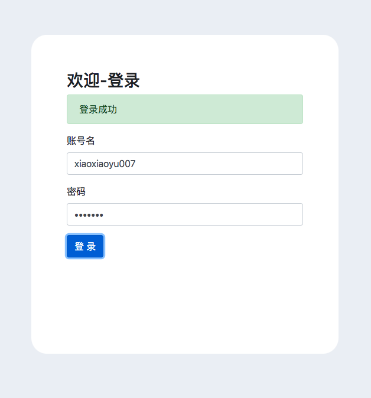
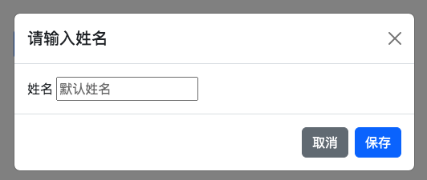
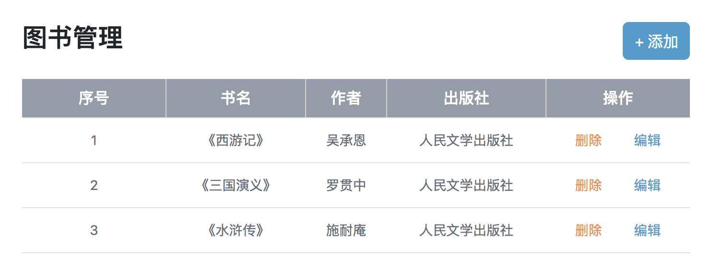
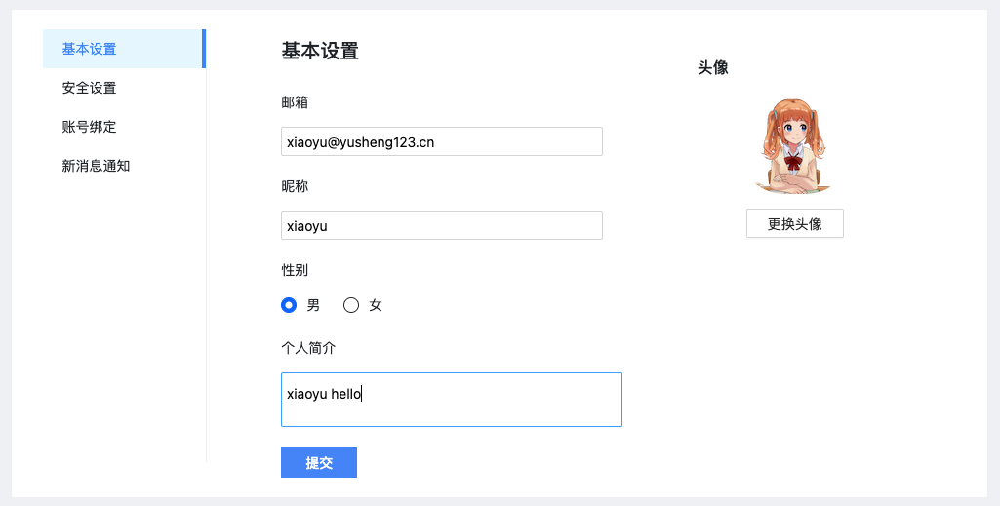
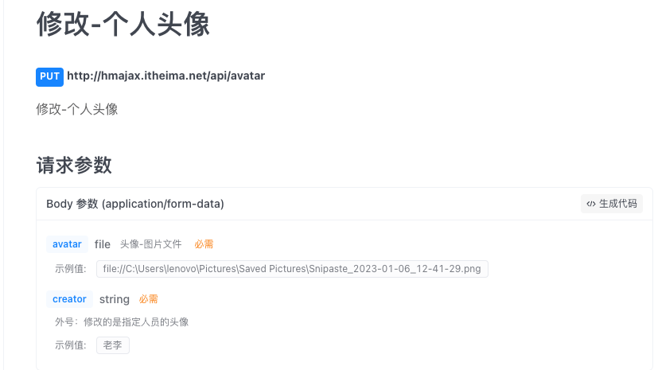
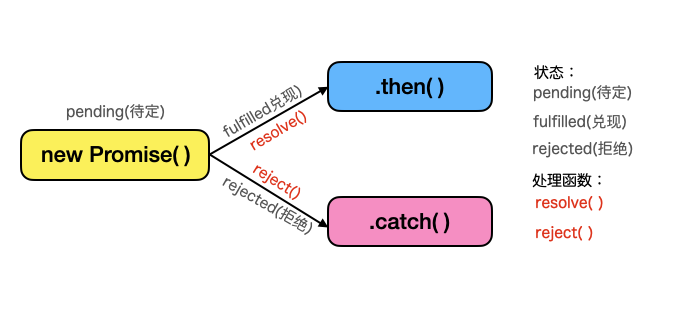
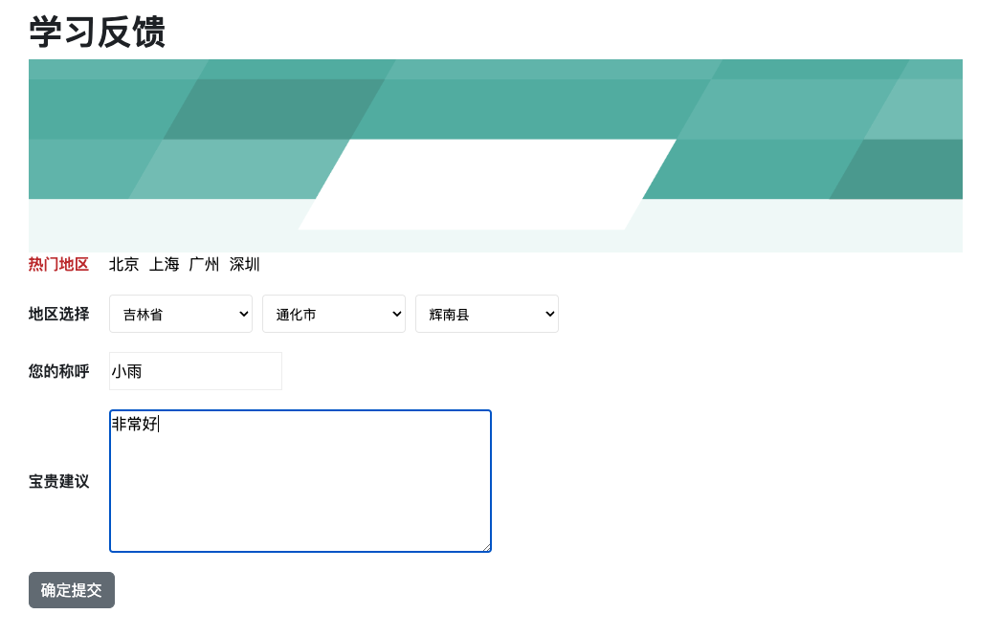

# AJAX学习笔记

## 概念：

定义：AJAX是异步的JavaScript与XML，使用XMLHttpRequest对象与服务器通信；

## 一、axios的使用：

Axios是一个基于promise构建的一个网络请求库，可以用于浏览器和node.js

### 1.引入axios.js

```html
<script src="https://cdn.jsdelivr.net/npm/axios/dist/axios.min.js"></script>
```

### 2.使用axios函数

（1）传入配置对象

（2）使用`.then`回调函数接收结果，并做后续处理

```js
axios({
	url:'目标资源地址'
}).then(result=>{
	// 对服务器返回的数据做后续处理
})
```

### 3.案例:获取API中的省份列表，并在段落中显示出来；

```html
<!doctype html>
<html lang="zh-cmn-Hans">
<head>
    <meta charset="utf-8">
<link rel="icon" href="./img/favicon.ico">
    <title>axios使用</title>
    <script src="https://cdn.jsdelivr.net/npm/axios/dist/axios.min.js"></script>
</head>
<body>
     <p class="my-p"></p>
</body>
<script>
    axios({
        url:'http://hmajax.itheima.net/api/province'
    }).then(result=>{
        // 对服务器返回的数据做后续处理
        console.log(result.data.list.join('<br>'));
        // 把准备好的省份列表插入到页面
        document.querySelector('.my-p').innerHTML = result.data.list.join('<br>');
    })
</script>
</html>
```

## 二、URL统一资源定位符


### 1.URL的概念

url是什么？URL是统一资源定位符，用于访问服务器上的资源；结构由协议、域名、资源路径组成；

### 2.URL查询参数

url参数查询语法：

```
http://xxx.com/xxx/xxx?参数名1=值1&参数名2=值2
```

### 3.axios查询参数

使用axios提供的params选项：

```js
axios({
    url:'目标资源地址',
    params:{
        参数名:值
    }
}).then(result=>{
    // 对服务器返回的数据做后续处理
})
```

实际上axios在运行时会把params中的内容自动拼接到url?参数名=值上面；

### 4.案例：地区查询

> 在ES6中如果属性名和变量同名，可以只写一个；

通过省份和城市名查询该城市的所有区县；

```js
document.querySelector('.sel-btn').addEventListener('click',() => {
  let pname = document.querySelector('.province').value;
  let cname = document.querySelector('.city').value;
  // 基于axios获取服务器数据
  axios({
    url: "http://hmajax.itheima.net/api/area",
    params: {
      pname,
      cname
    }
  }).then(result => {
    let list = result.data.list;
    // 利用map函数将list映射到新的列表中theLi中
    let theLi = list.map(areaName => `<li class="list-group-item">${areaName}</li>`).join('')
    console.log(theLi);
    //将结果插入到元素中显示出来
    document.querySelector('.list-group').innerHTML = theLi;
  })
})
```

### 5.常用的请求方法

| 请求方法 |   操作   |   备注   |
| :------: | :------: | :------: |
|   GET    | 获取数据 |          |
|   POST   | 提交数据 |          |
|   PUT    | 修改数据 | 全部数据 |
|  DELETE  | 删除数据 |          |
|  PATCH   | 修改数据 | 部分数据 |

axios配置请求方法怎么写？

GET方法是默认的可以省略，在参数列表中，如果是get方法则用params,如果是post方法则用data；

```js
axios({
    url:'目标资源地址',
    method:'请求方法',
    params:{
        参数名:值
    }
}).then(result=>{
    // 对服务器返回的数据做后续处理
})
```

### 6.axios错误处理

在axios请求错误时，通过调用`catch`方法传入回调函数并定义形参；例如在用户注册失败时，通过弹窗提示用户错误原因。

```js
axios({
  // 请求选项
}).then(result=>{
  // 对服务器返回的数据做后续处理
}).catch(error=>{
  // 处理错误
})
```

## 三、http协议

### 1.请求报文

Http协议：规定了浏览器发送以及服务器返回内容的格式；

请求报文：浏览器按照Http协议要求的格式，发送给服务器的内容

请求报文的组成部分有：

- 请求行：请求方法、URL、协议
- 请求头：以键值对的格式携带附加的信息
- 空行：分隔请求头，空行之后是发送给服务器的资源、
- 请求体：发送的资源

在浏览器中怎么查看请求报文：

在浏览器的浏览器开发者工具的网络面板中，选择Fetch/XHR中查看，

请求行和请求头在标头选项中，请求体在载荷选项中；


> 在故障排查时可以查看请求报文的请求体内容是否正确；

### 2.响应报文

响应报文的组成部分有:

- 响应行（状态行）：协议、HTTP响应状态码、状态信息
- 响应头：以键值对的格式携带附加信息，比如：Content-Type
- 空行：分隔响应头，空行之后是服务器返回的资源
- 响应体：返回的资源

HTTP响应状态码：用来表明请求是否成功，主要含义如下：

| HTTP状态码 | 说明       | 备注                |
| ---------- | ---------- | ------------------- |
| 1xx        | 信息       |                     |
| 2xx        | 成功       |                     |
| 3xx        | 重定向消息 |                     |
| 4xx        | 客户端错误 | 404服务器找不到资源 |
| 5xx        | 服务端错误 |                     |

## 四.接口文档案例

根据后端的接口文档，前端使用ajax进行调用；

示例API文档：https://apifox.com/apidoc/project-1937884/doc-1695440

### 1.案例-用户登录

- 点击登录时，判断用户名和密码长度；
- 提交数据和服务器通信
- 提示消息

```js
// 点击登录时，用户名和密码长度判断，并提交数据和服务器通信
// 定义一个函数用于显示提示框
function showAlert(msg, isSuccess) {
const alert = document.querySelector(".alert");
let alertStyle = isSuccess ? "alert-success" : "alert-danger";
alert.innerHTML = msg;
alert.classList.add("show");
alert.classList.add(alertStyle);
// 设置一个定时器3s后隐藏提示框
setTimeout(() => {
alert.classList.remove("show");
alert.classList.remove(alertStyle);
}, 3000);
}
// 登录点击事件
document
.querySelector(".btn-login")
.addEventListener("click", function () {
// 获取用户名和密码
const username = document.querySelector(".username").value;
const password = document.querySelector(".password").value;
// 对长度做判断
if (username.length < 8) {
console.log("用户名长度不能低于8");
showAlert("用户名长度不能低于8", false);
return;
}
if (password.length < 6) {
console.log("密码长度不能低于6");
showAlert("密码长度不能低于6", false);
return;
}
axios({
method: "post",
url: "http://hmajax.itheima.net/api/login",
data: {
    username,
    password,
},
})
.then((result) => {
    console.log(result.data.message);
    showAlert(result.data.message, true);
})
.catch((error) => {
    console.log(error.response.data.message);
    showAlert(error.response.data.message, false);
});
});
```



### 2.form-serialize插件

使用form-serialize插件快速收集表单元素的值，获取结果的键值对，根据表单元素中的`name`属性获取键；

语法：

```js
const data = serialize(form, {hash: true, empty:true})
/**
 * 使用serialize函数，快速收集表单元素的值
 *  参数1：要获取的表单名称；
 *  参数2：配置对象 
 *       hash:设置获取数据结构
 *          - false:获取到的是url查询字符串
 *          - true:获取到的是JS对象
 *       empty:设置是否获取空值
 *          - false: 不获取空值
 *          - true: 可以获取到空值
*/
```

使用方法：

引入插件，调用serialize方法获取到表单元素的值，表单元素的`name`属性会成为返回对象的属性名；

将上面用户登录的案例利用`form-serialize`插件获取表单的值，下面是实际的写法：

```js
// 点击登录时，用户名和密码长度判断，并提交数据和服务器通信
// 定义一个函数用于显示提示框
function showAlert(msg, isSuccess) {
const alert = document.querySelector(".alert");
let alertStyle = isSuccess ? "alert-success" : "alert-danger";
alert.innerHTML = msg;
alert.classList.add("show");
alert.classList.add(alertStyle);
// 设置一个定时器3s后隐藏提示框
setTimeout(() => {
alert.classList.remove("show");
alert.classList.remove(alertStyle);
}, 3000);
}
// 登录点击事件
document
.querySelector(".btn-login")
.addEventListener("click", function () {
// 使用form-serialize插件
const form = document.querySelector(".form-example");
const data = serialize(form, { hash: true, empty: true });
// 使用解构赋值的方式获取对象中用户名和密码
const { username, password } = data;
// 对长度做判断
if (username.length < 8) {
console.log("用户名长度不能低于8");
showAlert("用户名长度不能低于8", false);
return;
}
if (password.length < 6) {
console.log("密码长度不能低于6");
showAlert("密码长度不能低于6", false);
return;
}
axios({
method: "post",
url: "http://hmajax.itheima.net/api/login",
data: {
    username,
    password,
},
})
.then((result) => {
    console.log(result.data.message);
    showAlert(result.data.message, true);
})
.catch((error) => {
    console.log(error.response.data.message);
    showAlert(error.response.data.message, false);
});
});
```

### 3.Bootstrap弹框

功能：不离开当前页面，显示单独内容，供用户操作；调用弹窗可以通过两种方式：属性控制和JS控制；

使用方法：

（1）引入bootstrap.css与bootstrap.js

（2）给启动弹框的组件添加bootstrap属性，显示弹框需要两个属性，分别是`data-bs-toggle`和`data-bs-target`

```html
<button class="btn btn-primary" data-bs-toggle="modal" data-bs-target=".my-box">显示弹框</button>
```

（3）通过自定义属性，控制弹框的显示和隐藏，隐藏弹框需要设置属性`data-bs-dismiss="modal"`

通过属性控制弹窗的显示和隐藏具体写法如下：

```html
<div class="container mt-3">
    <button class="btn btn-primary" data-bs-toggle="modal" data-bs-target=".my-box">显示弹框</button>
    <!-- 弹框标签 -->
    <div class="modal my-box" tabindex="-1">
        <div class="modal-dialog">
            <div class="modal-content">
                <div class="modal-header">
                    <h5 class="modal-title">请输入姓名</h5>
                    <button type="button" class="btn-close" data-bs-dismiss="modal" aria-label="Close"></button>
                </div>
                <div class="modal-body">
                    <span>姓名</span>
                    <input type="text" class="form-contorl" placeholder="默认姓名">
                </div>
                <div class="modal-footer">
                    <button type="button" class="btn btn-secondary" data-bs-dismiss="modal">
                        取消
                    </button>
                    <button type="button" class="btn btn-primary">
                        保存
                    </button>
                </div>
            </div>
        </div>
    </div>
</div>
```



通过JS控制，显示或隐藏弹框：

```js
// 创建弹框对象
const modalDom = document.querySelector('.my-box');
const modal = new bootstrap.Modal(modalDom);
// 显示弹框
modal.show();
// 隐藏弹框
modal.hide();
```


### 4.案例：图书管理管理系统

获取图书列表的的API地址`http://hmajax.itheima.net/api/books`

#### a.获取内容并渲染到网页上

>  这里重点需要掌握的技巧是使用map将列表对象中的元素映射到html元素中,并进行字符串拼接的过程。map函数可以传入三个参数(element、index、array)，具体用法可见：https://www.freecodecamp.org/chinese/news/javascript-map-how-to-use-the-js-map-function-array-method/

```js
window.addEventListener('load',()=>{
    const creator = '小雨';
    // 封装一个函数，获取并渲染图书列表
    function getBookList(){
        axios({
            url: 'http://hmajax.itheima.net/api/books',
            params: {
                creator,
            }
        }).then(result => {
            const bookList = result.data.data;
            console.log(bookList);
            const bookItemHtml = bookList.map((item,index) => {
                return `<tr>
                <td>${index + 1}</td>
                <td>${item.bookname}</td>
                <td>${item.author}</td>
                <td>${item.publisher}</td>
                <td>
                    <span class="del">删除</span>
                    <span class="edit">编辑</span>
                </td>
            </tr>`
            }).join('');
            document.querySelector('.list').innerHTML = bookItemHtml;
        })
    }
    // 执行函数
    getBookList()
})
```



#### b.添加图书信息

```js
// 目标2：添加图书信息
    // 获取弹窗信息
const addModalDom = document.querySelector('.add-modal');
const addModal = new bootstrap.Modal(addModalDom);
document.querySelector('.add-btn').addEventListener('click',()=>{
    // 获取表单信息
    const bookItemForm = document.querySelector('.add-form');
    const bookItem = serialize(bookItemForm,{hash:true,empty:true});
    // 提交表单信息
    axios({
        url: 'http://hmajax.itheima.net/api/books',
        method: 'post',
        data:{
            // 这里的...是对象展开运算符
            ...bookItem,
            // 这里的creator是一个全局变量
            creator
        }
    }).then(result => {
        // 添加成功后请求重新渲染页面
        getBookList();
        // 重置表单，防止点击添加按钮后，上一次添加的内容还在
        bookItemForm.reset();
        // 隐藏弹框
        addModal.hide();
    })
});
```

#### c.删除图书信息

> 思路：
>
> a.绑定点击事件获取图书id 
>
> b.调用删除接口
>
> c.刷新图书列表

由于每一行图书信息是动态生成的，如果给每一行图书的删除按钮添加点击事件，则需要委托其父级元素设置点击事件。再定义一个判断条件如果点击的元素中含有`del`类，则获取其父元素的`id`。

在渲染图书列表时就给删除按钮的父级元素创建一个自定义属性`data-id`，在点击事件中，查询父元素的`id`属性即可通过AJAX删除指定ID的元素列表；

在接口文档中看到需要提供PATH参数，这是一种新的传参方式（路径传参）


将URL改为模板字符串即可。

```js
// 目标3：删除图书信息
document.querySelector('.list').addEventListener('click',function(e) {
    if(e.target.classList.contains('del')){
        // 获取图书id
        const id = e.target.parentNode.dataset.id;
        console.log(id);
        // 调用删除接口
        axios({
            method: 'delete',
            url: `http://hmajax.itheima.net/api/books/${id}`,
        }).then(result =>{
            // 刷新图书列表
            getBookList();
        });
    }
})
```

#### d.编辑图书信息

实现该功能主要需要完成以下部分的内容：

编辑弹窗的显示和隐藏；

获取当前图书的ID并通过查询接口获取图书信息填充到弹窗中；

点击提交按钮时，提交表单中的内容到后台，并重新渲染前端页面内容；

```js
// 目标4：编辑图书信息
// 获取编辑弹窗信息
const editModalDom = document.querySelector('.edit-modal');
const editModal = new bootstrap.Modal(editModalDom);
document.querySelector('.list').addEventListener('click',function(e){
    if(e.target.classList.contains('edit')){
        // 点击编辑按钮打开弹框
        editModal.show();
        // 获取图书id
        const theId = e.target.parentNode.dataset.id;
        // 获取图书详情信息
        axios({
            url: `http://hmajax.itheima.net/api/books/${theId}`,
        }).then(result => {
            const bookObj = result.data.data;
            const keys = Object.keys(bookObj);
            console.log(keys);
            keys.forEach(key => {
                document.querySelector(`.edit-form .${key}`).value = bookObj[key];
            });
        });
    }
})
// 点击修改按钮后保存数据提交到服务器
document.querySelector('.edit-btn').addEventListener('click',function(){
    // 获取编辑表单信息
    const editForm = document.querySelector('.edit-form');
    // 保存修改后的表单内容
    const {id,bookname,author,publisher} = serialize(editForm,{hash:true,empty:true});
    // 将表单中的内容提交到服务器
    axios({
            method: 'put',
            url: `http://hmajax.itheima.net/api/books/${id}`,
            data: {
                id,
                bookname,
                author,
                publisher,
                creator
            }
        }).then(() => {
            // 刷新页面
            getBookList();
            // 隐藏弹窗
            editModal.hide();
        });
})
```

### 5.案例：图片上传

图片上传的思路：

（1）获取图片文件对象

给input标签添加一个change事件；

（2）使用FormData携带图片文件

```js
const fd = new FormData()
fd.append(参数名,值)
```

（3）提交表单数据到服务器

通过ajax将图片提交到服务器，并拿到后端返回的图片URL；

```js
document.querySelector('.upload').addEventListener('change',(e)=>{
    // 获取图片文件
    console.log(e.target.files[0]);
    // 使用FormData携带图片文件
    const fd = new FormData();
    fd.append('img',e.target.files[0])
    // 提交到服务器
    axios({
        url: 'http://hmajax.itheima.net/api/uploadimg',
        method: 'POST',
        data: fd
    }).then(result => {
        console.log(result.data.data);
        const imgurl = result.data.data.url;
        document.querySelector('.my-img').src = imgurl;
    })
})
```

### 6.案例：更换网站背景

实现一个案例，点击按钮上传图片，并替换网页背景，页面刷新后依然不变；

思路：

* 设置一个`file`类型的input标签，选中本地图片后，添加一个`change`事件，将图片以`FormData`的方式通过Ajax提交到后端服务器；
* 获取后端返回的url,给body标签赋予backgroundImage属性，从而实现背景图片的更换；
* 上传成功后保存url到本地存储`localStorage.setItem(key,value)`；

```js
window.addEventListener('load',() => {
    // 逻辑
    document.querySelector('.bg-ipt').addEventListener('change',e => {
        console.log(e.target.files[0]);
        const fd = new FormData();
        fd.append('img',e.target.files[0])
        // 通过Ajax将图片传给后端服务器
        axios({
            method: 'POST',
            url:'http://hmajax.itheima.net/api/uploadimg',
            data: fd,
        }).then(result => {
            console.log(result);
            const imgURL = result.data.data.url;
            console.log(imgURL);
            document.querySelector('body').style.backgroundImage = `url(${imgURL})`;
            // 将URL存到本地
            localStorage.setItem('backImg',imgURL);
        })
    })
    // 网页运行后获取url地址
    const bgUrl = localStorage.getItem('backImg');
    bgUrl && (document.querySelector('body').style.backgroundImage = `url(${bgUrl})`);
})
```

### 7.案例：个人信息设置

实现效果：



该案例可以分为四个主要步骤：

#### a.信息渲染

```js
const creator = "xiaoyu";
function getProfile() {
    axios({
        url: 'http://hmajax.itheima.net/api/settings',
        params:{
            creator
        }
    }).then(result => {
        // 获取个人信息
        const profile = result.data.data;
        // 遍历个人信息属性并显示到页面中
        Object.keys(profile).forEach(key => {
            // 对于性别和头像需要特殊处理
            if(key === 'avatar'){
                document.querySelector('.prew').src = profile.avatar;
            }else if(key === 'gender'){
                const genderList = document.querySelectorAll('.gender');
                genderList[profile.gender].checked = true;
            }else{
                document.querySelector(`.${key}`).value = profile[key];
            }
        });
    });
}
```

#### b.头像修改

> 在做的这一步的时候，总是提交出错，原因是没有看清api文档中的参数要求



需要在整个FormData对象里append两个对象avatar和creator；

```js
document.querySelector('.upload').addEventListener('change',(e) => {
    const fd = new FormData();
    fd.append('avatar',e.target.files[0]);
    fd.append('creator',creator);
    axios({
        url: "http://hmajax.itheima.net/api/avatar",
        method: "PUT",
        data:fd,
    }).then(result => {
        document.querySelector('.prew').src = result.data.data.avatar;
    });
});
```

#### c.提交表单

这里需要注意给要提交的的对象添加一个属性，以及将字符串型的“0”转为整型的“0”

```js
document.querySelector('.submit').addEventListener('click',() => {
    const form = document.querySelector('.user-form');
    const newProfile = serialize(form,{hash:true,empty:true});
    // 对象可以通过赋值的方式添加属性
    newProfile.creator = creator;
    // 将字符串型的“0”转为整型的“0”
    newProfile.gender = +newProfile.gender;
   
    axios({
        url: 'http://hmajax.itheima.net/api/settings',
        method: 'put',
        data:{
            ...newProfile,
        }
    }).then(result => {
        console.log(result);
    });
});
```

#### d.结果提示

这里需要将提交成功的toast显示出来，如何使用Bootstrap显示提示框呢？

```html
<div class="toast" data-bs-delay="1500">
  提示框内容
</div>
```

```js
const toastDom = document.querySelector('css选择器');
// 创建提示框对象
const toast = new bootstrap.Toast(toastDom);
// 显示提示框
toast.show()
```

实际写法：

```html
<!-- toast提示框 -->
<div class="toast my-toast" data-bs-delay="1500">
    <div class="toast-body">
        <div class="alert alert-success info-box">
            操作成功
        </div>
    </div>
</div>
```

```js
const toastDom = this.document.querySelector('.my-toast');
const toast = new bootstrap.Toast(toastDom);
toast.show()
```

## 五、XMLHttpRequest

**定义：**XMLHttpRequest（XHR）对象用于与服务器交互，通过XMLHttpRequest可以在不刷新页面的情况下请求特定URL，获取数据，这允许网页在不影响用户操作的情况下，更新页面的布局内容。在AJAX编程中被大量使用；

使用XMLHttpRequest的方法：

```js
// 创建xhr对象
const xhr = new XMLHttpRequest()
xhr.open('请求方法','url网址')
xhr.addEventListener('loadend',() => {
  // 输出响应结果
  console.log(xhr.response)
})
// 正式发送请求
xhr.send()
```

> 使用axios返回的结果是对象，而原生的XHR返回的是JSON字符串，如果需要将JSON字符串转化为对象可以使用`JSON.parse()`的方式；
>
> XHR如果需要携带查询参数则直接在URL里设置；

### 1. 案例：使用XHR获取并展示所有省份的名字

```js
document.querySelector('.my-btn').addEventListener('click',() => {
    const xhr = new XMLHttpRequest();
    xhr.open('get','http://hmajax.itheima.net/api/province');
    xhr.addEventListener('loadend',() =>{
        const data = JSON.parse(xhr.response);
        console.log(xhr.response);
        document.querySelector('.res').innerHTML = data.list.join('</br>');
    });
    xhr.send();
})
```

### 2.案例：使用XHR获取并展示制定城市的地区列表

> 知识拓展：对于多参数查询字符串，是可以根据对象名生成的。

```js
// 创建URLSearchParams对象
const paramsObj = new URLSearchParams({
  参数名1:值1,
  参数名2:值2
})
// 生成指定格式的查询字符串
const queryString = paramsObj.toString()
// 结果：参数名1=值1&参数名2=值2
```

```js
document.querySelector('.my-btn').addEventListener('click',() => {
    const formDom = document.querySelector('.user-form');
    const form = serialize(formDom,{hash:true,empty:true});
    const pname = form.province;
    const cname = form.city;
    // 获取xhr查询参数
    const paramsObj = new URLSearchParams({
            pname:pname,
            cname:cname
        }
    );
    const queryURL = paramsObj.toString();
    const xhr = new XMLHttpRequest();
    xhr.open('get',`http://hmajax.itheima.net/api/area/?${queryURL}`);
    xhr.addEventListener('loadend',()=>{
        // JSON.parse()将JSON字符串转为JS对象
        const resObj = JSON.parse(xhr.response);
        const resItem = resObj.list.map(function (areaName) {
            return `<li class="list-group-item">${areaName}</li>`
        }).join('');
        console.log(resItem); 
        document.querySelector('.list-group-item').innerHTML = resItem;
    });
    xhr.send();
})
```

### 3.案例：使用XHR完成数据提交的功能

使用方法：

```js
// 告诉服务器需要传递的内容类型是JSON字符串
xhr.setRequestHeader('Content-Type','application/json')
// JSON.stringify将JS对象转为JSON字符串
const user = {key1:value1,key2:value2};
const userStr = JSON.stringify(user);
// 发送请求体数据
xhr.send(userStr)
```

实际用法：

```js
document.querySelector('.my-btn').addEventListener('click',() => {
    const formDom = document.querySelector('.user-form');
    const form = serialize(formDom,{hash:true,empty:true});
    const pname = form.province;
    const cname = form.city;
    // 获取xhr查询参数
    const paramsObj = new URLSearchParams({
            pname:pname,
            cname:cname
        }
    );
    const queryURL = paramsObj.toString();
    const xhr = new XMLHttpRequest();
    xhr.open('get',`http://hmajax.itheima.net/api/area/?${queryURL}`);
    xhr.addEventListener('loadend',()=>{
        const resItem = JSON.parse(xhr.response).list.map(function (areaName) {
            return `<li class="list-group-item">${areaName}</li>`
        }).join('');
        console.log(resItem); 
        document.querySelector('.list-group-item').innerHTML = resItem;
    });
    xhr.send();
})
```

## 六、Promise对象

**定义**：Promise对象用于表示一个异步操作的最终结果值；

**使用Promise的好处：**

可以链式调用

**用法**：

```js
// 1.创建Promise对象
const p = new Promise((resove,reject) => {
  // 2.执行异步任务，并传递结果
  setTimeout(() => {
    // resove('模拟成功结果');
    // reject(new Error('模拟失败结果'))
  },2000);
})
p.then(result => {
  // 成功
  console.log(result);
}).catch(error => {
  // 失败
  console.log(error);
})
```

### 1. Promise的三种状态



### 2.案例：使用Promise+XHR获取省份列表

需求：使用Promise管理XHR获取省份列表，并展示到页面上

实现：

```js
// 1.创建Promise对象
const p = new Promise((resolve,reject) => {
    // 2.执行XHR异步代码，获得省份列表
    const xhr = new XMLHttpRequest();
    xhr.open('get','http://hmajax.itheima.net/api/province');
    xhr.addEventListener('loadend',() => {
        // 根据XHR返回的结果，转为对象分别给resolve和reject函数作为参数传进去
        if(xhr.status >= 200 && xhr.status < 300){
            resolve(JSON.parse(xhr.response));
        }else{
            reject(new Error(xhr.response));
        }
    });
    xhr.send();
});
// 3.关联成功或失败函数做后续处理,result和error为上面传入的参数对象
p.then(result => {
    document.querySelector('.my-p').innerHTML = result.list.join('</br>');
}).catch(error => {
    console.dir(error);
    document.querySelector('.my-p').innerHTML = error.message;
})
```

### 3.使用XHR与Promise封装自定义的axios

#### 案例1：实现获取省份列表

**需求：**通过Promise和XHR实现对axios的自定义封装，完成返回省份列表的获取；

**思路：**

Step1：封装myAxios函数，传入config配置对象，返回Promise对象；

Step2：发起xhr请求，定义默认方法为get,定义接收URL参数；

Step3：定义成功或失败请求的处理程序，将传入结果对象

Step4：实际调用自封装的函数，检查效果

```js
function myAxios(config) {
    // 1. 定义myAxios函数,接受配置对象，返回Promise对象
    const p = new Promise((resolve,reject) => {
        // 2.发起xhr请求
        const xhr = new XMLHttpRequest();
        xhr.open(config.method || 'get',config.url);
        xhr.addEventListener('loadend',() => {
            // 3.判断响应结果
            if(xhr.status >= 200 && xhr.status < 300){
                return resolve(JSON.parse(xhr.response));
            }else{
                return reject(new Error(xhr.response));
            }
        });
        xhr.send();
    });
    return p;   
}
// 4.调用自封装的my-axios
myAxios({
    url: 'http://hmajax.itheima.net/api/province',
}).then(result => {
    document.querySelector('.my-p').innerHTML = result.list.join('</br>');
}).catch(error => {
    document.querySelector('.my-p').innerHTML = error.message;
})
```

#### 案例2：实现获取地区列表

**需求：**修改myAxios函数，支持传递params参数，完成地区列表的查询

**思路：**需要考虑自定义的axios对传入的params参数的支持，可以借助URLSearchParams实现将params参数转为URL连接;

```js
function myAxios(config) {
    // 1. 定义myAxios函数,接受配置对象，返回Promise对象
    return new Promise((resolve,reject) => {
        // 2.对params进行处理,前提是有params参数
        if(config.params){
            const paramsObj = new URLSearchParams(config.params);
            const queryString = paramsObj.toString();
            config.url += `?${queryString}`;
        }
        // 3.发起xhr请求
        const xhr = new XMLHttpRequest();
        xhr.open(config.method || 'get',config.url);
        xhr.addEventListener('loadend',() => {
            // 4.判断响应结果
            if(xhr.status >= 200 && xhr.status < 300){
                return resolve(JSON.parse(xhr.response));
            }else{
                return reject(new Error(xhr.response));
            }
        });
        xhr.send();
    });         
}
```

#### 案例3：实现注册用户功能

**需求：**修改myAxios函数，支持传递请求体数据，完成用户注册功能；

**思路：**

Step1：myAxios函数调用后，判断data选项

Step2：转换数据类型，在send方法中发送

Step3：使用自己封装的myAxios完成用户注册功能

**实现：**

```js
function myAxios(config) {
    // 1. 定义myAxios函数,接受配置对象，返回Promise对象
    return new Promise((resolve,reject) => {
        // 2.对params进行处理,前提是有params参数
        if(config.params){
            const paramsObj = new URLSearchParams(config.params);
            const queryString = paramsObj.toString();
            config.url += `?${queryString}`;
        }
        
        // 3.发起xhr请求
        const xhr = new XMLHttpRequest();
        xhr.open(config.method || 'get',config.url);
        xhr.addEventListener('loadend',() => {
            // 4.判断响应结果
            if(xhr.status >= 200 && xhr.status < 300){
                return resolve(JSON.parse(xhr.response));
            }else{
                return reject(new Error(xhr.response));
            }
        });
        // 对data进行处理
        if(config.data){
            const jsonString = JSON.stringify(config.data);
            xhr.setRequestHeader('Content-Type','application/json')
            xhr.send(jsonString);
        }else{
            xhr.send();
        }
    });         
}
document.querySelector('.my-btn').addEventListener('click',() => {
    // 5.调用自封装的my-axios
    myAxios({
        url: 'http://hmajax.itheima.net/api/register',
        method: 'post',
        data: {
            username: 'xiaoyu1927',
            password: '7654321'
        }
    }).then(result => {
        console.log(result);
        alert(result.message);
    }).catch(error => {
        console.dir(error);
        alert(error.message);
    })
})
```

### 4.案例：天气预报

步骤：

Step1：默认获取北京市天气数据，并展示；

>  这一步其实就是通过axios获取后端数据，并显示到html页面中，`${}`将网页中的元素替换为JS对象属性值，对于需要批量操作的内容，可以使用map进行映射操作；

Step2：搜索🔍城市列表，展示；

> 同样是调用axios,需要给搜索框设置对`input`事件的监听

```js
const searchInput = document.querySelector('.search-city');
searchInput.addEventListener('input',() => {
    // 获取输入框中输入的内容
    const searchName = searchInput.value;
    // 通过axios获取城市列表
    myAxios({
        url: 'http://hmajax.itheima.net/api/weather/city',
        params:{
            city:searchName,
        }
    }).then(result => {
        console.log(result);
        const cityList = result.data;
        const cityListStr = cityList.map(item => {
            return `<li class="city-item">${item.name}</li>`;
        }).join('');
        document.querySelector('.search-list').innerHTML = cityListStr;
    });
});
```

Step3：点击城市，显示对应天气数据

> 对搜索到的城市列表添加一个点击事件，获取该城市的cityCode，调用前面的方法将结果渲染到页面中；
>
> 由于城市列表是动态生成的，如果需要绑定点击事件则需要通过事件委托(绑定父元素并通过e.target.classList.contains来获取元素)

在Step2中添加的城市列表city-item也要添加自定义属性`data-code=${item.code}`

```js
return `<li class="city-item" data-code="${item.code}">${item.name}</li>`;
```

```js
document.querySelector('.search-list').addEventListener('click',(e) => {
    // 通过事件委托，判断点击的是否是城市item
    if(e.target.classList.contains('city-item')){
        const cityCode = e.target.dataset.code;
        getWeather(cityCode)
    }
})
```

**最终效果：**


## 七、同步与异步

同步：逐行执行，需要原地等待结果后，才继续向下执行；

异步：不必等待任务完成，在将来完成后触发一个回调函数；

### 1.回调函数地狱问题：

概念：在回调函数中嵌套回调函数，一直嵌套下去就形成了回调函数地狱；

缺点：耦合性严重，异常无法捕获，可读性差；

通过一个案例，理解回调函数地狱问题：

```js
//根据省名称获取城市名称，再根据省名称和城市名称获取地区名称，axios模拟回调函数地狱问题
axios({url:'http://hmajax.itheima.net/api/province'}).then(result => {
    const pname = result.data.list[0]
    document.querySelector('.province').innerHTML = pname;
    axios({url:'http://hmajax.itheima.net/api/city',params:{pname}}).then(result => {
        const cname = result.data.list[0];
        document.querySelector('.city').innerHTML = cname;
        axios({url:'http://hmajax.itheima.net/api/area',params:{pname,cname}}).then(result =>{
            const areaname = result.data.list[0];
            document.querySelector('.area').innerHTML = areaname;
        })
    })
})
```

这种嵌套问题，出现异常是无法捕获的；

### 2.Promise链式调用问题

依靠then()方法会返回一个新生成的Promise对象的特性，继续串联下一环任务，直到结束；


```js
// 将省份变量pname定义为全局变量
let pname = '';
axios({url:'http://hmajax.itheima.net/api/province'}).then(result => {
    pname = result.data.list[0];
    document.querySelector('.province').innerHTML = pname;
  	// 关键点是axios结尾返回一个新的Promise对象，这样就可以链式调用了
    return axios({url:'http://hmajax.itheima.net/api/city',params:{pname}})
}).then(result => {
    const cname = result.data.list[0];
    document.querySelector('.city').innerHTML = cname;
  	// 由于这里的pname是在兄弟作用域中，所以将pname定义为全局变量；
    return axios({url:'http://hmajax.itheima.net/api/area',params:{pname,cname}})
}).then(result => {
    const area = result.data.list[0];
    document.querySelector('.area').innerHTML = area;
})
```

### 3. 异步编程的终极解决方案-async、await

使用async和await关键字后，可以更简洁的写出基于Promise的异步行为，不需要刻意地链式调用Promise；

```js
//获取默认省市区
async function getDefaultArea(){
    const pObj = await axios({url:'http://hmajax.itheima.net/api/province'});
    const pname = pObj.data.list[0];
    const cObj = await axios({url:'http://hmajax.itheima.net/api/city',params:{pname}});
    const cname = cObj.data.list[0];
    const aObj = await axios({url:'http://hmajax.itheima.net/api/area',params:{pname,cname}});
    const aname = aObj.data.list[0];
    // 赋予到页面上
    document.querySelector('.province').innerHTML = pname;
    document.querySelector('.city').innerHTML = cname;
    document.querySelector('.area').innerHTML = aname;
}
getDefaultArea();
```

> async修饰函数名表明该函数为异步函数，await表明该任务为异步任务，会原地等待后续执行完毕后将结果返回，替代then回调函数的功能；

在使用async函数和await关键字时，如何捕获错误？答案是使用`try...catch`关键字；

```js
//获取默认省市区
async function getDefaultArea() {
    try {
        const pObj = await axios({ url: 'http://hmajax.itheima.net/api/province' });
        const pname = pObj.data.list[0];
        const cObj = await axios({ url: 'http://hmajax.itheima.net/api/city', params: { pname } });
        const cname = cObj.data.list[0];
        const aObj = await axios({ url: 'http://hmajax.itheima.net/api/area', params: { pname, cname } });
        const aname = aObj.data.list[0];
        // 赋予到页面上
        document.querySelector('.province').innerHTML = pname;
        document.querySelector('.city').innerHTML = cname;
        document.querySelector('.area').innerHTML = aname;
    } catch (error) {
        console.dir(error);
    }
}
getDefaultArea();
```

### 4.事件循环EventLoop

Javascript 单线程为了让耗时代码不阻塞其他代码运行，设计了事件循环模型；

执行代码和收集异步任务，在调用栈空闲时，反复调用任务队列里回调函数执行机制；

**为什么要有事件循环？**

因为JavaScript是单线程的，为了不阻塞JavaScript引擎，而设计执行的代码模型

**事件循环的过程:**

a.执行同步代码，遇到异步代码交给宿主浏览器环境执行；

b.异步有了结果后，把回调函数放入任务队列排队；

c.当调用栈空闲后，返回调用任务队列里的回调函数；

### 5.宏任务与微任务

ES6之后引入了promise对象，让JS引擎也能发起异步任务： 

宏任务：由浏览器环境执行的异步代码,例如JS脚本事件、定时器、AJAX、用户交互事件

微任务：由JS引擎环境执行的异步代码，例如Promise对象.then()回调；

> Promise.then()属于微任务队列，优先级高于宏任务队列；

#### 事件循环经典面试题：

```js
// 回答代码执行顺序
console.log(1);
setTimeout(() => {
    console.log(2);
    const p = new Promise(resolve => resolve(3));
    p.then(result => console.log(result))
},0);
const p = new Promise(resolve => {
    setTimeout(() => {
        console.log(4);
    },0);
    resolve(5);
});
p.then(result => console.log(result));
const p2 = new Promise(resolve => resolve(6));
p2.then(result => console.log(result));
console.log(7);
```

答案：1 7 5 6 2 3 4 

### 6.Promise.all静态方法

语法：

```js
const p = Promise.all([Promise对象,Promise对象,...])
p.then(result => {
// result结果：[Promise对象成功结果，Promise对象成功结果,...]
}).catch(error => {
// 第一个失败的Promise对象，抛出的异常
})
```

#### 案例1：同时获取北上广深四个城市的天气信息

```js
const bjPromise = axios({url:'http://hmajax.itheima.net/api/weather',params:{city:'110100'}})
const shPromise = axios({url:'http://hmajax.itheima.net/api/weather',params:{city:'310100'}})
const gzPromise = axios({url:'http://hmajax.itheima.net/api/weather',params:{city:'440100'}})
const szPromise = axios({url:'http://hmajax.itheima.net/api/weather',params:{city:'440300'}})
const p = Promise.all([bjPromise,shPromise,gzPromise,szPromise]);
p.then(result => {
    console.log(result);
    const weathers = result.map(item => {
        return `<li>${item.data.data.area}---${item.data.data.weather}</li>`;
    }).join('');
    document.querySelector('.my-ul').innerHTML = weathers
    
}).catch(error => {
    console.dir(error);
})
```

#### 案例2：展示商品到分类页面上

思路：遍历所有的一级分类数据；遍历id，创建获取二级分类请求；合并所有二级分类Promise对象；等待同时成功，开始渲染页面。

```js
axios({ url: 'http://hmajax.itheima.net/api/category/top' }).then(result => {
            console.log(result.data.data);
            // 获取二级列表的Promise对象
            const subPromise = result.data.data.map(itemTop => {
                return axios({ url: 'http://hmajax.itheima.net/api/category/sub', params: { id: itemTop.id } });
            })
            // 合并二级Promise对象
            const promiseAll = Promise.all(subPromise).then(result => {
                console.log(result);
                const showStr = result.map(item => {
                    const subObj = item.data.data;
                    return `<div class="item">
                            <h3>${subObj.name}
                            <ul>
                                ${subObj.children.map(item => {
                                return `<li>
                                            <a href="javascript:;">
                                            
                                            </a>
                                            <p>${item.name}</p>
                                        </li>`
                                }).join('')
                            }
                            </ul>
                            </h3>
                            </div>`
                            }).join('');
                document.querySelector('.sub-list').innerHTML = showStr;
            })
        })
```

#### 案例3：学习反馈-省市区切换



```js
// 1.1 设置省份下拉菜单数据
// 创建一个全局变量
let pname = '';
axios({ url: 'http://hmajax.itheima.net/api/province' }).then(provinceList => {
    const proinceListStr = provinceList.data.list.map(pname => {
        return `<option value=${pname}>${pname}</option>`
    }).join('');
    document.querySelector('.province').innerHTML = `<option value="">省份</option>` + proinceListStr;
})

// 1.2 切换省份
document.querySelector('.province').addEventListener('change', async e => {
    // 用户选中的省份
    pname = e.target.value;
    const cityList = await axios({ url: 'http://hmajax.itheima.net/api/city', params: { pname: e.target.value } });
    console.log(cityList.data.list);
    const cityListStr = cityList.data.list.map(cname => {
        return `<option value=${cname}>${cname}</option>`
    }).join('');
    document.querySelector('.city').innerHTML = `<option value="">城市</option>` + cityListStr;
    document.querySelector('.area').innerHTML = `<option value="">地区</option>`
})

// 1.3 切换城市
document.querySelector('.city').addEventListener('change', async e => {
    // 用户选择的城市
    const areaList = await axios({ url: 'http://hmajax.itheima.net/api/area', params: { pname: pname, cname: e.target.value }});
    console.log(areaList.data.list);
    const areaListStr = areaList.data.list.map(aname => {
        return `<option value=${aname}>${aname}</option>`
    }).join('');
    document.querySelector('.area').innerHTML = `<option value="">地区</option>` + areaListStr;
})

// 2.收集数据并提交保存到后端
document.querySelector('.submit').addEventListener('click', async () => {
    // 获取表单中的内容
    try{
        const form = document.querySelector('.info-form')
        const formRes = serialize(form, { hash: true, empty: true });
        const res = await axios({ url: 'http://hmajax.itheima.net/api/feedback', method: 'post', data: { ...formRes } });
        console.log(res);
        alert(res.data.message)
    }catch (error){
        console.dir(error);
        alert(error.response.data.message);
    }
})
```

