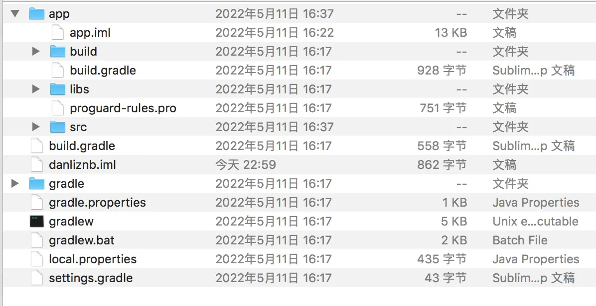

AndroidStudio项目中有两个build.gradle文件，一个在最外层目录下，一个在app目录下。

##### 最外层的bulid.gradle文件内容如下：
```
buildscript {
    repositories {
        google()
        jcenter()
        
    }
    dependencies {
        classpath 'com.android.tools.build:gradle:3.5.2'
        
        // NOTE: Do not place your application dependencies here; they belong
        // in the individual module build.gradle files
    }
}

allprojects {
    repositories {
        google()
        jcenter()
        
    }
}
```
build.gradle文件中，两处仓库中都声明了`jcenter()`这行配置，它是一个代码托管仓库，有了这行配置表明当前项目可以引用jcenter上的开源项目。classpath声明了gradle插件版本用于构建Android项目。

##### APP目录下的build.gradle文件
```
apply plugin: 'com.android.application'

android {
    compileSdkVersion 32
    buildToolsVersion "32.0.0"
    defaultConfig {
        applicationId "com.example.danliznb"
        minSdkVersion 19
        targetSdkVersion 32
        versionCode 1
        versionName "1.0"
        testInstrumentationRunner "androidx.test.runner.AndroidJUnitRunner"
    }
    buildTypes {
        release {
            minifyEnabled false
            proguardFiles getDefaultProguardFile('proguard-android-optimize.txt'), 'proguard-rules.pro'
        }
    }
}

dependencies {
    implementation fileTree(dir: 'libs', include: ['*.jar'])
    implementation 'androidx.appcompat:appcompat:1.0.2'
    implementation 'androidx.constraintlayout:constraintlayout:1.1.3'
    testImplementation 'junit:junit:4.12'
    androidTestImplementation 'androidx.test.ext:junit:1.1.0'
    androidTestImplementation 'androidx.test.espresso:espresso-core:3.1.1'
}
```
应用插件apply plugin一般由两种值：`com.android.application`表明这是一个应用的程序模块，可以直接运行。`com.android.library`表明这是一个库模块，作为代码库一副与别的应用程序模块

### AndroidStudio创建项目无法在手机上运行
试着在MainActivity中添加android:exported="true"
