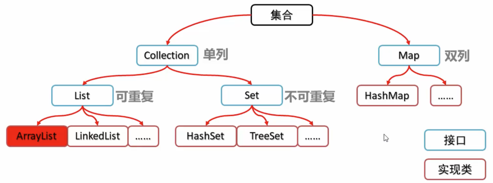
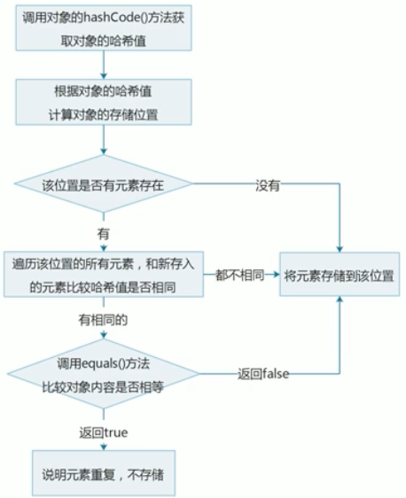

## Java面向对象

#### 什么是多态？

多态的实现依赖与继承和重写(override)，不同的对象可以通过相同的接口实现特定的行为；子类重新定义了父类的方法时，子类实例可以被当做父类实例来使用；

## 集合

集合体系结构



### List

#### LinkedList

特有的功能主要是：

```java
 void addFirst(E e)
 void addLast(E e)
 E getFirst()
 E getLast()
 E removeFirst()
 E removeLast()
```

#### ArrayList

ArrayList构造方法里可以传入一个Set类型的变量，可以构造一个List类型的集合；

```java
List<Integer> keyList = new ArrayList<>(keySet);
```

#### Iterator迭代器

集合的专用遍历方式，`Iterator<E> iterator()`返回集合中元素的迭代器；

迭代器是通过集合的`iterator()`方法得到的；

迭代器的常用方法：

* E next()返回迭代中的下一个元素

* boolean hasNext()如果迭代具有更多元素，则返回true

```java
Collection<String> c = new ArrayList<String>();
c.add("hello");
c.add("world");
c.add("java");
Iterator<String> iterator = c.iterator();
while(iterator.hasNext()){
    System.out.println(iterator.next());
}
```

##### 并发修改异常

下面的代码中会报错ConcurrentModificationException

```java
List<String> list = new ArrayList<String>();
list.add("hello");
list.add("world");
list.add("java");
// 遍历集合
// 使用迭代器会报并发修改异常ConcurrentModificationException
Iterator<String> itr = list.iterator();
while (itr.hasNext()){
    String s = itr.next();
    if(s.equals("world")){
        list.add("javaee");
    }
}
```

产生的原因：迭代器遍历集合的过程中，通过集合对象修改了集合进行了结构性修改（增加或者删除），造成了迭代器获取元素时判断预期修改值与实际修改值不一致；
解决方案：

- 使用普通的 `for` 循环来遍历集合，for不使用迭代器，就不会发生预期修改次数与实际修改次数不一致的情况。
- 使用迭代器的 `remove` 方法来删除元素，而不是直接通过集合对象删除。这样迭代器会更新预期修改次数，避免异常。
- 在多线程环境中，使用同步机制（例如锁）来确保只有一个线程能够同时修改集合。

##### 列表迭代器ListIterator

列表迭代器支持正向遍历和逆向遍历，可以直接使用列表迭代器对象对集合对象继续结构性操作，不会产生并发修改异常；

```java
List<String> list = new ArrayList<String>();
list.add("hello");
list.add("world");
list.add("java");
ListIterator<String> lit = list.listIterator();
while (lit.hasNext()) {
    String s = lit.next();
    if (s.equals("world")) {
        lit.add("javaee");
    }
}
System.out.println(list);
```


### Set

Set是一个接口继承自Collection接口，是一个不包含重复元素的集合，没有带索引的方法，不能使用普通for循环遍历；

哈希值：是jdk根据对象的地址或者字符串或者数字计算出来的int类型的值，Object类中的`public int hashCode`方法可以计算哈希值； 

>  同一个对象多次调用hashCode方法返回的哈希值是相同的；
>
> 默认情况下，不同对象的哈希值是不相同的；通过方法重写，可以实现不同对象的相同哈希值；

#### HashSet

底层数据结构是哈希表，没有带索引的方法，不能使用普通for循环遍历，由于是Set集合，所以是不包含重复元素的集合；

HashSet集合保证元素唯一性的原理：




#### LinkedHashSet

LinkedHashSet是一个基于LinkedHashMap实现的有序去重集合列表。

- LinkedHashSet中的元素没有重复
- LinkedHashSet中的元素有顺序，维护了添加顺序
- LInkedHashSet可以存储null值
- LinkedHashSet是一个线程不安全的容器

#### TreeSet

元素有序，具体的排序方式取决于构造方法：

* `TreeSet()`根据元素的自然排序进行排序
* `TreeSet(Comparator comparator)`根据指定的比较器进行排序

##### Comparable

如果一个自定义对象需要实现排序，那么该对象就要实现`Comparable`接口，并重写`CompareTo`方法；

```java
public class Student implements Comparable<Student> {
    int age;
    String name;
		...省略构造方法、get\set方法
   
    @Override
    public int compareTo(Student s ) {
        // 按照年龄的顺序从小到大排序
        int num1 = this.age - s.age;
        // 如果年龄相同就按照姓名首字母排序
        int num2;
        num2 = num1 == 0 ? this.name.compareTo(s.name):num1;
        return num2;
    }
}
```

##### Comparator

在对象里实现comparable接口外，还可以直接在集合构造方法中通过内部类的方式添加一个比较器Comparator接口；

```java
public class TreeSetDemo {
    public static void main(String[] args) {
        // 构建TreeSet
        TreeSet<Student> ts = new TreeSet<>(new Comparator<Student>() {
            @Override
            public int compare(Student s1, Student s2) {
                int num1 = s1.getAge() - s2.getAge();
                return num1 == 0 ? s1.getName().compareTo(s2.getName()):num1;
            }
        });
        // 创建学生对象，并将其添加到集合中
        Student tom = new Student(18, "tom");
        Student jerry = new Student(19, "jerry");
        Student bob = new Student(19, "bob");
        ts.add(tom);
        ts.add(jerry);
        ts.add(bob);
        // 遍历集合
        for(Student s: ts){
            System.out.println(s.getName()+","+s.getAge());
        }
    }
}
```

### Map

#### 概述

Interface Map<K,V>将键映射到值的对象，不能包含重复的键。put过程中，如果键第二次出现，则会修改原始的值；

```java
Map<String,String> map = new HashMap<>();
map.put("1001","tom");
map.put("1002","jerry");
map.put("1002","bob");
System.out.println(map);
//{1002=bob, 1001=tom}
```

| **方法名**                          | **说明**                 |
| :---------------------------------- | :----------------------- |
| V put(K key,V value)                | 添加元素                 |
| V remove(Object key)                | 根据键删除元素           |
| void clear()                        | 移除所有键值对           |
| boolean containsKey(Object key)     | 判断是否包含指定的键     |
| boolean containsValue(Object value) | 判断是否包含指定的值     |
| V get(Object key)                   | 根据键获取值             |
| Set<K> keySet()                     | 获取所有值的集合         |
| Collection<V> values()              | 获取所有值的集合         |
| Set<Map.Entry<K<V>> entrySet()      | 获取所有键值对对象的集合 |

```java
Map<String,String> map = new HashMap<>();
map.put("tom","jerry");
map.put("romeo","juliet");
System.out.println("-----根据键获取值----");
System.out.println(map.get("romeo"));

System.out.println("-----获取集合----");
Set<String> keys = map.keySet();
for(String k:keys){
    System.out.println(k);
}

System.out.println("-----获取值的集合----");
Collection<String> values = map.values();
for(String c : values){
    System.out.println(c);
}

System.out.println("-----获取键值对的集合----");
Set<Map.Entry<String, String>> entries = map.entrySet();
for (Map.Entry<String,String> e: entries){
    System.out.println(e);
}
```

#### HashMap

JDK8之前底层采用数组+链表实现，JDK8之后当链表长度大于等于7且数组长度大于64时，链表会转化为红黑树；

[HashMap面试宝典](https://www.jianshu.com/p/d04edc8aaf0f)

#### 遍历

* 获取所有的key,通过增强for循环依次找到对应的value

```java
Set<String> keys = map.keySet();
for(String k : keys){
    System.out.println(k+"="+map.get(k));
}
```

* 直接获取所有的键值对对象的集合，对每个键值对对象通过`getKey()`获取键，通过`getValue()`获取值

```java
Set<Map.Entry<String, String>> entries = map.entrySet();
for(Map.Entry<String,String> entry : entries){
    System.out.println(entry.getKey()+"="+entry.getValue());
}
```


### 泛型

#### 概述

泛型就是将原来的具体类型参数化，在使用或者调用时传入具体的类型；可以用在类、方法、

接口中，分别称为泛型类、泛型方法、泛型接口；

#### 格式

* <类型>：指定一种类型的格式，这里的类型可以看成是形参；
* <类型1，类型2...>：指定多种类型的格式，多种类型之间用逗号隔开，这里的类型可以看成是形参；

##### 泛型类

```java
// 修饰符 class 类名<类型>{}
// 此处的T可以随便写为任意标识T、E、K、V均可
public class Generic<T> {
    T age;
    public T getAge() {
        return age;
    }
    public void setAge(T age) {
        this.age = age;
    }
}
// 泛型类的使用
public class GenericDemo {
    public static void main(String[] args) {
        GenericClass<Integer> i = new GenericClass<>();
        i.setAge(12);
        System.out.println(i.getAge());
        GenericClass<String> g = new GenericClass<>();
        g.setAge("12");
        System.out.println(g.getAge());
    }
}
```

##### 泛型方法

```java
// 修饰符 <类型> 返回值类型 方法名(类型 变量名){}
public <T> void show(T t){
   System.out.println(t);
}
// 泛型方法的使用
public class GenericDemo {
    public static void main(String[] args) {
        Generic g = new Generic();
        g.show("hello");
        g.show(123);
    }
}
```

##### 泛型接口

```java
// 修饰符 interface 接口名<类型>{}
public interface Generic<T> {
    void show(T t);
}
//接口的实现类
public class GenericImpl<T> implements Generic<T>{
    @Override
    public void show(T t) {
        System.out.println(t);
    }
}
// 泛型接口的使用
public class GenericDemo {
    public static void main(String[] args) {
        GenericImpl<String> g1 = new GenericImpl<>();
        g1.show("tom");
        GenericImpl<Integer> g2 = new GenericImpl<>();
        g2.show(12);
    }
}
```

#### 类型通配符

* 默认类型通配符`<?>`

List<?>表示元素类型未知的List，它的元素可以匹配任何的类型；

* 类型通配符上限`<? extends 类型>`

List<? extends Number>其表示的类型是Number或者及其子类型；

* 类型通配符下限`<? super 类型>`

List<? super Number>其表示的类型是Number或者其父类型；

```java
// 默认类型通配符
List<?> list2 = new ArrayList<Number>();
List<?> list3 = new ArrayList<Integer>();
// 有上限的类型通配符
List<? extends Number> list4 = new ArrayList<Integer>();
// 有下限的类型通配符
List<? super Number> list5 = new ArrayList<Object>();
```

#### 可变参数

格式：修饰符 返回值类型 方法名(数据类型...变量名)

```java
public static int sum(int... a) {
    // 这里的变量 a其实是一个数组
    int s = 0;
    for (int i : a) {
        s += i;
    }
    return s;
}
```

#### Collections

> Collections是一个实用类，与Collection是一个接口，注意他们是完全不同的概念：

Collections类常用的方法：

```java
public static <T extends Comparable<? super T>>
void sort(List<T> list)
void reverse(List<T> list)
void shuffle(List<T> list)
```

> 必须通过Collections这个类来调用，可排序的集合对象作为该方法的参数；

案例： 

```java
List<Integer> list = new ArrayList<>();
list.add(10);
list.add(30);
list.add(80);
list.add(40);
// Collections常用方法方法
Collections.sort(list);
System.out.println(list); // 10 30 40 80
Collections.reverse(list);
System.out.println(list); // 80 40 30 10
Collections.shuffle(list);
System.out.println(list); // 30 10 80 40

```

## 文件与IO流

## 进程与线程

进程与线程的区别：

## 网络编程

