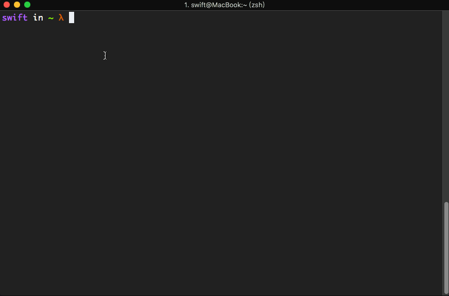

###  前言

我们通常使用Mac的terminal登录Linux服务器时，每次都需要输入服务器的IP地址和密码，是不是很不方便，今天就教大家一个方法可以快速免密码登录服务器。
这里以快速登录我的树莓派服务器为例：


### 你需要了解的基础知识
##### 1. Mac上负责ssh登录的公钥私钥存储位置：
```shell
~/.ssh/
```
公钥：id_rsa.pub
私钥：id_rsa
如果我们Mac上没有ssh 公钥和私钥，我们就手动生成一下,使用命令：
```
 ssh-keygen -t rsa
```
##### 2. 服务器上存储ssh登录认证密钥的位置：
```shell
~/.ssh/authorized_keys
```
理论上我们只要把Mac本地的公钥内容写入服务器认证密钥中，Mac就可以免密登录了！
### 实际操作
##### step01:把Mac上的公钥写入到服务器中：
```
# 把本地公钥上传到服务器.ssh目录下
scp ~/.ssh/id_rsa.pub root@192.168.123.159:~/.ssh
# 将id_rsa.pub重命名为authorized_keys
mv id_rsa.pub authorized_keys
```
到这里我们就可以，输入`ssh 用户名 IP地址`，就已经可以免密登录了；
但是如果我们还想要连IP地址都懒得输入，直接通过`ssh 别名` 就直接登录，这样该怎么操作呢？
##### step02: 使用别名快速登录服务器
通过本地ssh配置文件来使用别名登录服务器
我们进入Mac本地管理ssh的文件夹`~/.ssh`，通过vim编辑文件`config`
```
vim ~/.ssh/config
```
写入相关内容，规则如下：
* Host 服务器的别名
* Host Name 服务器的域名或者IP地址
* Port 端口 可以不写，默认22
* User 服务器用户名
* IdentityFile 本地私钥的位置
我们可以设置多个服务器的别名登录
```
Host pi
    HostName 192.168.123.159
    User pi
    IdentityFile ~/.ssh/id_rsa
    UseKeychain yes
    AddKeysToAgent yes
Host pi_root
    HostName 192.168.123.159
    User root
    IdentityFile ~/.ssh/id_rsa
    UseKeychain yes
    AddKeysToAgent yes
```
### 可能遇到的问题：
可能你在登录的时候系统会出现这种问题
```
Enter passphrase for key '~/.ssh/id_rsa':
```
这是因为我们再生成公私钥的时候设置了私钥密码，导致ssh免密登录后每次都有输入私钥密码，明明是为了提高效率，这下好了，每次登录前还有手动输入三次ssh私钥密码！有解决办法吗？有：
##### 解决办法
将私钥添加到钥匙串中：
```
ssh-add -K ~/.ssh/id_rsa 
```
按照提示输入一次私钥密码即可，后面就不需要输入了！
在配置文件中添加属性`UseKeychain`、`AddKeysToAgent`，像这样：
```
UseKeychain yes
AddKeysToAgent yes
```
保存一下，就大功告成啦~
### 参考链接
https://www.jianshu.com/p/5a5f3867d425
https://www.jianshu.com/p/272316fa1cda
https://blog.csdn.net/acaixuediannao/article/details/79764841