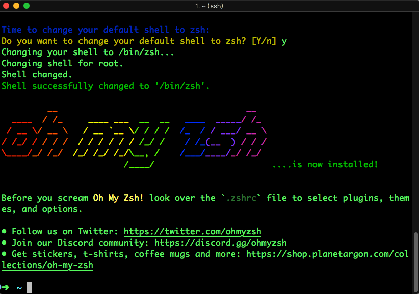

## 使用oh-my-zsh

### 1. 介绍

一般情况下，Linux系统默认的shell是bash，默认的bash也不是不能用，但是想要扩展功能的时候受限太多，缺少很多方便的插件。为此使用一个现代化的，智能的终端可以节省很多时间。
推荐配套使用oh-my-zsh，目的是方便进行主题更换以及插件安装。

### 2. 安装
1. zsh、以及oh-my-zsh
```sh
// 如果是Ubuntu、Debian家族的系统自行替换为apt来下载，Mac请替换为brew
sudo yum install zsh
sh -c "$(curl -fsSL https://gitee.com/mirrors/oh-my-zsh/raw/master/tools/install.sh)"
```


2.zsh-autosuggestions
能够自动进行提示相关已经键入的内容和以前的历史记录

```sh
git clone https://gitee.com/phpxxo/zsh-autosuggestions.git ${ZSH_CUSTOM:-~/.oh-my-zsh/custom}/plugins/zsh-autosuggestions
```
3.zsh-syntax-highlighting
能够对命令进行语法高亮
```sh
git clone https://github.com/zsh-users/zsh-syntax-highlighting.git ${ZSH_CUSTOM:-~/.oh-my-zsh/custom}/plugins/zsh-syntax-highlighting
```
4.extract
能够使用x命令解压所有的压缩格式文件，zsh自带，无序安装
5.zsh-completions
能够提示当前命令所具有的参数描述
```sh
git clone https://github.com/zsh-users/zsh-completions ${ZSH_CUSTOM:-${ZSH:-~/.oh-my-zsh}/custom}/plugins/zsh-completions
```
### 配置
最后都需要在~/.zshrc中的plugins=配置上对应的插件名字就OK啦

## 配置vim

在用户目录下创建一个文件`.vimrc`,用于写入vim相关配置信息：

```
" Show line numbers
set number
" 开启语法高亮
syntax on
" 查找结果 高亮显示
set hlsearch
" 配色方案
colorscheme molokai
" 关闭兼容模式
set nocompatible
" 解决vim 退格键（backspace）不能用
set backspace=indent,eol,start
```

配色主题则需要再`.vim`目录下创建一个`colors`文件夹，放入对应的配色配置文件，推荐配色主题是`molokai`https://github.com/tomasr/molokai

