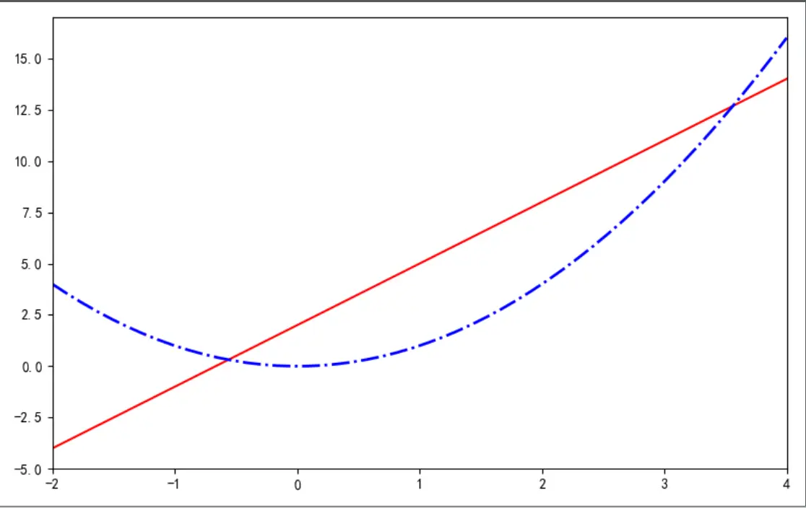
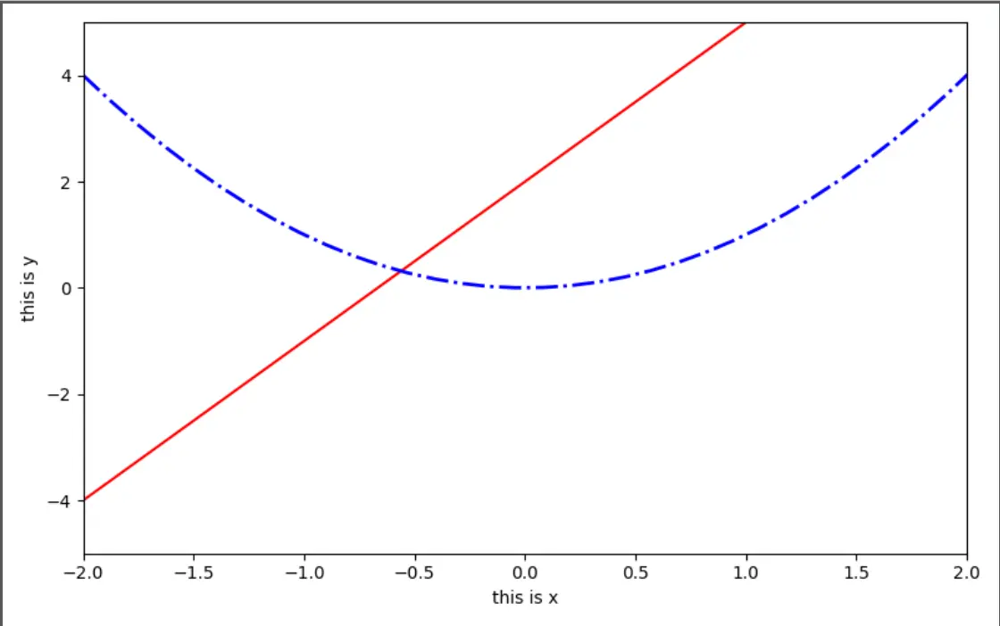
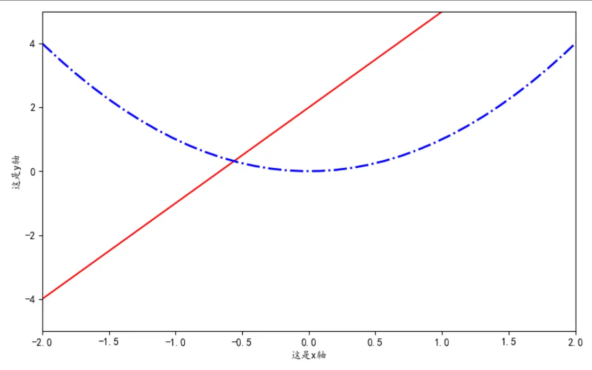
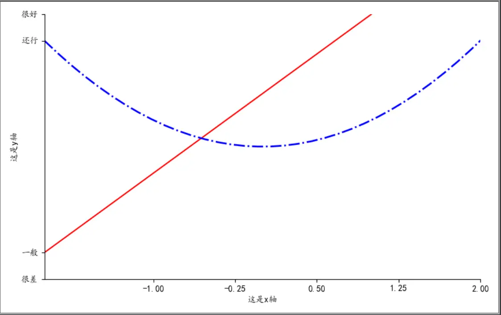
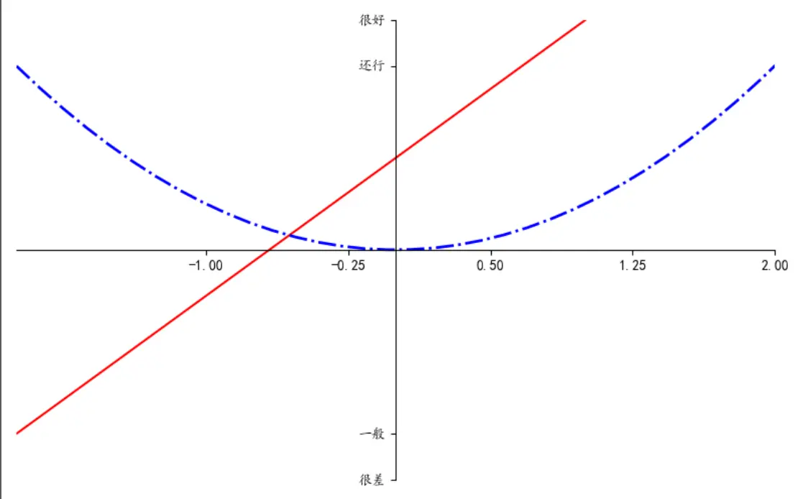

##### matplotlib是什么？
matplotlib是用python开发的可视化和分析工具，是一款非常强大的python画图工具。具备优秀的跨平台交互式属性，能够生成出版质量级的图表。
只需几行代码就可以生成：图表、直方图、功率图、条形图、散点图
接下来，我们将正式开始学习matplotlib！

##### 如何安装matplotlib
```
pip install matplotlib
```
> 目前建议使用Python3.8，如果使用Python3.9可能会出现无法通过pip安装matplotlib的情况。

##### 导入模块
使用import导入模块matplotlib.pyplot;并简写成plt;
为了方便获取和处理数据我们也导入numpy模块，并简写成np;
```
import matplotlib.pyplot as plt
import numpy as np
```
##### 定义函数
然后使用numpy创建两组数据，使用np.linespace定义x,范围是(-2,4),个数是50，系统会生成一组（-2，4）以内均匀分布的50个数，(x,y1)表示曲线1，（x,y2)表示曲线2。
```
x = np.linspace(-2,4,50)
y1 = 3*x + 2
y2 = x ** 2
```
##### 定义窗口并画图
在画图前使用`plt.figure()`定义一个图像窗口，使用`figsize`参数可以设置弹出图像的像素大小，当我们设置`figsize=(8,5)`时，则表明绘制的图像大小为：800*500像素。
使用plt.plot()来绘制曲线，可以直接将表示x轴y轴的列表传进去。也可以添加一些额外的参数。

|  参数名   |     用途     |             备注             |
| :-------: | :----------: | :--------------------------: |
|   color   | 设置曲线颜色 |    'red'红色、'green'绿色    |
| linewidth | 设置曲线宽度 |    可以设置数值1.0、1.5等    |
| linestyle | 设置曲线类型 | '-'实线、'--'虚线、'-.'i型线 |

```
plt.figure(figsize=(8,5))
plt.plot(x, y1, color='red', linestyle='-', linewidth=1.5)
plt.plot(x, y2, color='blue', linestyle='-.', linewidth=2.0)
plt.show()
```


##### 设置坐标轴名称及范围
使用plt.xlim设置x轴范围：(-2,2);
使用plt.ylim设置y轴范围：(-5,5);
使用plt.xlabel设置x轴名称；
使用plt.ylabel设置y轴名称；

```
plt.xlim(-2, 2)
plt.ylim(-5, 5)
plt.xlabel("this is x")
plt.ylabel("this is y")
```


##### 设置坐标轴中文名称

如果给坐标轴设置的名称有中文的话，直接通过`plt.xlabel()`设置的话会乱码，我们需要通过rc()方法指定中文的字体才可以。
```
import matplotlib
matplotlib.rc("font",family="KaiTi")
```
除了设置成楷体外，还可以设置的中文字体有：
```
DengXian
FangSong
LiSu
YouYuan
Adobe Fan Heiti Std
Adobe Fangsong Std
Adobe Heiti Std
```
此时再调用xlabel、ylabel设置x轴y轴的中文名称，会出现游标中的负号无法正常显示，此时再添加一个语句即可正常显示：
```
plt.rcParams['axes.unicode_minus'] = False
```

##### 定义坐标轴刻度及名称
如果我们希望坐标轴的刻度不是一连串的数字而是一些文字，或者想要调整刻度的系数。这时就需要`plt.xticks()`来调整。
我们x轴设置新刻度new_ticks,从-1到2，个数是5，我们就可以这样写。
```
new_ticks = np.linspace(-1,2,5)
plt.xticks(new_ticks)
```
y轴的刻度[-5,-4,4,5]对应的名称为['很差','一般','还行','很好']，我们可以这样写：
```
plt.ytricks([-5,-4,4,5],['很差','一般','还行','很好'])
```

这样我们就实现了对x轴调整稀疏程度，对y轴调整指定范围指定名称。

##### 调整边框
我们发现以上的图像都有四条实线边框，我们如果想隐藏某个边框或者设置指定颜色改怎么做呢？
`plt.gca()`获取边框对象，使用`.spines`设置指定边框，使用`set_color`方法指定边框线条的颜色，如果想隐藏边框则使用`none`参数。
```
ax = plt.gca()  # 获取坐标轴对象
ax.spines['top'].set_color('none')  # 隐藏上边框
ax.spines['right'].set_color('none')  # 隐藏右边框
```
如果想x轴与y轴交界的位置：

```
ax.xaxis.set_ticks_position('bottom')
ax.spines['bottom'].set_position(('data',0))
ax.yaxis.set_ticks_position('left')
ax.spines['left'].set_position(('data',0))
```

以上就是今天matplot基础部分的全部内容了，后续会继续更新新的内容

##### 总结
今天所讲的全部代码如下：
```
import matplotlib.pyplot as plt
import numpy as np
import matplotlib

matplotlib.rc("font", family="KaiTi")

x = np.linspace(-2, 4, 50)

y1 = 3*x + 2
y2 = x**2

plt.figure(num=3, figsize=(8, 5))
plt.plot(x, y1, color='red', linestyle='-', linewidth=1.5)
plt.plot(x, y2, color='blue', linestyle='-.', linewidth=2.0)
plt.xlim(-2, 2)
plt.ylim(-5, 5)
# plt.xlabel("这是x轴")
# plt.ylabel("这是y轴")
plt.rcParams['axes.unicode_minus'] = False
new_ticks = np.linspace(-1, 2, 5)
plt.xticks(new_ticks)
plt.yticks([-5,-4,4,5],['很差','一般','还行','很好'])
ax = plt.gca()
ax.spines['right'].set_color('none')
ax.spines['top'].set_color('none')
ax.xaxis.set_ticks_position('bottom')
ax.spines['bottom'].set_position(('data',0))
ax.yaxis.set_ticks_position('left')
ax.spines['left'].set_position(('data',0))
plt.show()
```
知识点自测：
* 导入模块并重命名` import matplotlib.pyplot as plt`
* 定义图像窗口 `plt.figure()`
* 绘图 `plt.plot(x,y)`
* 定义坐标轴范围 `plt.xlim()`
* 定义坐标轴刻度及名称`plt.xticks()`
* 定义图像边框 `ax=plt.gca() ax.spines[].set_color()`
* 设置刻度位置 `ax.xaxis.set_ticks_position()`
* 设置坐标轴位置 `ax.spines[].set_position()`

### 参考文献
参考链接：https://matplotlib.org/stable/index.html