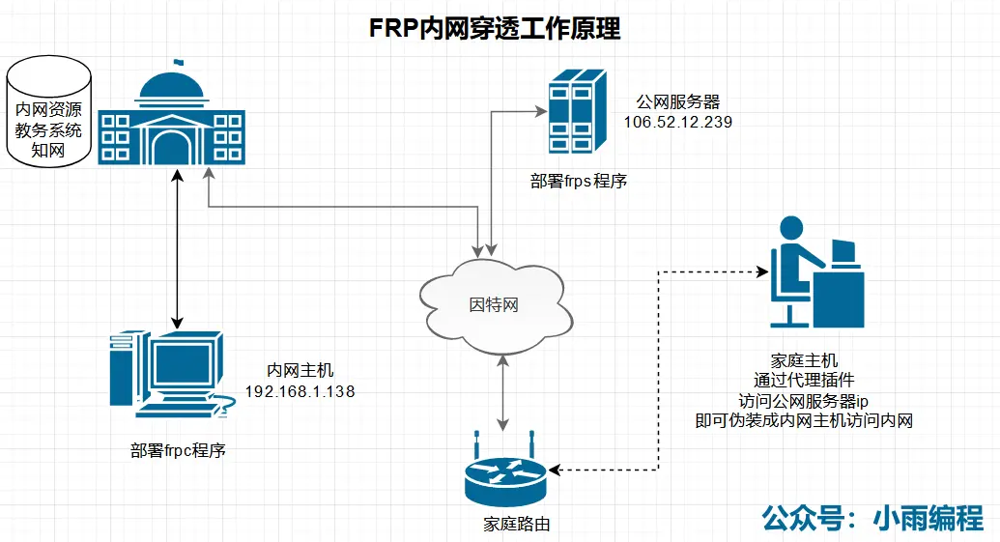

### 前言
校园网可以访问知网、万方数据库，可以进入内网，你在家里怎样才能进入校园网这个内网？随时随地用手机访问校园网内网的资源呢？今天小雨给大家介绍一种内网穿透的方式，便捷高效地访问内网。

> 通过树莓派，实现了远程ssh登录、vnc桌面查看、远程smb访问文件。



### 一、准备工作
1. 你有一台具备公网ip的服务器
2. 你有一台能一直工作的且接入了校园网的电脑或者服务器。
3. 你稍微了解一点点Linux基础操作。
### 二、实际操作
##### 1. 下载软件安装包
从[frp项目托管网页](https://github.com/fatedier/frp/)下载对应版本的安装包，这里我们下载的是`frp_0.35.1_linux_amd64.tar.gz`和`frp_0.35.1_windows_386.zip`。

##### 2. 服务器端配置
编辑`frps.ini`，修改为：
```ini
[common]
bind_port = 7000

token = bob.kim

dashboard_port = 7500
dash_user = admin
dash_pwd = admin

max_pool_count = 5
log_file = ./frps.log
log_level = info
log_max_days = 3
```
以后台启动方式启动这个服务
```sh
nohup ./frps -c frps.ini >/dev/null 2>&1 &
```

##### 2. 本地端配置
编辑`frpc.ini`文件，修改为：
```ini
[common]
server_addr = 服务器地址
server_port = 7000
token = bob.kim

[rdp]
type = tcp
local_ip = 127.0.0.1
local_port = 3389
remote_port = 5200

[http_proxy]
type = tcp
remote_port =6000
plugin = http_proxy

[ssh]
type = tcp
local_ip = 127.0.0.1
local_port = 22
remote_port =18011

[vnc]
type = tcp
local_ip = 127.0.0.1
local_port = 5900
remote_port = 18012

[samba-rasp]
type = tcp
local_ip = 127.0.0.1
local_port = 445
remote_port = 18013
```
注意将第二行的服务器地址，修改为你的远程vps的ip地址。
使用命令行启动本地端的服务程序：
```sh
frpc.exe -c frpc.ini
```
如果本地是Linux系统则使用命令：
```shell
 nohup ./frpc -c frpc.ini >/dev/null 2>&1 &
```
### 出现问题解决方案
#####  本地启动失败
报错
```
 A connection attempt failed because the connected party did not properly respond after a period of time, or established connection failed because connected host has failed to respond.
```
可能是因为服务器相应端口没有打开，我们可以使用`wget 服务器ip:端口`，来探测服务器端口有没有打开，如果连接不上则说明服务器端口没开。
我们可以找到服务器供应商的防火墙控制面板里放行端口。
> 亲测：如果只使用命令firewall-cmd放行端口，有可能是还不够，可能还需--a要到服务器供应商的防火墙页面里操作才行。

##### 查看已经打开的端口
```sh
firewall-cmd --list-ports
```
##### 开启服务器端口：
```sh
firewall-cmd --zone=public --add-port=5200/tcp --permanent
firewall-cmd --zone=public --add-port=6000/tcp --permanent
firewall-cmd --zone=public --add-port=18010/tcp --permanent
firewall-cmd --zone=public --add-port=18011/tcp --permanent
```
##### 命令含义解释：
```
–zone #作用域
–add-port=80/tcp #添加端口，格式为：端口/通讯协议
–permanent #永久生效，没有此参数重启后失效
```
##### 重启防火墙
```sh
firewall-cmd --reload
```
### 制作windows自动执行脚本
我们写一个批处理脚本文件，让操作系统开机时自动执行`frpc`,脚本内容：
```sh
@echo off 　
if "%1" == "h" goto begin 
mshta vbscript:createobject("wscript.shell").run("%~nx0 h",0)(window.close)&&exit 
:begin 
::下面是你自己的代码。

TIMEOUT /T 5
cd C:\frp
frpc -c frpc.ini
```
保存为`bat`后缀，名称任意取，然后保存在`目录下`，这样开机就能自动执行了。

### 制作树莓派自启动脚本
我们把执行frpc程序的过程写成一个服务，让systemctl开机自启动这个服务。
首先，我们把frpc和frpc.ini放在树莓派的`/home/pi/frp/`目录下，然后开始写service文件
```
[Unit]
Description=frpc servic
After=network.target

[Service]
Type=simple
TimeoutStartSec=30
ExecStart=/home/pi/frp/frpc -c /home/pi/frp/frpc.ini
Restart= always
RestartSec=1min

[Install]
WantedBy=multi-user.target
```
保存后，使用命令
```sh
systemctl enable frp.service
```
即可实现frp程序的开机自启动。
一旦实现了开机自启动，这样就可以给树莓派的供电接口装上一个智能开关，随时随地通过手机app开启树莓派从而开启frp服务。
### 可以使用rc.local实现frp脚本树莓派开机自启动
参考链接[树莓派通过rc.local设置开机自启动指定脚本](https://www.jianshu.com/p/74d76e991491)

### 通过frp远程ssh登录内网树莓派
> 放在实验室的树莓派，我在宿舍能随时通过ssh登录，当然，如果实验室还有服务器的话，我还能直接登录ssh服务器。如果你的手机或者iPad装一个ssh客户端软件的话，这一切都可以在手机上实现登录！

关键点：一定要确保公网服务器的指定端口是开放的。
frps公网配置：
```
[ssh]
type = tcp
local_ip = 127.0.0.1
local_port = 22
remote_port = 18011  # 这个端口可以自定义，但是要确保防火墙放行了改端口
```
frpc内网配置：
```
[ssh]
type = tcp
local_ip = 127.0.0.1  # 设置为127.0.0.1用于登录树莓派，或者改成你想登录的内网服务器ip
local_port = 22
remote_port = 18011
```
登录时，使用命令：
```sh
ssh -p 18011 内网服务器用户名@公网服务器ip
```
键入的密码也是内网服务器的登录密码。