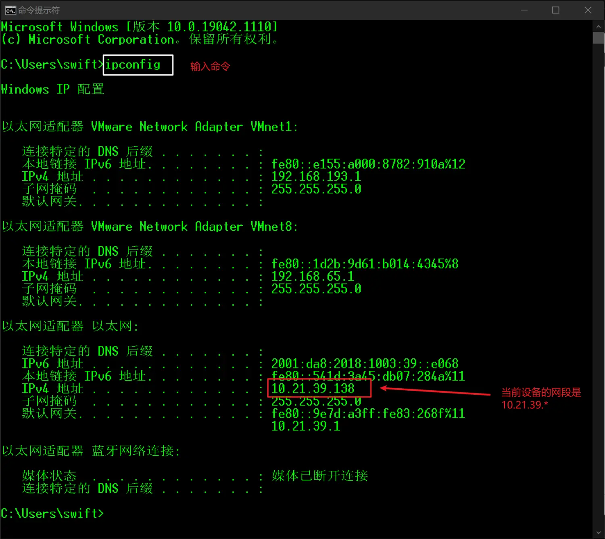
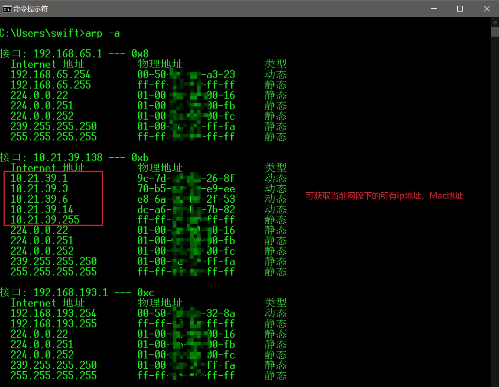

问题描述：在没有后台管理页面的时候，如何知道当前网段下连接所有连接设备的ip地址？
系统环境：windows
使用工具：cmd
### 1. 查看当前设备的网段

在命令提示符中，输入命令
```
ipconfig
```


### 2. 通过for循环对当前网段下的所有ip地址依次进行ping操作
我们的思路是对当前网段10.21.39.*中每一个ip地址（10.21.39.1~10.21.39.254）进行ping操作。cmd里面也是可以进行for循环语句的操作的。
```
for /L %i IN (1,1,254) DO ping -w 2 -n 1 192.168.1.%i
```
> 参数 -n 表示发送数据包的个数；
> 参数 -w 表示制定超时间隔，单位为毫秒；
> /L为for参数以增量方式从开始到结束循环一个数列；
> %i从这个循环数列获取变量值。

### 3. 获取ip地址表

使用命令：
```
arp -a
```


> 每一台主机中都有一张arp表，用来记录ip地址与Mac地址的对应关系，`arp -a`命令就是用来查询这个表的。