树莓派是一台基于ARM的微型电脑，外表虽小，能力却毫不逊色。
给它装上开源的RetroPi模拟器后，它就是一台万能复古游戏机，可以运行索尼、任天堂、世嘉旗下的PS1、PS2、NES、GBA......50种以上的游戏主机;

运行上万款游戏,超级马里奥、魂斗罗、合金弹头、古惑狼等等等等都可以装在你的树莓派里！
接下来我将一步步告诉大家如何把手上吃灰的树莓派拿出来，制作一个“复古游戏机”！

### 一、烧录系统
##### 1.1 下载镜像

RetroPie镜像我们可以从在官网下载：https://retropie.org.uk/download/
或者也可以从百度云下载：链接: https://pan.baidu.com/s/1iWu6KVL2DYUZZ_eMXDpowA 提取码: kd8k 

##### 1.2 写入镜像
关于如何给SD卡烧录镜像，可以参考我前面的文章，[在mac上用Terminal给SD卡写入img镜像的方法](https://www.jianshu.com/p/b6faa1a515bf)，如果你是Windows也是同样的道理，格式化SD卡后，使用工具Win32DiskImager写入镜像即可。
写入完毕后，给树莓派插上卡，接上显示器，通上电即可。

>注意：树莓派供电电压恒定在5v,电流一定要给足，至少也要配上2A以上的电源适配器。如果树莓派电流过小的话，可能会出现自动重启的情况。

### 二、模拟器配置

当我们把树莓派接上显示器后，系统启动界面就很好看，别兴奋，要想玩上游戏还要再折腾一会；

如果你有一个游戏手柄，通过USB插在树莓派上，任意按一个键，系统会自动检测到你的手柄。
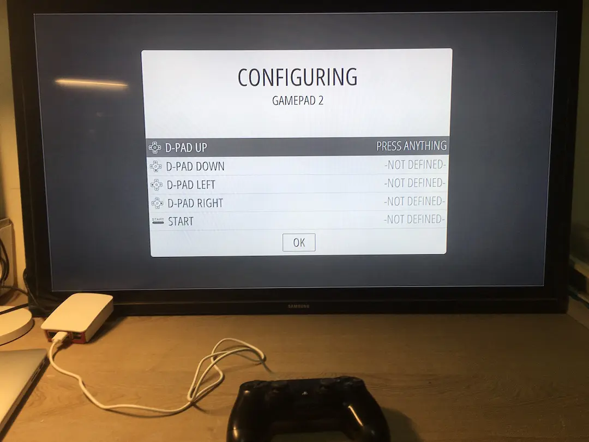

##### 2.1键位配置
按键配置的目的是让你的手柄精准地控制到这款模拟器里的游戏，通过按着手柄上相应的按键来一一对应，只有一次机会，一旦配置错了，就得重新配置按键。
如果你配置错了，怎么重新配置呢？这时候把树莓派的USB口上插上键盘，按一下F4键，就可以进入系统的命令行界面，输入命令exit,即可重启系统，重新配置按键；
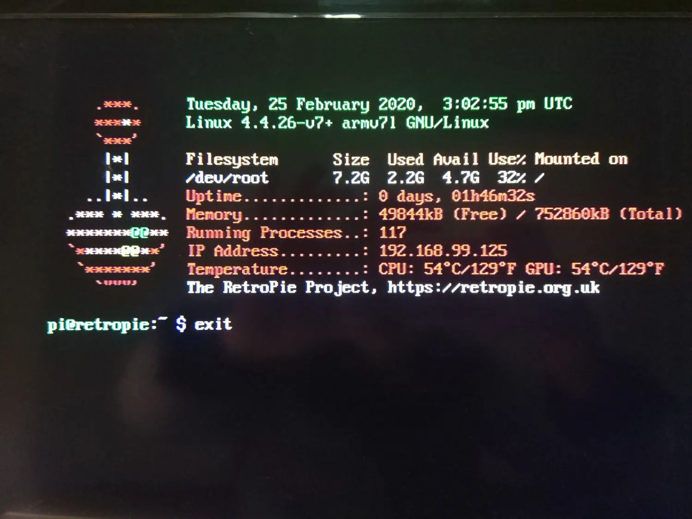

##### 小建议：手柄按键配置方案
 （1）PS手柄，对应键位如下：

* A<==>O键
* B<==>X键
* X<==>三角形键
* Y<==>正方形键
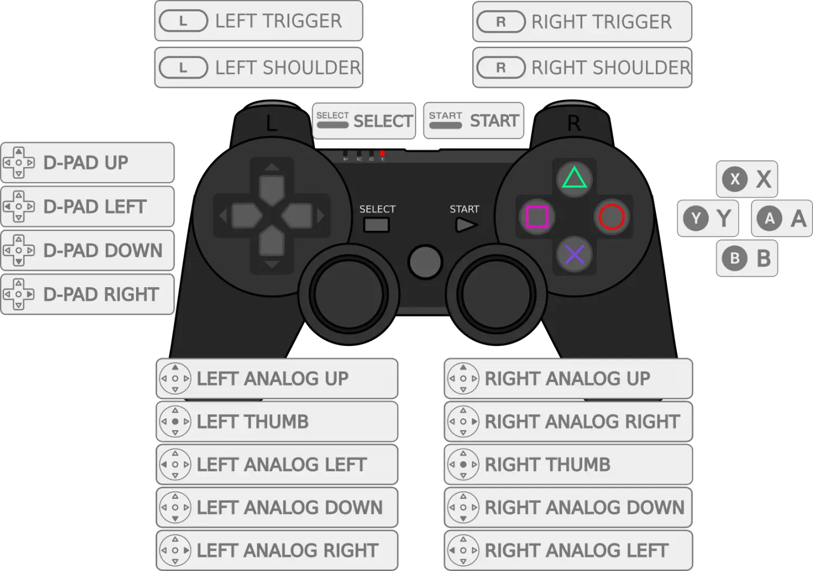
（2）XBOX手柄，主要对应键位如下：
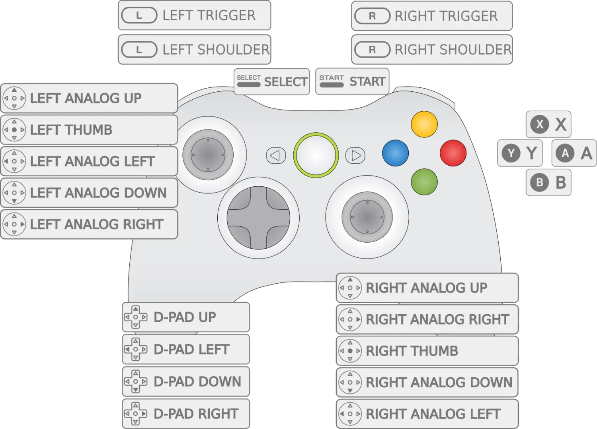
（3）SNES手柄，主要对应键位如下：
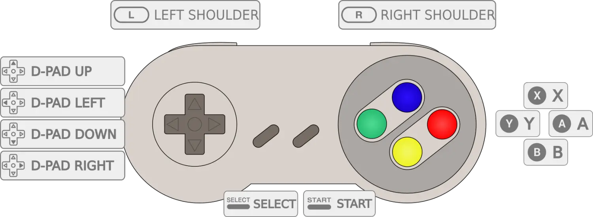

当键位配置完成后，你会看到下面界面，13 GAMES AVAILABLE，别兴奋太早，那是13个设置菜单，
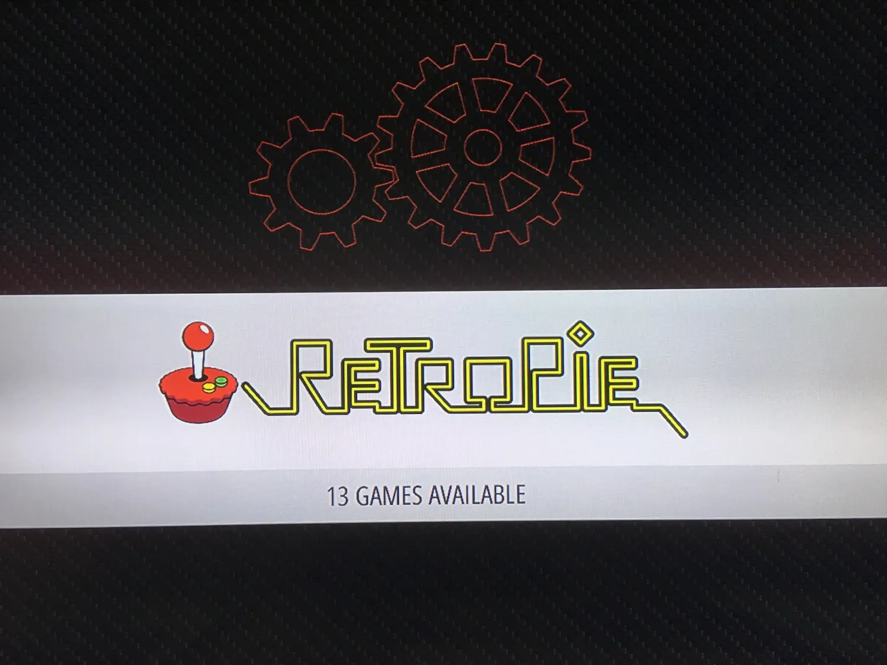
由于版权问题，官网下架了所有自带游戏，要想玩上游戏还是要自己找rom资源

##### 2.2连接WiFi
当我们配置好按键后，我们的手柄就可以很方便的控制我们的模拟器了，
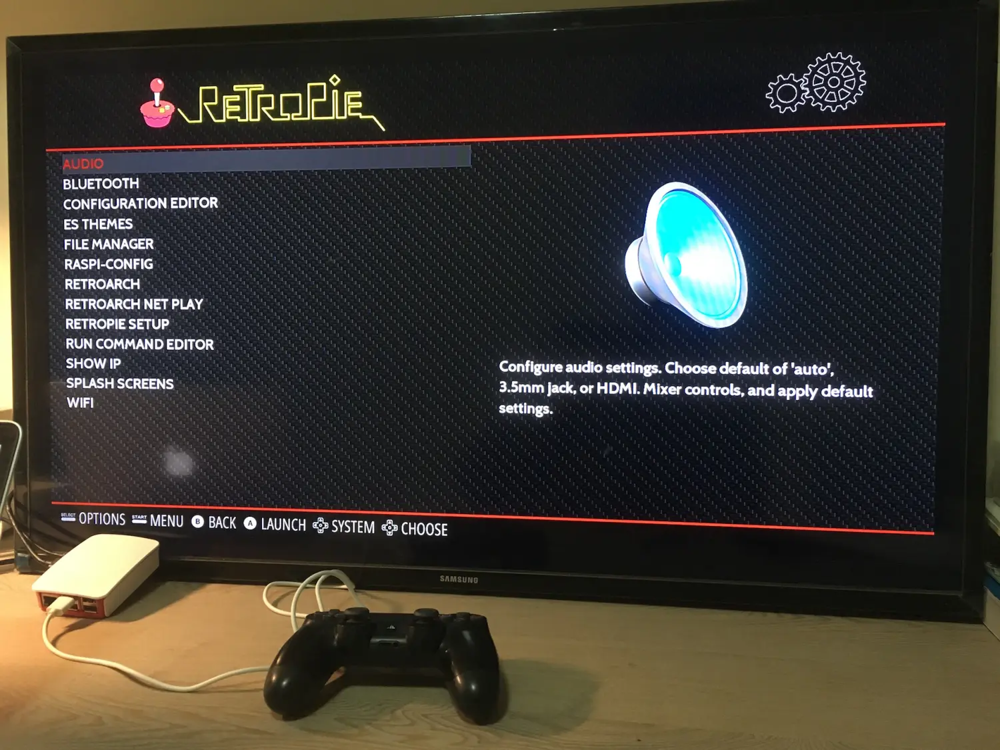
我们进入菜单设置，找到WiFi选项，先给RetroPie连上WiFi，输入WiFi密码的时候最好还是用键盘输入数字方便一点。连上WiFi后记住当前的IP地址，比如我当前的IP地址就是：192.168.99.125
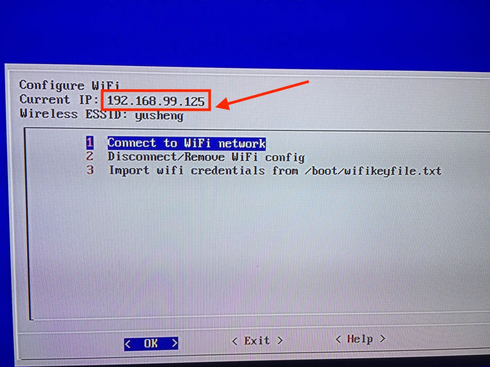

### 三、安装游戏
##### 3.1 游戏资源
游戏资源可以去贴吧、论坛、搜索引擎”游戏名关键字+rom"，都可以，这里只分享几款游戏rom,链接:https://pan.baidu.com/s/1L1U-18myM3TreiB3pAE7JA  密码:96pk,更多游戏roms,工众号“小雨编程”,恢复关键字“roms”即可获得更多游戏roms
##### 3.2 游戏安装
由于RetroPie系统安装完毕后，自动开启了smb文件传输服务，在同一个局域网下，可以直接通过smb服务,把游戏rom传到RetroPie中；具体操作如下：

第一步：在Mac系统下，在Finder界面下按command+K键，
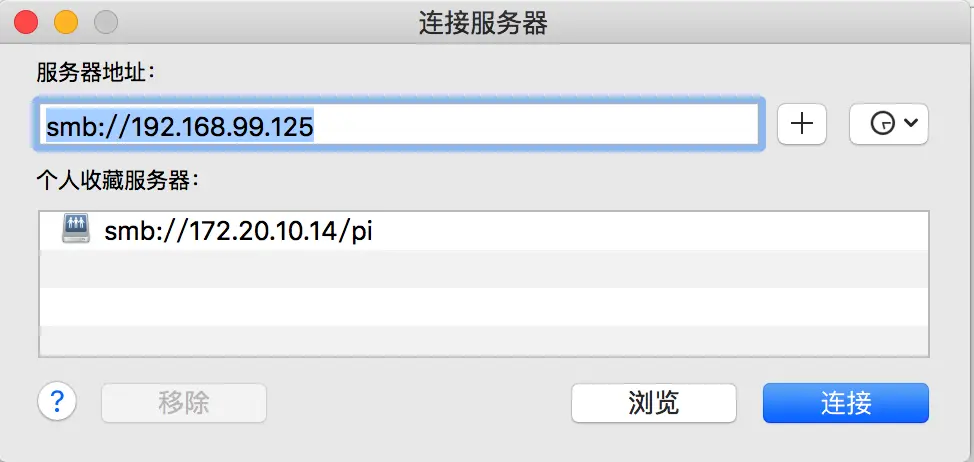
第二步：输入刚才记下的IP地址，点击连接，用户和密码界面选择客人用户连接；

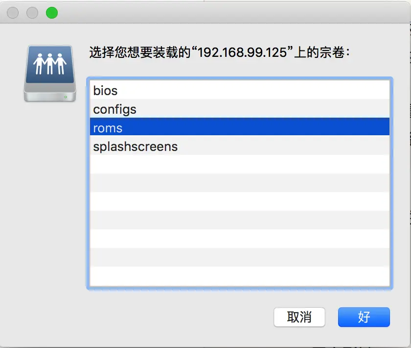
第三步：装载宗卷选择：roms
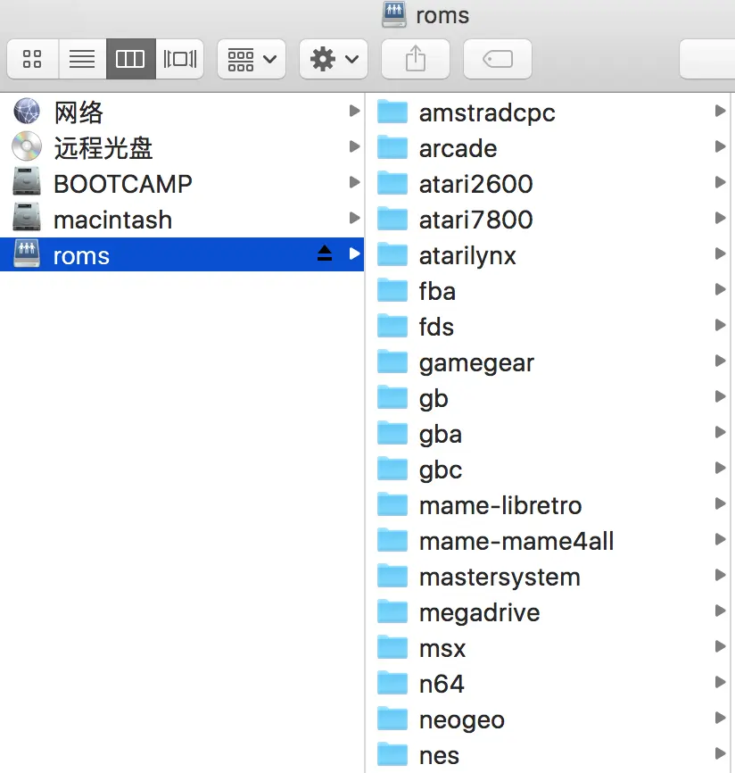
第四步：这时候你会看到很多个游戏模拟器的文件夹，把你获取到的游戏roms,放入指定文件夹，如果是Ps one的游戏，其后缀是img,放入文件夹psx中，如果是任天堂的游戏后缀为nes,直接拖动过去即可

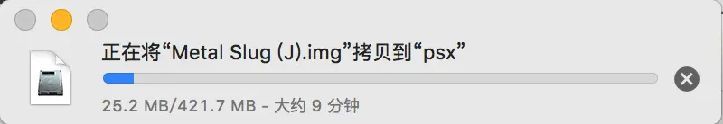
第五步：重启系统，你就会发现游戏已经装好啦！
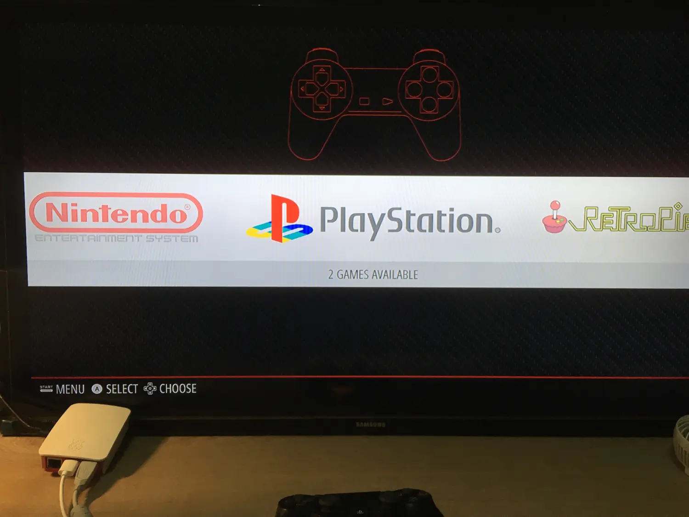

### 最后

祝你玩得愉快！
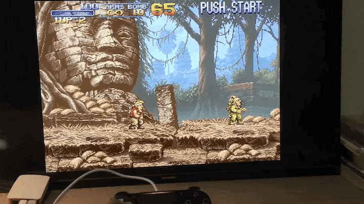

> 更多内容欢迎关注公众号：*小雨编程*