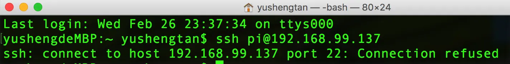
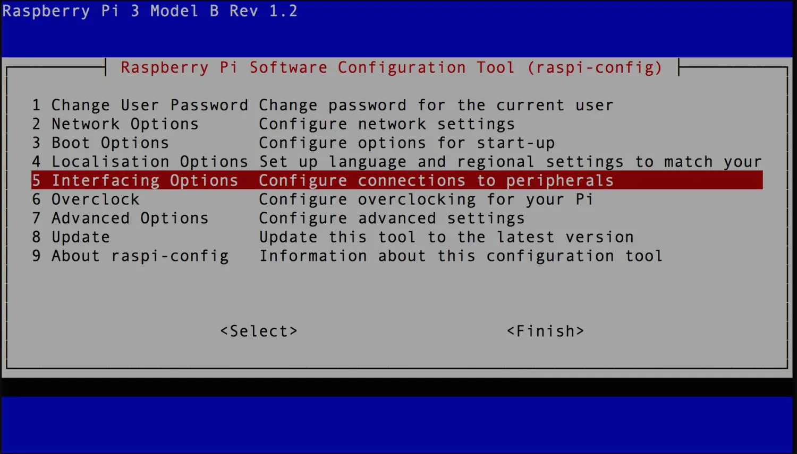
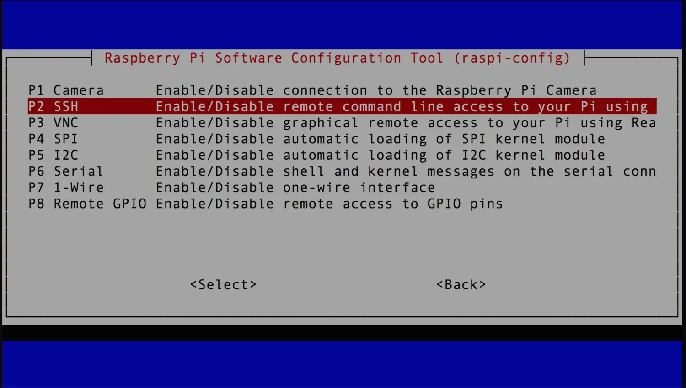
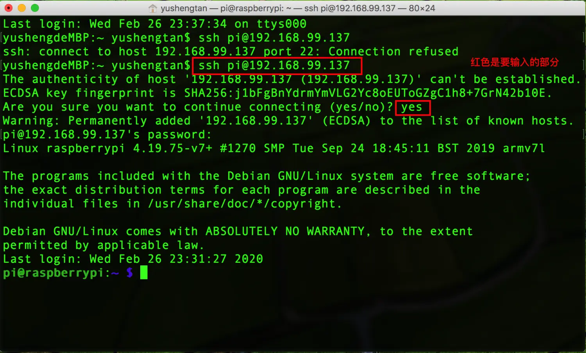

### 前言

**首先，什么是SSH？**

SSH（Secure Shell）是一种网络协议，用于计算机之间的加密登录，如果用户在本地用SSH登录远程另一台计算机，我们可以认为这种登录方式是安全的，即使中途被截获，密码也不会被泄露。如果互联网通信都是明文通信的话，一旦被截获，数据就暴露无遗。SSH协议是互联网安全的基本方案，是Linux系统的标准配置。

通过SSH，不用外接显示器就可以完全访问和控制树莓派，这会带来极大的方便，那么该如何开启呢？
当你想在另一台电脑上通过SSH连接树莓派，如果你的树莓派没有开启ssh服务，你若直接通过ssh连接树莓派就会显示访问被拒绝

那么如何开启ssh服务呢？

### 开启SSH方法

在树莓派上开启ssh最简单的方式就是使用raspi-config程序（类似于系统设置的程序)，在任何时候使用终端输入如下命令会启动它：

```shell
sudo raspi-config
```
这时候终端会打开raspi-config程序，界面类似于BIOS，



选中Interfaceing Options再选中SSH，直接开启就好了；


### 测试

此时在同一局域网下的另一台电脑的终端，使用ssh命令，测试一下SSH服务是否被打开：

```shell
ssh pi@192.168.99.137
```


### 如何启用root用户ssh登录

在标准的树莓派操作系统中，根用户（root用户）默认是被禁用的，出于安全考虑，推荐使用sudo来执行管理员权限的操作。然而，如果你仍然想要开启root用户，可以按照以下步骤进行：

1. **登录到pi用户：** 连接到你的树莓派，使用默认的pi用户登录。

2. **设置root密码：** 打开终端（命令行界面），输入以下命令来设置root用户的密码。

   ```shell
   sudo passwd root
   ```

   然后，按照提示输入你想要设置的root密码，以及确认密码。

3. **启用root登录：** 编辑PAM（Pluggable Authentication Module）配置文件，将`/etc/ssh/sshd_config`文件打开：

   ```shell
   sudo vim /etc/ssh/sshd_config
   ```

   找到以下行（可能在文件中的不同位置），将其注释或修改为以下内容：

   ```shell
   #PermitRootLogin prohibit-password
   ```

   将其修改为：

   ```shell
   PermitRootLogin yes
   ```

4. **重启SSH服务：** 输入以下命令以重新启动SSH服务，使更改生效：

   ```shell
   sudo service ssh restart
   ```

5. **切换到root用户：** 输入以下命令切换到root用户：

   ```shell
   su -
   ```

   输入之前设置的root密码，即可切换到root用户。

   而且现在可以使用root用户进行SSH登录了！


### 最后

SSH是一种远程连接电脑的常用方式，可以对树莓派使用命令，同时SSH也称加密壳协议，任何基于ssh的通信都是加密的，基于命令行的操作既方便又便捷。
开启SSH服务很简单，接下来我会继续更新[树莓派Linux基础](https://www.jianshu.com/p/564f8bd3eb53)，了解在树莓派中如何使用Linux基础操作指令，真正学以致用。