### 前言
Samba是一种局域网文件共享系统，安装上Samba后，在局域网内任何设备都可以共享（读写）树莓派内的文件资源，使树莓派成为家庭文件共享的中心。
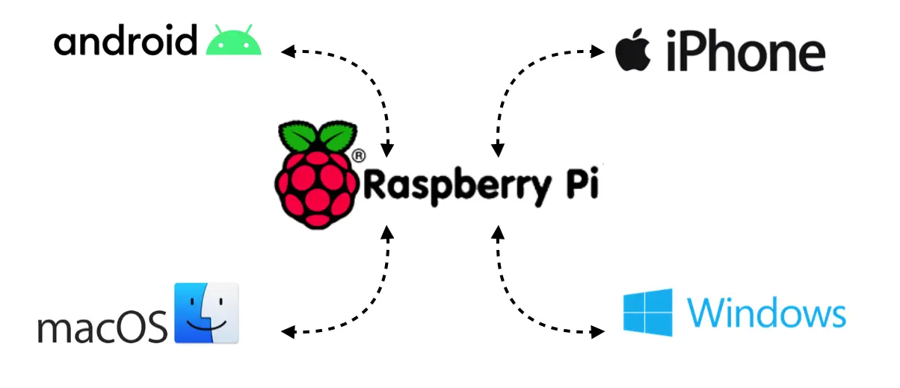

>注意：安装Samba需要将apt-get更新到最新版，关于apt-get如何配置请见我的上一篇文章[树莓派apt-get更新速度慢的解决办法](https://www.jianshu.com/p/7ee5f075f32a)

### 一、配置方法
第一步：更新apt-get
```shell
sudo apt-get update
```
如果源设置的没有问题，继续升级apt-get
```shell
sudo apt-get upgrade
```
第二步：安装Samba
```shell
sudo apt-get install samba-common-bin
```
```shell
sudo apt-get install samba 
```
第三步：修改Samba配置文件
```shell
sudo nano /etc/samba/smb.conf
```
第四步：添加pi用户
```conf
[pi]
path = /home/pi/
valid users = pi
browseable = Yes
writeable = Yes
writelist = pi
create mask = 0777
directory mask = 0777
```
第五步：修改smb密码
```shell
sudo smbpasswd -a pi
```
设置成你想设置的密码后就可以以这个密码来登录啦
### 二、客户端连接
#####1. Windows端：
1.1. 打开我的电脑，选中网络，系统自动刷新当前局域网内的设备，选中RASPBERRYPI
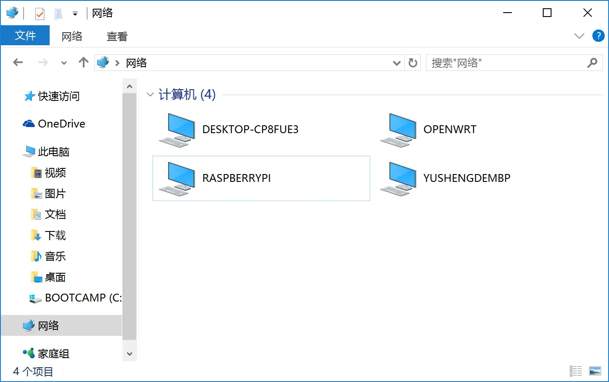

---
##### 如果没有自动刷新，请手动添加：
打开我的电脑，点击网络，右击进入菜单选项，选中映射网络驱动器，

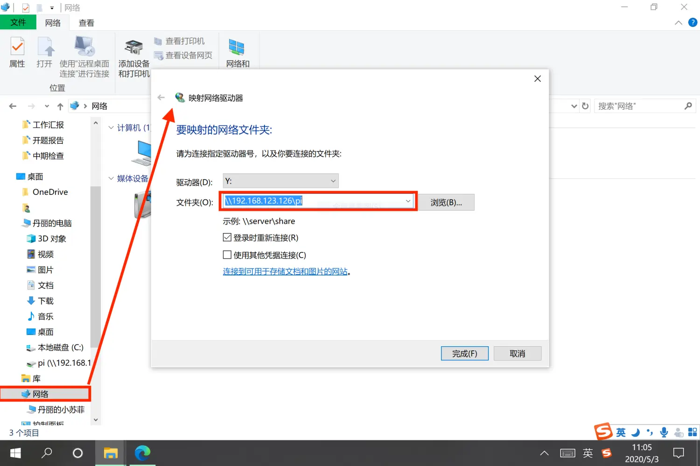

输入对应samba服务器地址，输入前面设置的账号和密码，此时就可以看到Samba成功映射到windows系统中
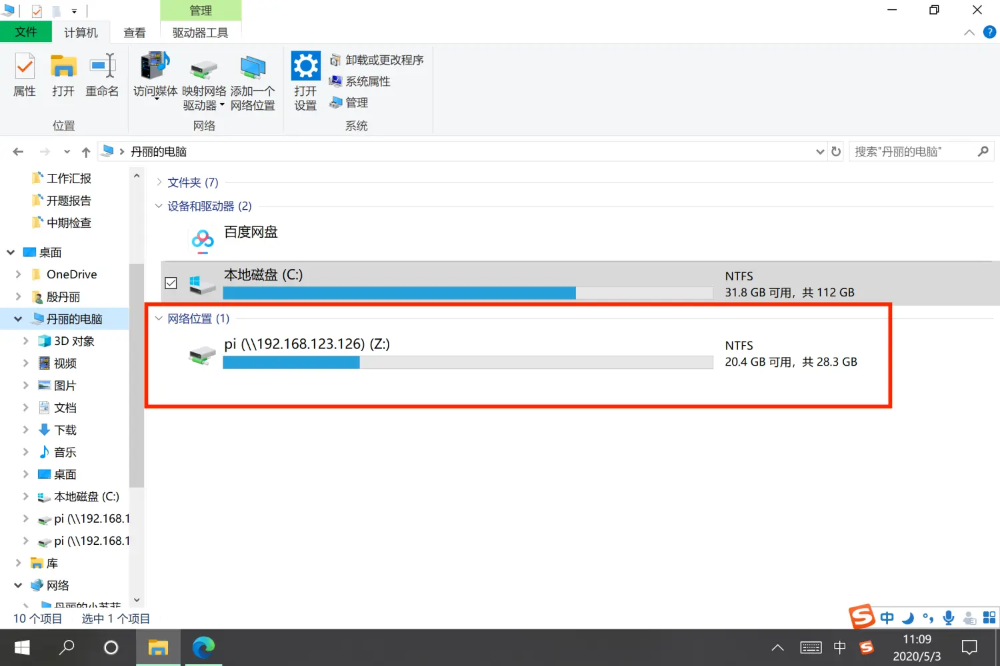

1.2. 点击进入，输入用户名和密码
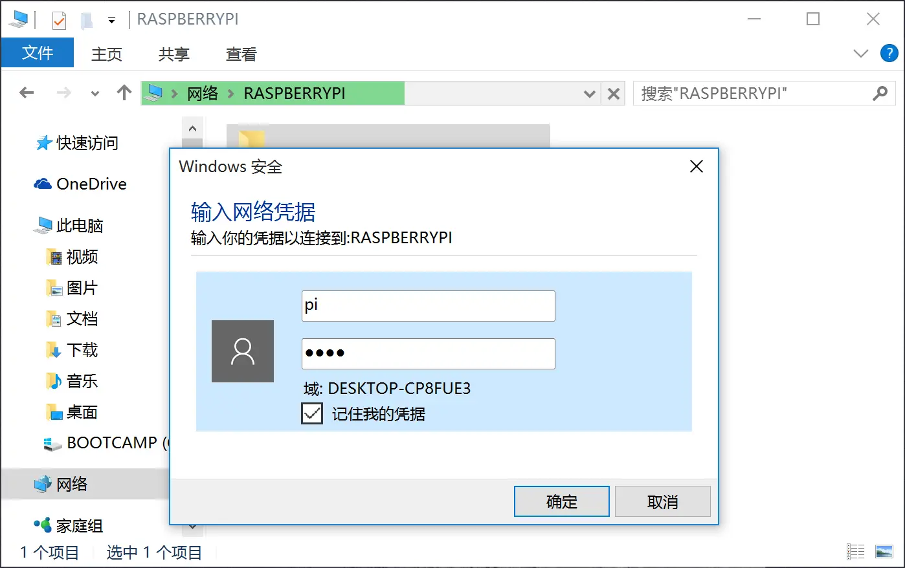
1.3.成功访问，并且具备读写功能
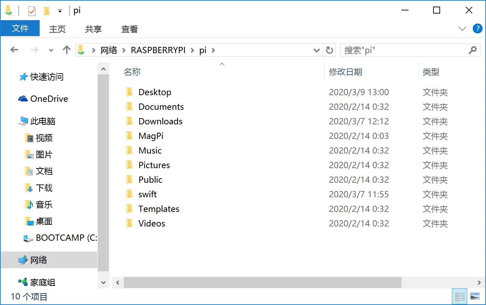


##### 2. Mac端：
2.1. 在Finder（访达）界面直接按`command`+`k`
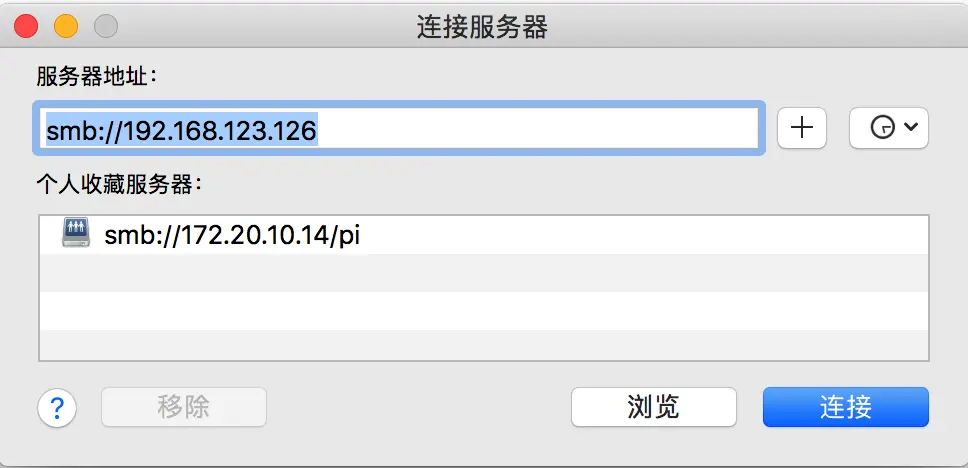
2.2. 服务器地址里的ip换成你树莓派在局域网的IP地址
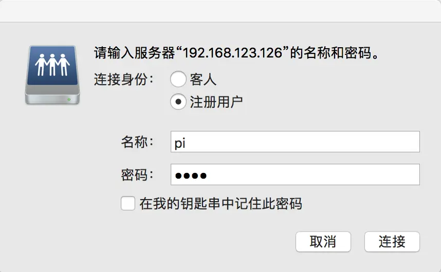
2.3. 输入你刚才添加的`pi`账户，密码是你树莓派的登录密码
点击连接即可
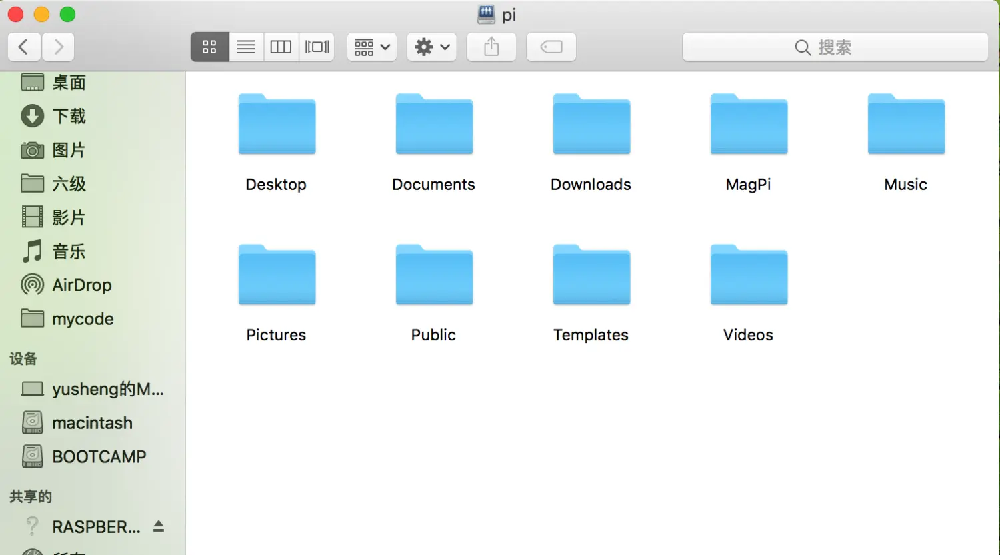


##### 3.Android端：
3.1. Android设备可以使用**ES文件浏览器**，下载安装。依次点击菜单->网络->局域网->新建
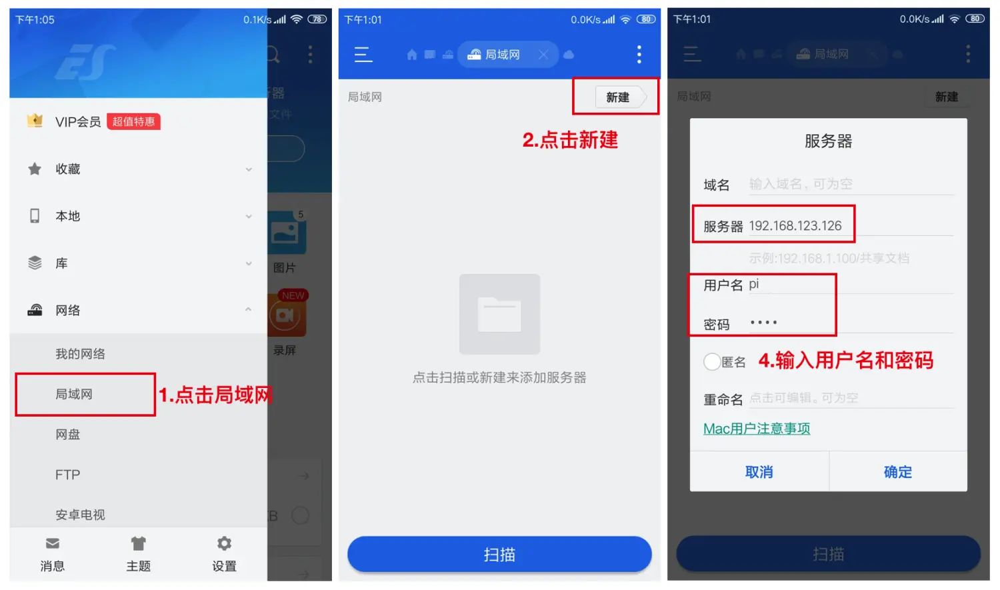
3.2. 输入树莓派ip和用户名和密码后，连接成功。
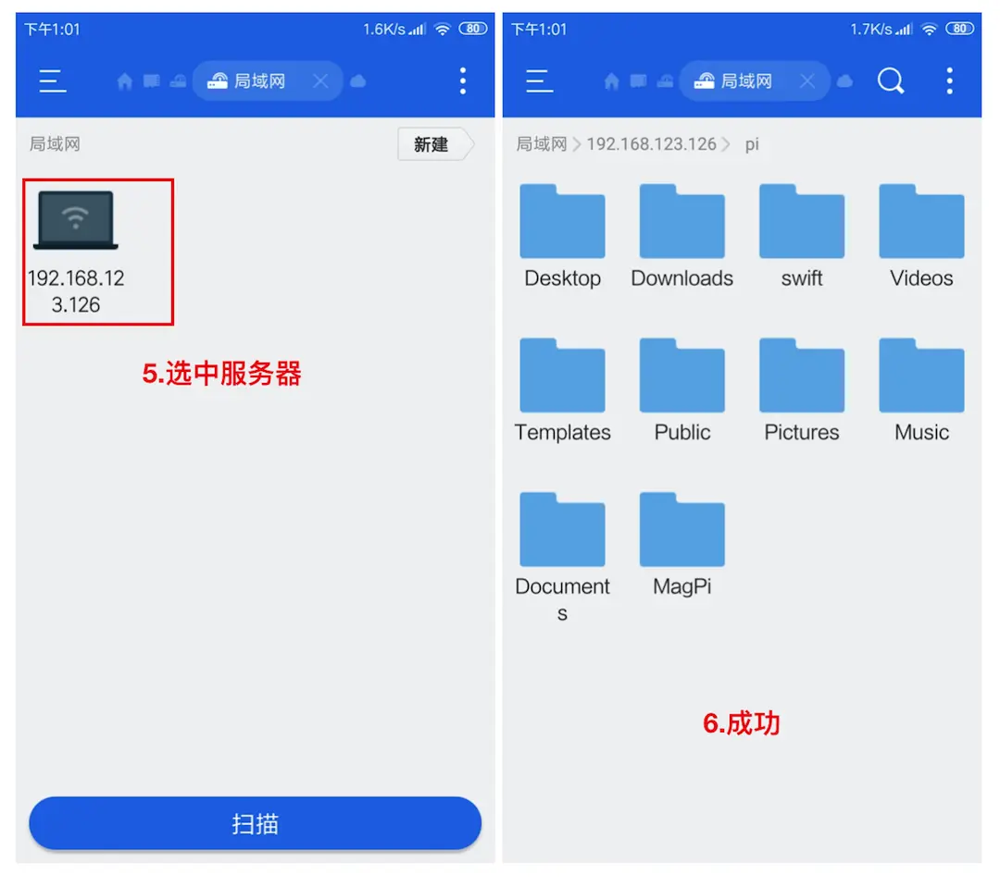
3.3 电视也可以共享文件
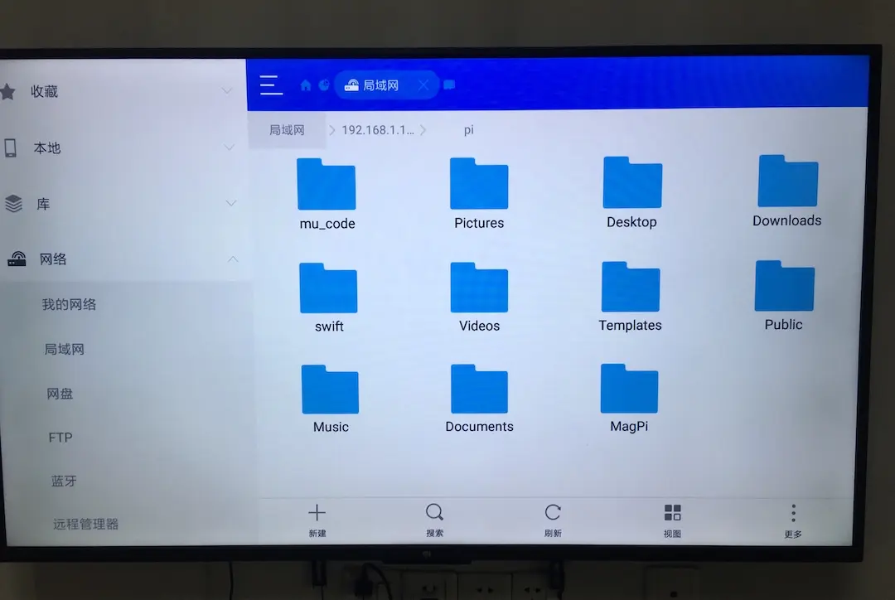

#####4. ios端：
4.1. ios设备可以使用`FileExplorer`，[下载地址](https://apps.apple.com/cn/app/fe文件管理器/id510282524),

4.2. 安装后，依次点击新建->选择NAS->输入树莓派ip->输入用户名和密码，连接成功。
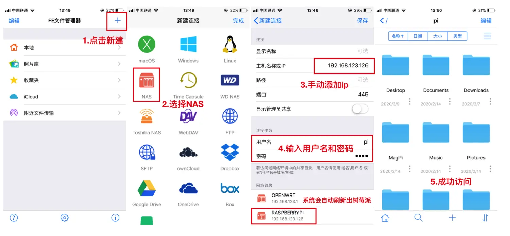

### 总结
树莓派开启了Samba服务后，家里就相当于家庭文件共享中心。传输文件再也不用通过qq传送或者U盘拷贝来拷贝去了。
树莓派上存一个文件，家里的任何设备都可以访问。下载一部电影放进树莓派里，无论是手机、平板电脑、客厅的电视可以秒加载，局域网文件共享，效率高，速度快！
> samba对于文件共享这个功能来说还可以，如果是流媒体播放的话，推荐树莓派安装miniDLNA,体验了你就知道了，播放流媒体的速度非常快！