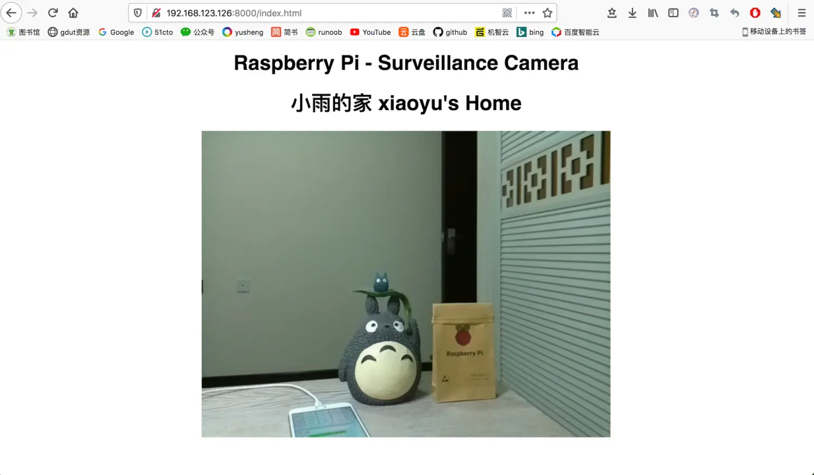
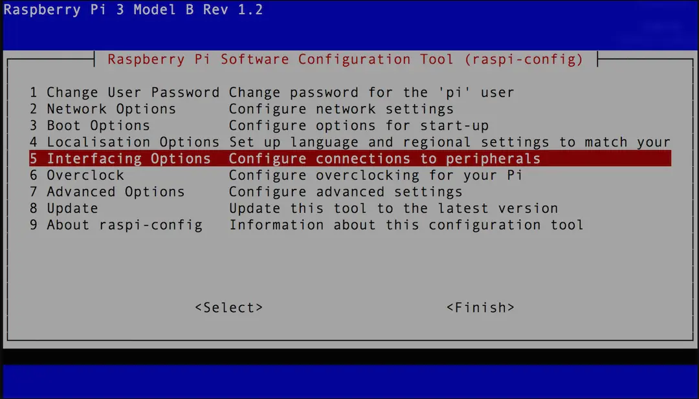
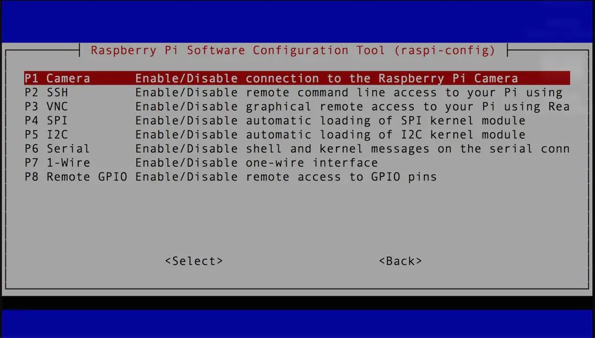
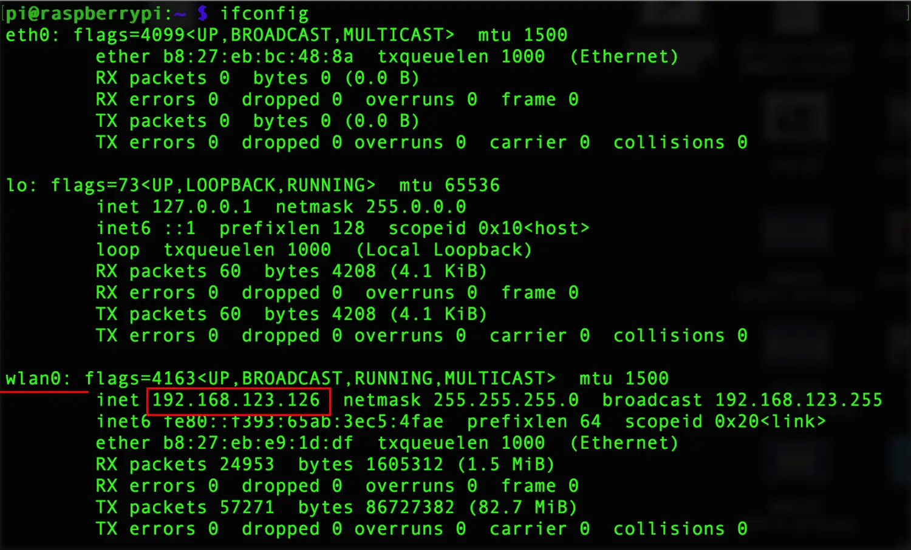
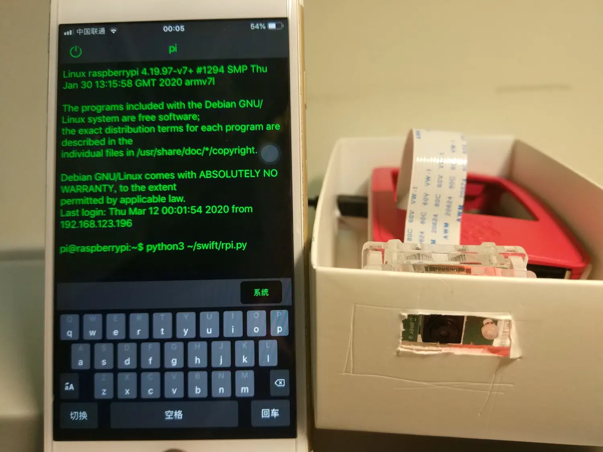
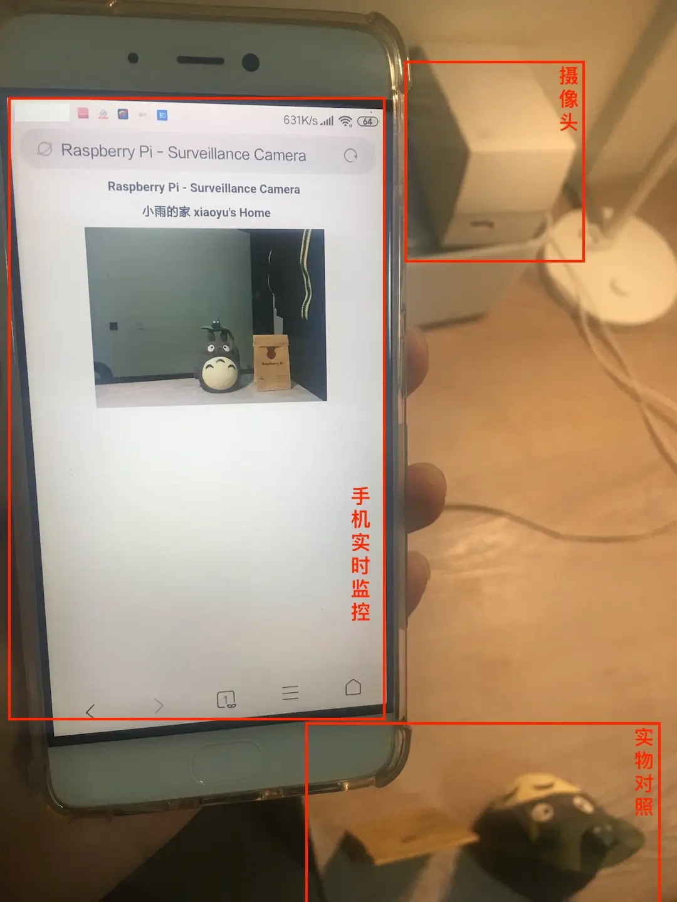

### 前言
在GitHub上发现一个好玩的[项目](https://github.com/RuiSantosdotme/Random-Nerd-Tutorials/blob/master/Projects/rpi_camera_surveillance_system.py)，不用安装其它任何依赖包，只要运行一个Python脚本就可以在局域网构建一个视频监控系统。果断试了一下，确实挺好玩的，现在分享给大家。



### 搭建方法
##### 1. 硬件准备
首先你得有一个树莓派CSI接口的摄像头和一个装好系统的树莓派。
如何安装系统请参考我之前的教程[如何给树莓派写入镜像](https://www.jianshu.com/p/b6faa1a515bf)


如果你之前已经使用过摄像头接口，直接看跳到下一步。如果还没有的用过的话，树莓派摄像头接口可能还没有打开，这是树莓派打开摄像头接口的方法：

(1) 命令行输入：`sudo raspi-config`

(2) 选中`Interfacing Options`，按`Enter`进入子菜单


(3) 选中`Camera`，按`Enter`打开摄像头接口，确认后即可


##### 2. 接入摄像头
给树莓派接上摄像头很容易。确保树莓派已经关机的情况下，用指甲轻轻打开CSI接口卡扣，将连接带有金属接触面的方向对准CSI接口黑色的一面，再扣紧卡扣就可以了。

##### 3. 找到树莓派的IP地址
在树莓派终端输入命令`ipconfig`，wlan0即为树莓派的ip地址，这里是`192.168.123.126`



##### 4. 下载脚本
GitHub项目地址：[地址](https://github.com/RuiSantosdotme/Random-Nerd-Tutorials/blob/master/Projects/rpi_camera_surveillance_system.py)

下面是我的示例文件:
```python
# Web streaming example
# Source code from the official PiCamera package
# http://picamera.readthedocs.io/en/latest/recipes2.html#web-streaming

import io
import picamera
import logging
import socketserver
from threading import Condition
from http import server

PAGE="""\
<html>
<meta http-equiv="Content-Type" content="text/html; charset=utf-8" />
<head>
<title>Raspberry Pi - Surveillance Camera</title>
</head>
<body>
<center><h1>Raspberry Pi - Surveillance Camera</h1></center>
<center><h1>小雨的家 Xiaoyu's Home</h1></center>
<center></center>
</body>
</html>
"""

class StreamingOutput(object):
    def __init__(self):
        self.frame = None
        self.buffer = io.BytesIO()
        self.condition = Condition()

    def write(self, buf):
        if buf.startswith(b'\xff\xd8'):
            # New frame, copy the existing buffer's content and notify all
            # clients it's available
            self.buffer.truncate()
            with self.condition:
                self.frame = self.buffer.getvalue()
                self.condition.notify_all()
            self.buffer.seek(0)
        return self.buffer.write(buf)

class StreamingHandler(server.BaseHTTPRequestHandler):
    def do_GET(self):
        if self.path == '/':
            self.send_response(301)
            self.send_header('Location', '/index.html')
            self.end_headers()
        elif self.path == '/index.html':
            content = PAGE.encode('utf-8')
            self.send_response(200)
            self.send_header('Content-Type', 'text/html')
            self.send_header('Content-Length', len(content))
            self.end_headers()
            self.wfile.write(content)
        elif self.path == '/stream.mjpg':
            self.send_response(200)
            self.send_header('Age', 0)
            self.send_header('Cache-Control', 'no-cache, private')
            self.send_header('Pragma', 'no-cache')
            self.send_header('Content-Type', 'multipart/x-mixed-replace; boundary=FRAME')
            self.end_headers()
            try:
                while True:
                    with output.condition:
                        output.condition.wait()
                        frame = output.frame
                    self.wfile.write(b'--FRAME\r\n')
                    self.send_header('Content-Type', 'image/jpeg')
                    self.send_header('Content-Length', len(frame))
                    self.end_headers()
                    self.wfile.write(frame)
                    self.wfile.write(b'\r\n')
            except Exception as e:
                logging.warning(
                    'Removed streaming client %s: %s',
                    self.client_address, str(e))
        else:
            self.send_error(404)
            self.end_headers()

class StreamingServer(socketserver.ThreadingMixIn, server.HTTPServer):
    allow_reuse_address = True
    daemon_threads = True

with picamera.PiCamera(resolution='640x480', framerate=24) as camera:
    output = StreamingOutput()
    #Uncomment the next line to change your Pi's Camera rotation (in degrees)
    #camera.rotation = 90
    camera.start_recording(output, format='mjpeg')
    try:
        address = ('', 8000)
        server = StreamingServer(address, StreamingHandler)
        server.serve_forever()
    finally:
        camera.stop_recording()

```
##### 5. 写入脚本
将上面的代码保存一个名为`rpi.py`的Python文件，通过smb传输的方式，将代码上传至树莓派任意用户文件夹中，这里我们可以上传到树莓派`~/swift`文件夹下。

***
> 注意：如果你还不会使用smb服务，请查看我的上一篇文章[树莓派安装Samba服务](https://www.jianshu.com/p/0c4ec31bd09d)
##### 6. 代码执行
```shell
python3 ~/swift/rpi.python
```
此时监控系统以及开始工作了。局域网内的任何设备，打开浏览器地址栏输入`192.168.123.126:8000`，(冒号前的IP地址换成你自己树莓派的ip)即可打开网络监控系统。视频响应的延时取决于你的树莓派和路由器的性能。
##### 7.实际效果

### 最后：
由于树莓派没有开机按键，每次开机都要手动上电（拔插电源接口）于是我把树莓派电源接在可以手机控制开关的智能插座上，这样就能随时通过手机来控制树莓派开机了。另外我还用手机包装盒给这个树莓派监控系统做了一个外壳，这样就可以“伪装”起来，手机上再安装一个可以ssh的app，随时执行视频监控脚本。这样我就可以在家里任何地方，随时用手机查看监控了。

