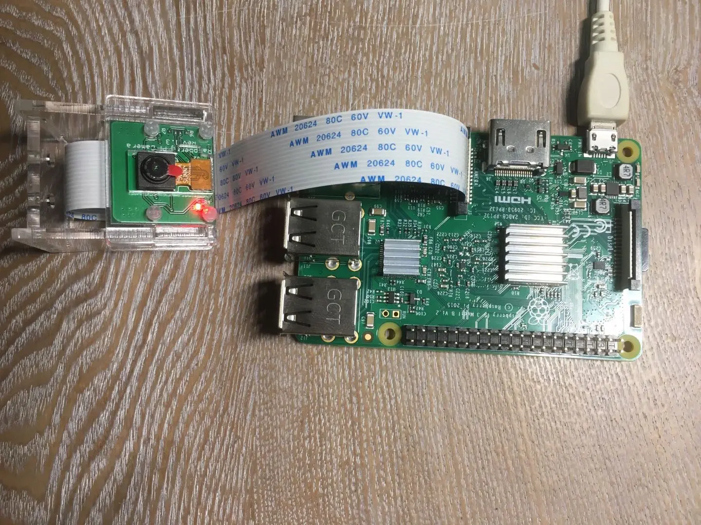
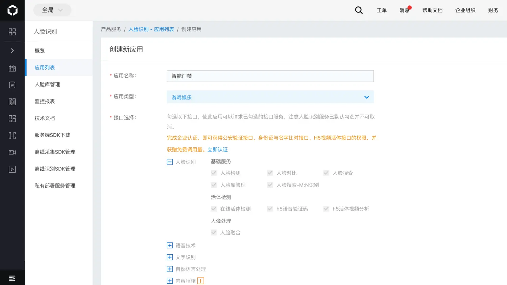
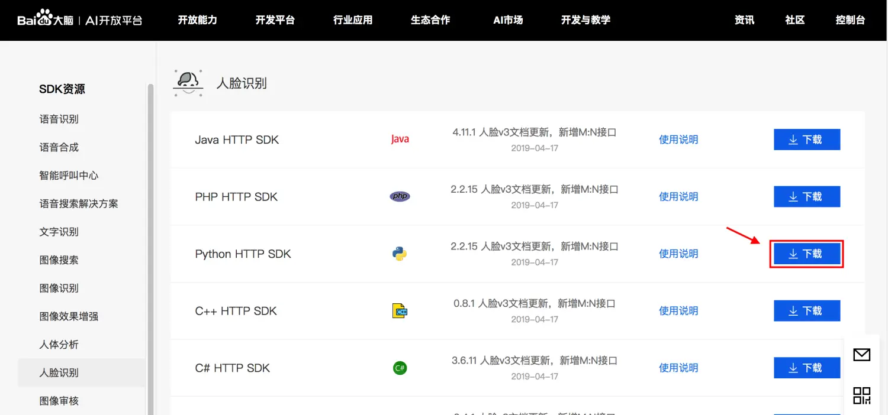
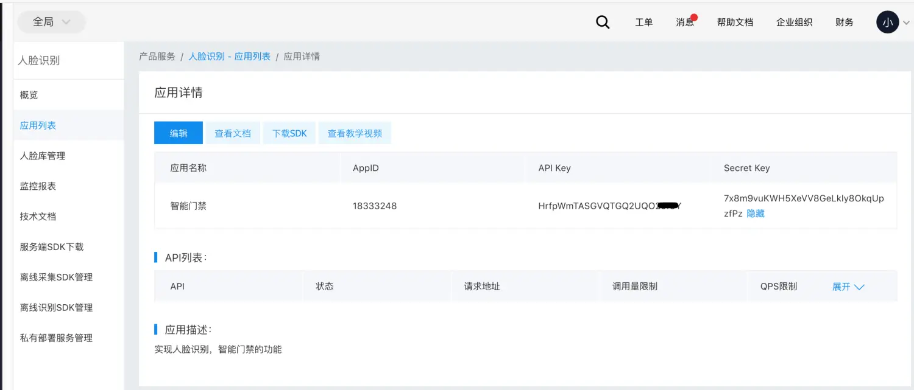
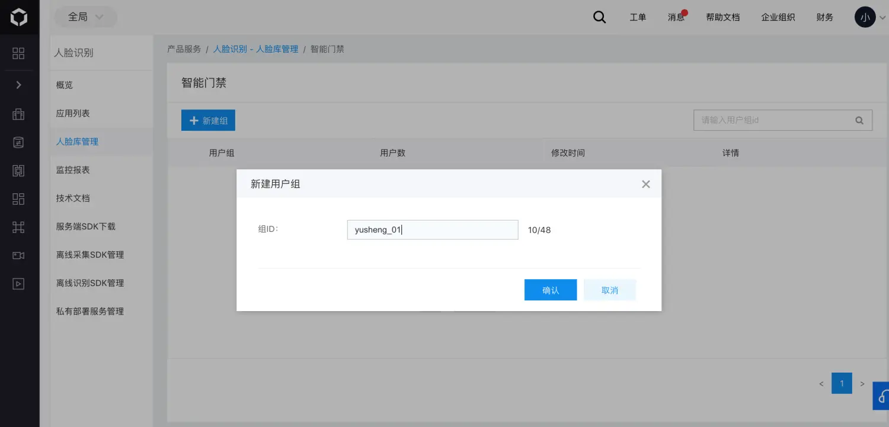
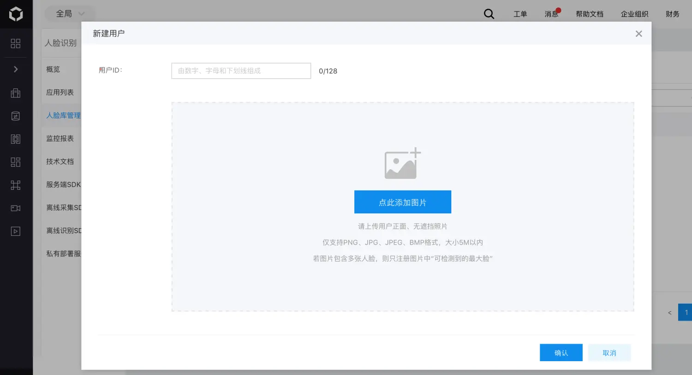
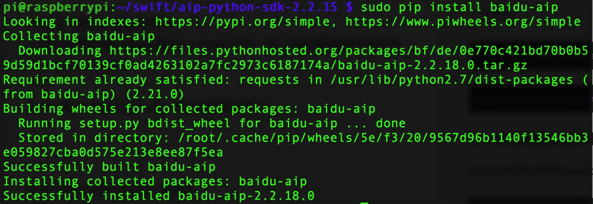
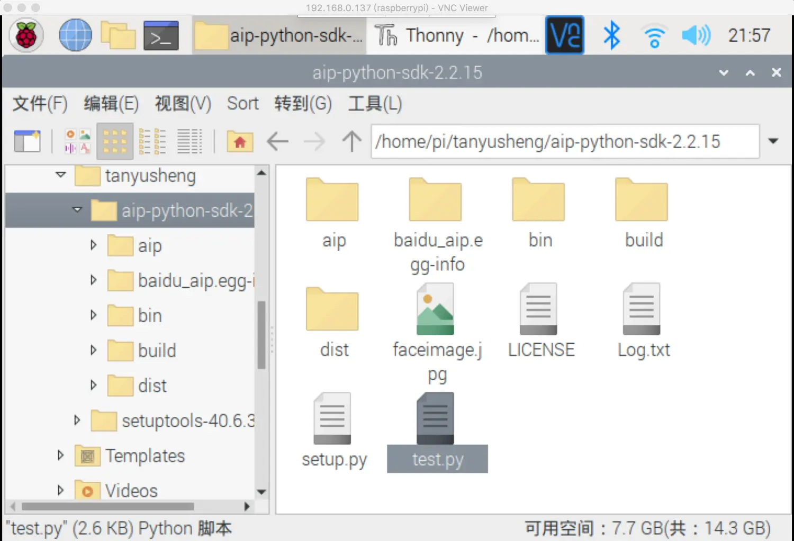
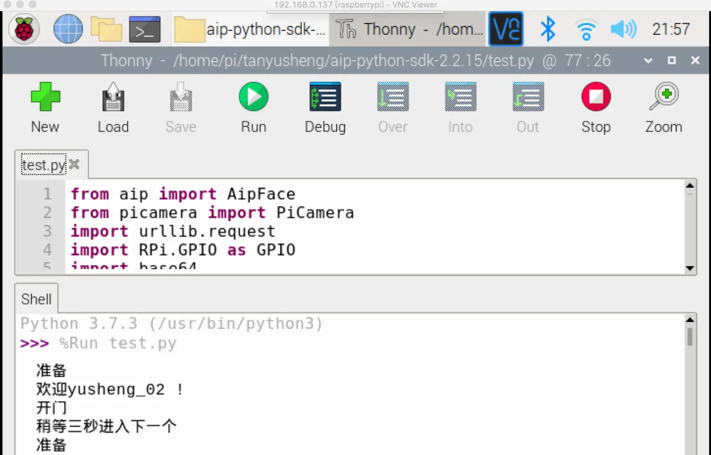

### 前言
树莓派配置OpenCV，配置起来有点繁琐且耗时，调用百度智能云的人脸识别API是一个很好的解决方案


### 一、申请AppID、API Key和Secret Key
##### 1.1 创建应用
在百度智能云人脸识别项目中创建应用，



##### 1.2 下载SDK
创建完毕后，下载SDK文档，因为是在树莓派中运行，所以选中python HTTP SDK下载到本地。


##### 1.3 记录AppID
查看应用详情，记录下AppID、API Key和Secret Key，在后面的代码中会用到。


##### 1.4 在人脸库管理中添加人脸数据
在人脸库管理中新建用户组，再从用户组中新建人脸id和照片；


### 二、项目部署
##### 2.1 sdk传输至树莓派上
把下载好的SDK压缩包解压，可以通过ftp或者smb的方式，
如何使用smb,请见我的另一篇文章[树莓派安装Samba服务](https://www.jianshu.com/p/0c4ec31bd09d)把文件传输到到树莓派你想放的目录下，然后cd进入该目录；
##### 2.2 安装pip以及setuptools
*如果你的树莓派以及安装好了这两款软件，直接跳至2.3，如果还没，可以按一下步骤安装这两款重要的软件；*
2.2.1 安装setuptools
到官网（[https://pypi.org/project/setuptools/](https://pypi.org/project/setuptools/)）
a)下载 setuptools 安装包
```
wget https://files.pythonhosted.org/packages/37/1b/b25507861991beeade31473868463dad0e58b1978c209de27384ae541b0b/setuptools-40.6.3.zip
```
b)解压缩
```
unzip setuptools-40.6.3.zip
```
c)安装
```
cd setuptools-40.6.3
sudo python setup.py build
sudo python setup.py install
```
2.2.2 安装pip
a)下载
到官网（[https://pypi.org/project/pip/](https://pypi.org/project/pip/)）下载pip安装包

```
wget https://files.pythonhosted.org/packages/45/ae/8a0ad77defb7cc903f09e551d88b443304a9bd6e6f124e75c0fbbf6de8f7/pip-18.1.tar.gz
```

2）解压

```
tar zxvf pip-18.0.tar.gz
```

3）安装

```
cd ../pip-18.0/
sudo python3 setup.py install
```

##### 2.3 安装人脸识别SDK
当你的树莓派装好pip以及setuptools之后，进入到树莓派的SDK目录下，执行一下命令：

```
sudo pip install baidu-aip //安装百度AI模块
```

显示如下界面百度AI模块就成功了：

再继续安装当前的API，

```
sudo python3 setup.py install
```

### 三、测试人脸识别是否成功
以上我们就把树莓派的人脸识别基础环境配置好了，现在我们测试一下系统是否能够正常运行
可以直接在sdk文件夹aip-python-sdk-2.2.15里创建一个测试文件test.py,

```python
from aip import AipFace
from picamera import PiCamera
import urllib.request
import RPi.GPIO as GPIO
import base64
import time
#百度人脸识别API账号信息
APP_ID = '18333248'
API_KEY = 'HrfpWmTASGVQTGQ2UQO29IGY'
SECRET_KEY ='7x8m9vuKWH5XeVV8GeLkly8OkqUpzfPz'
client = AipFace(APP_ID, API_KEY, SECRET_KEY)#创建一个客户端用以访问百度云
#图像编码方式
IMAGE_TYPE='BASE64'
camera = PiCamera()#定义一个摄像头对象
#用户组
GROUP = 'yusheng01'
 
#照相函数
def getimage():
    camera.resolution = (1024,768)#摄像界面为1024*768
    camera.start_preview()#开始摄像
    time.sleep(2)
    camera.capture('faceimage.jpg')#拍照并保存
    time.sleep(2)
#对图片的格式进行转换
def transimage():
    f = open('faceimage.jpg','rb')
    img = base64.b64encode(f.read())
    return img
#上传到百度api进行人脸检测
def go_api(image):
    result = client.search(str(image, 'utf-8'), IMAGE_TYPE, GROUP);#在百度云人脸库中寻找有没有匹配的人脸
    if result['error_msg'] == 'SUCCESS':#如果成功了
        name = result['result']['user_list'][0]['user_id']#获取名字
        score = result['result']['user_list'][0]['score']#获取相似度
        if score > 80:#如果相似度大于80
            if name == 'yusheng_02':
 
                print("欢迎%s !" % name)
                time.sleep(3)
            if name == 'xiaoming':
                print("欢迎%s !" % name)
                time.sleep(3)
            if name == "xiaoyu":
                print("欢迎%s !" % name)
        else:
            print("对不起，我不认识你！")
            name = 'Unknow'
            return 0
        curren_time = time.asctime(time.localtime(time.time()))#获取当前时间
 
        #将人员出入的记录保存到Log.txt中
        f = open('Log.txt','a')
        f.write("Person: " + name + "     " + "Time:" + str(curren_time)+'\n')
        f.close()
        return 1
    if result['error_msg'] == 'pic not has face':
        print('检测不到人脸')
        time.sleep(2)
        return 0
    else:
        print(result['error_code']+' ' + result['error_code'])
        return 0
#主函数
if __name__ == '__main__':
    while True:
        print('准备')
        if True:
            getimage()#拍照
            img = transimage()#转换照片格式
            res = go_api(img)#将转换了格式的图片上传到百度云
            if(res == 1):#是人脸库中的人
                print("开门")
            else:
                print("关门")
            print('稍等三秒进入下一个')
            time.sleep(3)

```

当你把py文件保存到树莓派中，

可直接通过Tonny打开它，而且可以直接运行该程序，


### 四、最后
通过控制台打印输出，我们模拟了真实情况，已经可以知道现在树莓派的人脸识别已经能正常工作了。下一步我们将把人脸识别成功后，把print语句换成其它的的操作语句，做一个人脸识别控制舵机开门的小项目，跳转到我的下一篇文章：[树莓派人脸识别实际应用：智能门禁](https://www.jianshu.com/p/d3dac31893da)