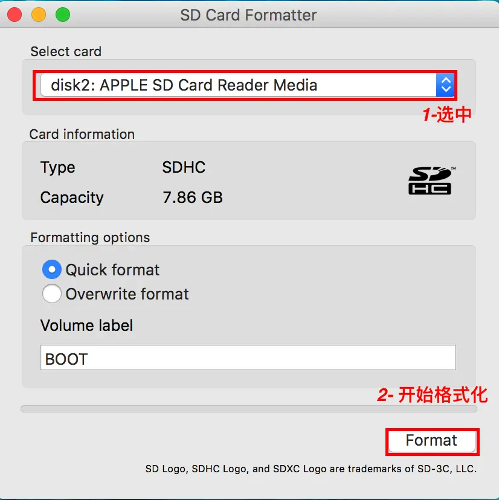
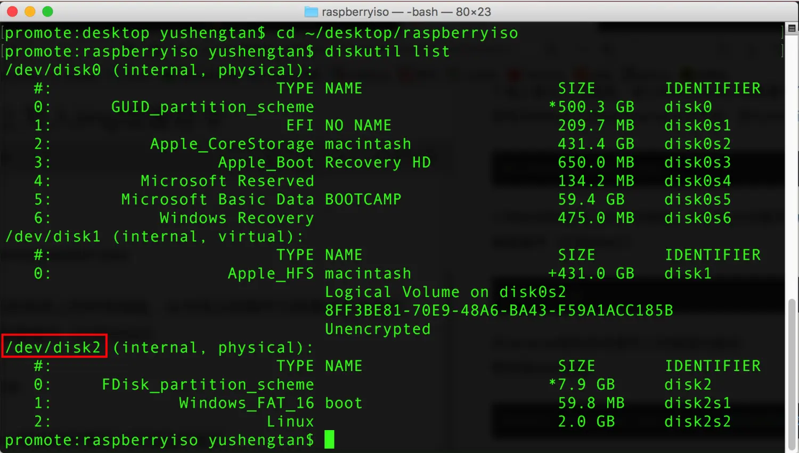
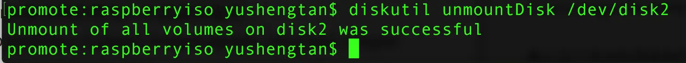
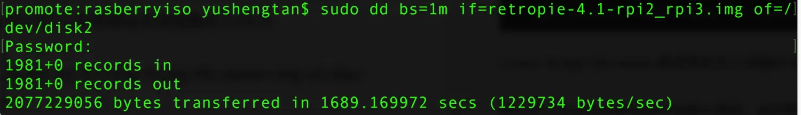

### 前言
给sd卡写入官方镜像，在windows上要用Win32 Disk Image,因为我用的是Mac系统切来切去有点麻烦，要是直接在Mac上写就方便多了。
对于要写入的SD卡，我们通常需要对它进行格式化，可以用格式化工具SD Card Formatter,这款格式化工具可以从SD官网[下载](https://www.sdcard.org/downloads/formatter/)


选中要操作的SD卡，点击Format即可；

### 操作步骤

##### 1.进入目录

插入要写入的sd卡，进入Mac上存放img镜像文件的目录，比如我的就是放在Desktop上的raspberryiso文件夹，那么terminal的命令就是:

```
cd ~/desktop/rasiberryiso
```
##### 2.列出目前系统上的所有磁盘;

```
diskutil list
```
在terminal里找到你要写入的磁盘的编号；


##### 3.推出此磁盘
```
diskutil unmountDisk /dev/<disk#> 
```
(<disk#>换成你要写入的磁盘编号）


##### 4.用dd命令将树莓派系统镜像写入SD卡
```
    sudo dd bs=1m if=<your image file name>.img of=/dev/<disk#> 
```
(<your image file name>换成要你写入镜像的文件名)

输入这个命令后系统会提示你输入密码，此时输入你电脑账户的密码即可。


#### 建议

终端写入镜像会花费较长时间，没有进度条请耐心等待，请不要急着关闭相应“终端”窗口，我给树莓派烧录一个系统镜像花了一个多小时才好，一定要有耐心，这一点很重要。