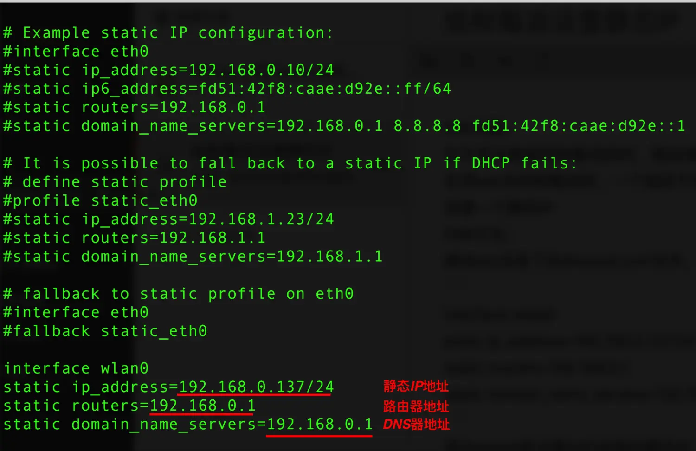
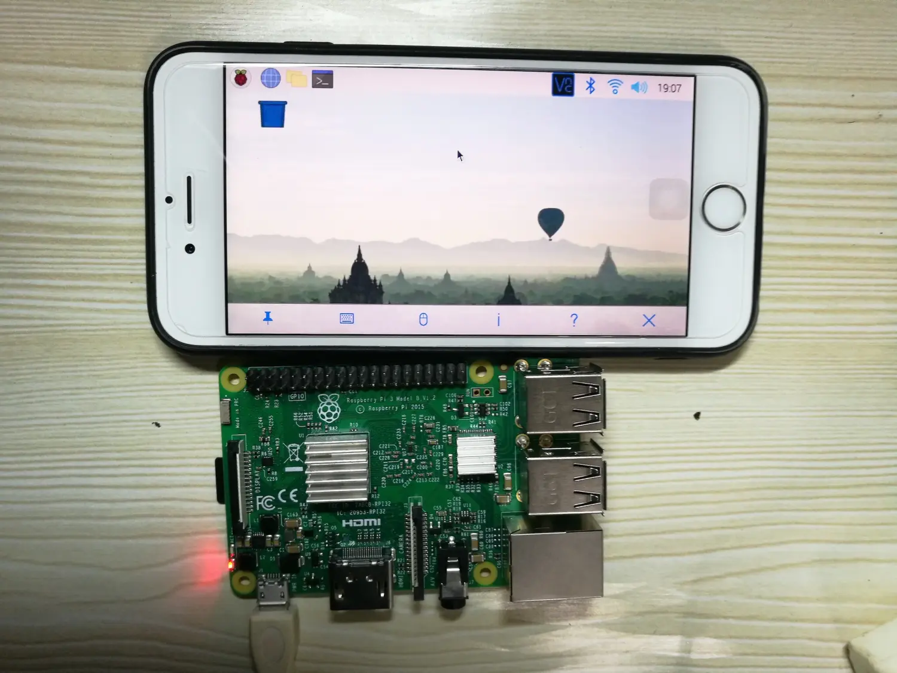

### 问题：

在无显示器使用树莓派的时，路由器的DHCP服务会使树莓派的IP地址发生改变，在用ssh访问树莓派时，一个固定不变的静态IP会方便很多。下面就来说一下如何设置一个静态IP

### 方法：

修改etc目录下的dhcpcd.conf文件，在末尾加入以下代码：

```
interface wlan0
static ip_address=192.168.0.137/24
static routers=192.168.0.1
static domain_name_servers=192.168.0.1
```
其中wlan0是设置WiFi连接的静态IP，如果要设置以太网有线连接的静态IP那就要再加上eth0,目前我的树莓派只用WiFi就没加了。
ip_address可以改为目前没有被占用的IP地址，我这里设置了192.168.0.137



保存后，执行sudo halt重启树莓派，你会发现树莓派的IP地址变为192.168.0.137，不会变了。
###实际应用
当你有时候想使用树莓派，可身边没有可用显示器的时候，我们可以用这个方法。
1.设置静态IP地址为手机热点
2.树莓派开机自动连接手机
3.在笔记本上或者手机上安装VNC
这时手机或者笔记本就可以当做树莓派的显示器了。


还有一点好处：
---
当你没带键盘鼠标，用这个方法就可以使用SSH命令登录操作树莓派了