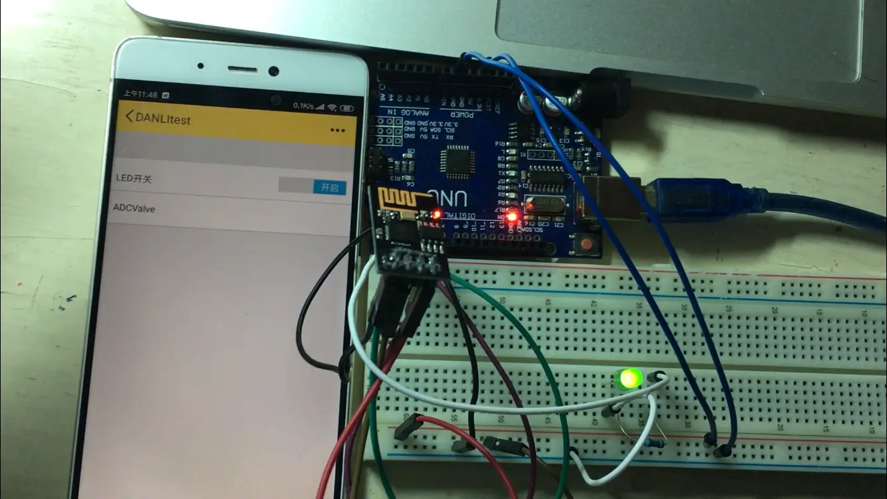
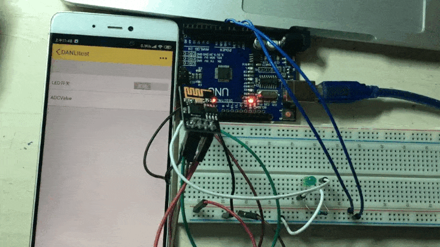
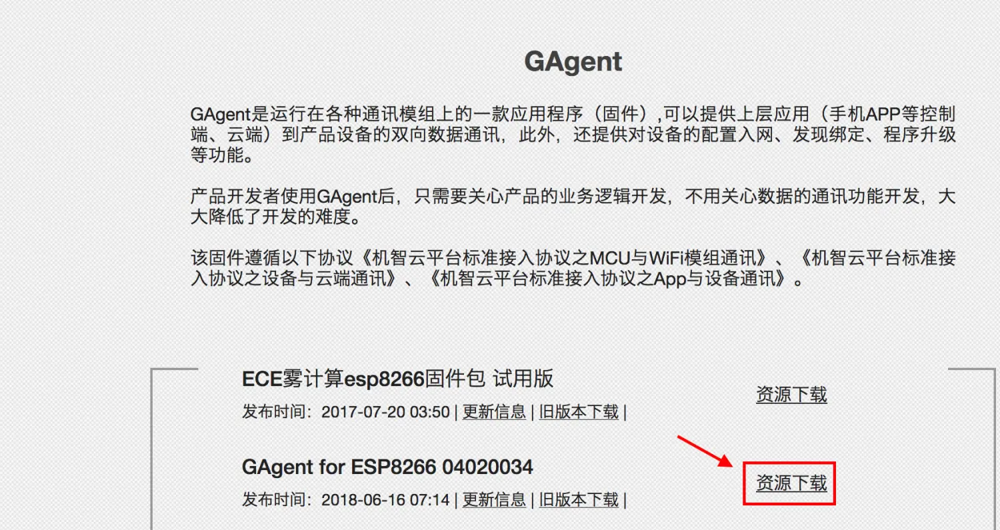
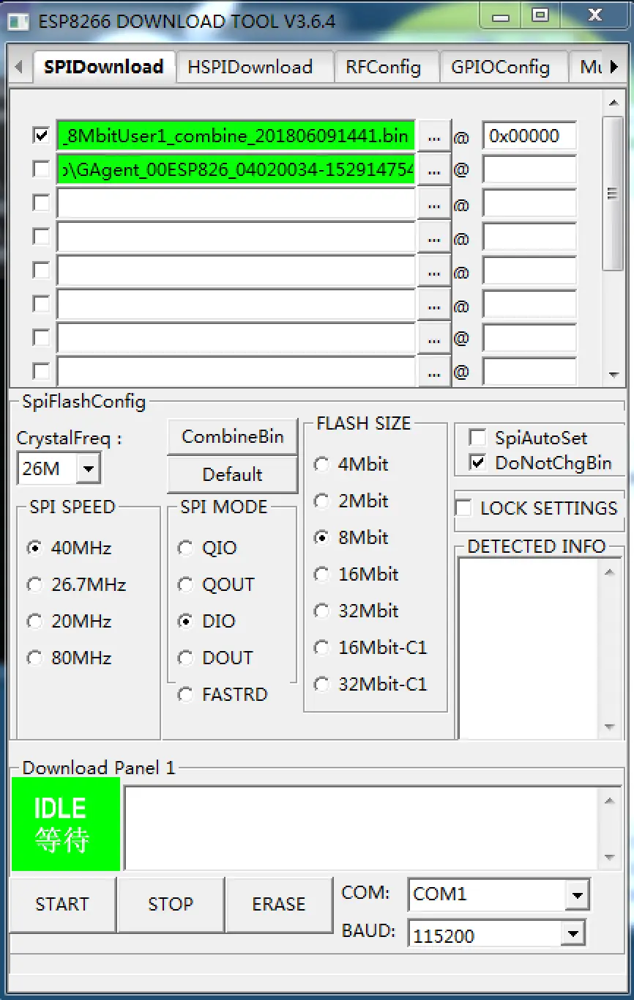
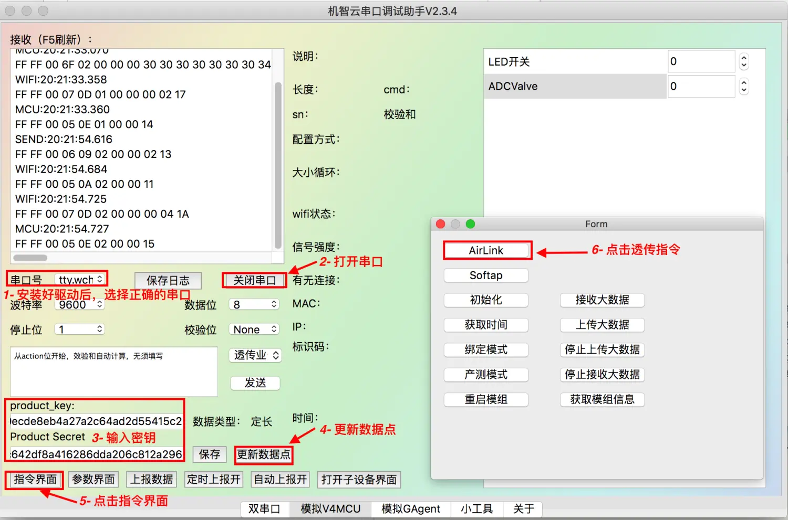
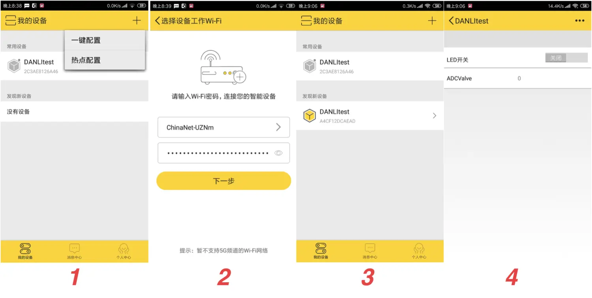
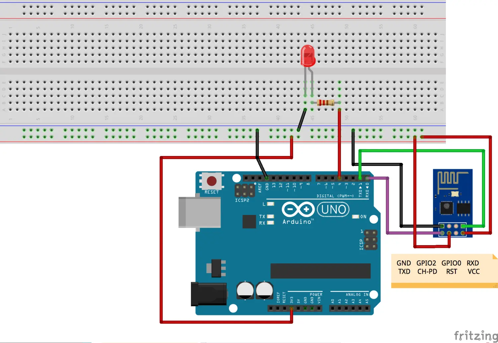

### 前言

本文实现Arduino UNO R3通过ESP8266-01模块连接机智云平台，从而实现用手机APP远程点亮LED灯。




### 一、ESP8266模块本地调试

当我们参考机智云官网给的教程时，关于Arduino平台主要都是关于机智云官方自己的开发板Gokit的资料。

但当我们只使用Arduino UNO R3接入机智云平台，有很多教程通过添加了两个按键来选择airlink和softap模式，其实我们只要在本地给ESP8266配好了网络连接，就不需要每次通过按键切换配网模式。

##### 第一步：首先在官网下载机智云固件[GAgent](https://download.gizwits.com/zh-cn/p/92/94),



##### 第二步：使用ESP8266下载工具ESPFlashDownloadTool，将固件下载至ESP8266中。



##### 第三步：在机智云官网下载[机智云串口调试助手](https://download.gizwits.com/zh-cn/p/98/119),


将ESP8266通过串口转USB工具插在电脑上，安装好驱动，选择中确的驱动后，打开串口，填入在官网申请的product_key和Product Secret后，就能在右边看见数据点了，此时再打开指令界面，点击AirLink命令，ESP8266就进入了自动配网模式；

##### 第四步：下载[机智云移动端APP](https://download.gizwits.com/zh-cn/p/98/99)



打开APP,点击一键配置，输入家里的WiFi账号及密码，选择乐鑫，因为刚才我们已经将ESP8266设置成AirLink透传模式，现在通过APP就可以将家里的WiFi信息发送给ESP8266,此时APP发现新设备下会出现你的WiFi模组，点击后就会看到你定义的数据点了。

### 二、硬件搭建

##### 2.1硬件连接图



LED接上220欧姆电阻，连在Arduino的D4上，ESP8266CH-PD和vcc都接高电平。
***
注意：
* 在给Arduino烧录程序的时候要断开ESP8266与Arduino的串口连接，否则会有干扰导致代码烧录不成功；
* ESP8266-01只能供给3.3v电压，5v电压可能会烧坏WiFi模组
***
##### 2.2项目源码

```c
/**************************************************************

Name:      Gizwits + ArduinoUnoWiFi Library 
Author:   tli@gizwits.com / bing@arduino.org.cn 
Version:  V1.0
Init:     2016-12-23
Modify:   2020-02-22
****************************************************************/
#include <Gizwits.h>
#include <Wire.h>
#include <SoftwareSerial.h>

int ledPin = 13;                 // LED connected to digital pin 13,it's used for status 
int myledPin = 4;                 // my LED connected to digital pin 4
int sensorValue = 0;        // value read from the pot
bool varR_LED_OnOff = 0;
Gizwits myGizwits;

#define   KEY1              6
#define   KEY2              7
#define   KEY1_SHORT_PRESS  1
#define   KEY1_LONG_PRESS   2
#define   KEY2_SHORT_PRESS  4
#define   KEY2_LONG_PRESS   8
#define   NO_KEY            0
#define   KEY_LONG_TIMER    3
unsigned long Last_KeyTime = 0;

unsigned long gokit_time_s(void)
{
  return millis() / 1000;
}


void setup() {
  // put your setup code here, to run once:

  Serial.begin(9600);
  
  pinMode(ledPin, OUTPUT);      // sets the digital pin as output
  pinMode(myledPin, OUTPUT);      // sets the digital pin as output
 
  pinMode(KEY1, INPUT_PULLUP);
  pinMode(KEY2, INPUT_PULLUP);
  
  myGizwits.begin();
}
void wifiStatusHandle()
{

  if(myGizwits.wifiHasBeenSet(WIFI_CON_ROUTER))
  digitalWrite(ledPin, LOW);    // sets the LED off

}
void loop() {  
  
  sensorValue = analogRead(A0);

  unsigned long varW_ADCValue = sensorValue;//Add Sensor Data Collection
  myGizwits.write(VALUE_ADCValue, varW_ADCValue);

  if(myGizwits.hasBeenSet(EVENT_LED_OnOff))
  {
    myGizwits.read(EVENT_LED_OnOff,&varR_LED_OnOff);//Address for storing data 
  }
  if(varR_LED_OnOff==1)
  {
    digitalWrite(myledPin, HIGH);   // 打开 LED 
  }
  else
  {
    digitalWrite(myledPin, LOW);    // 关闭 LED 
  }
  
//  KEY_Handle();//key handle , network configure
  wifiStatusHandle();//WIFI Status Handle
  myGizwits.process();
}
```
### 最后

至此，你的ESP8266模组就成功连接上机智云服务平台了，无论你在任何地方，无论用WiFi和4G都能通过APP来控制LED等的亮灭了，机智云还提供了APP的开源框架，我们可以在此基础上高度自由地定制我们自己的APP接入机智云物联网平台。

***
最后的最后：我还拍了一个视频演示综合了各个功能的最终效果，[视频传送门](https://www.bilibili.com/video/av93482171/)点击链接即可观看~