### 一.操作系统的特征

**并发：**两个或多个事件在同一时间间隔内发生。这些事件`宏观上是同时发生`的，但`微观上是交替发生`的。

**并行：**指两个或多个事件在同一时刻同时发生。

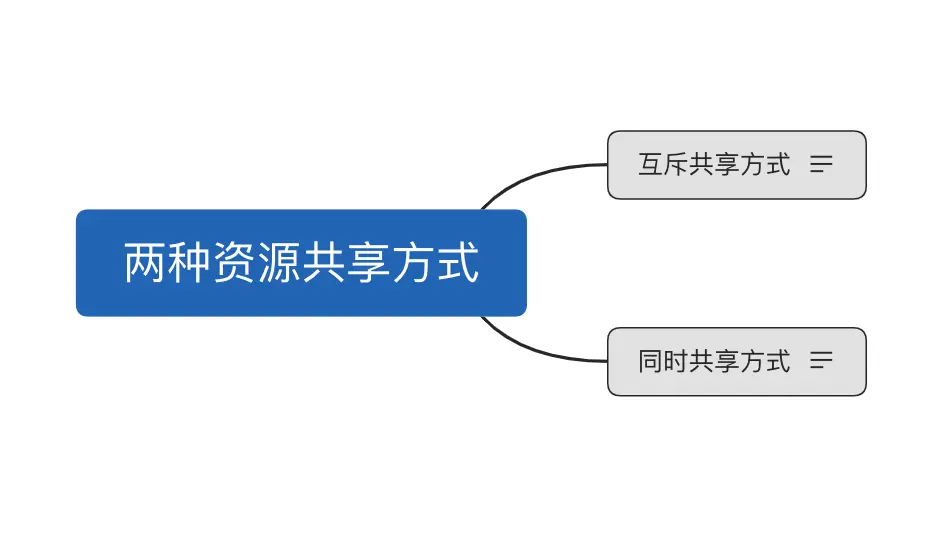

**并发性：**指计算机中同时存在着多个运行着的程序

**共享性：**是指系统中的资源可供内存中对各并发执行的进程共同调用

**虚拟：**是指把一个物理上的实体变为若干逻辑上的对应物。物理实体是实际存在的，二逻辑上对应物是用户感受到的。
虚拟技术中的时分复用技术：微观上处理机在各个微小的时间段内交替为着各个进程服务

**异步：**在多道程序环境下，允许多个程序并发执行，但由于资源有限，进程的执行不是一贯到底的，而是走走停停，以不可预知的速度向前推进，这就是进程的异步性。
#####*重要考点：*
理解并发和并行的区别
并发和共享互为存在条件，没有并发和共享，就谈不上虚拟和异步，因此并发和共享是操作系统的两个最基本的特征。
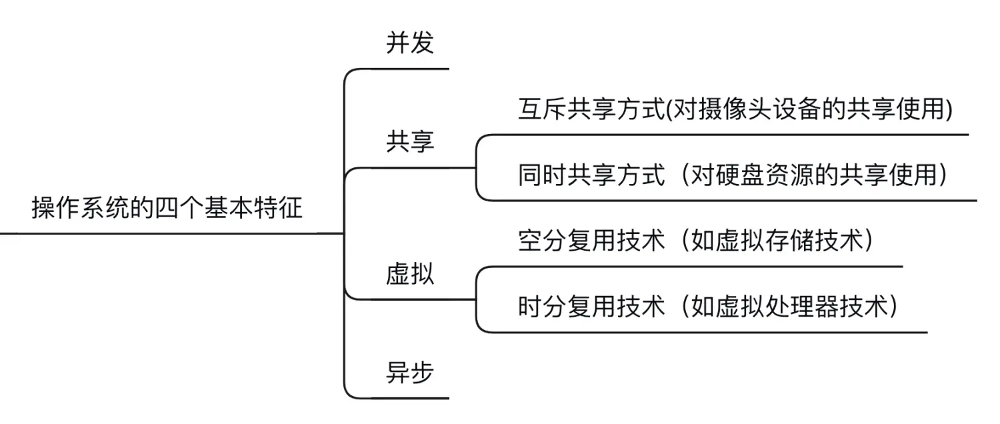
###二. 操作系统的发展和分类
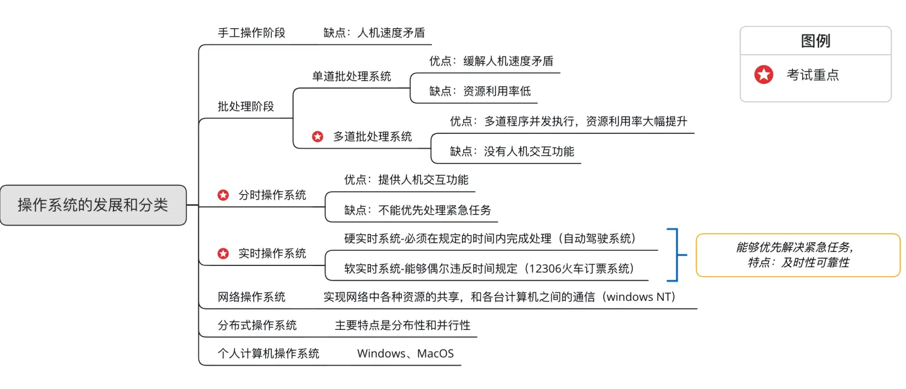

##### 批处理阶段--多道批处理系统
问题：为什么多道批处理系统能使资源利用率大幅提升？
假设计算机需要处理三个作业

作业一：输入1秒，计算机1秒，输出1秒

作业二：输入1秒，计算机1秒，输出1秒

作业三：输入1秒，计算机1秒，输出1秒

采用`单道批处理`技术：
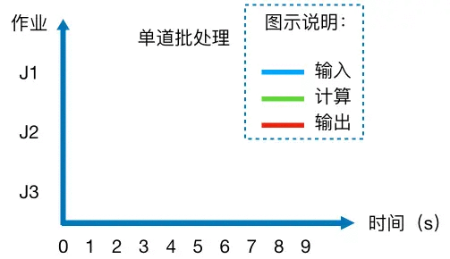

采用`多道批处理`技术：
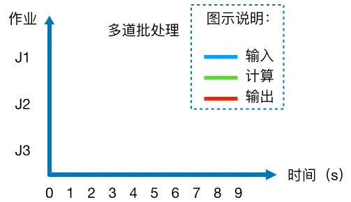

### 三. 操作系统的运行机制和体系结构
##### 1.计算机系统的层次结构
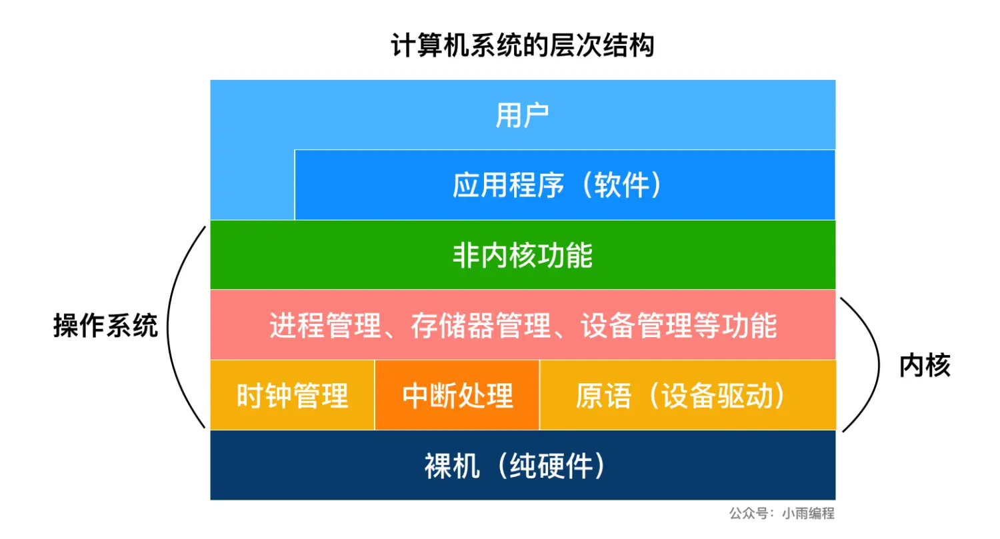

**内核：**是计算机上配置的底层软件，是操作系统最基本、最核心的部分，实现操作系统内核功能的那些程序就是内核程序。
##### 2.操作系统体系结构
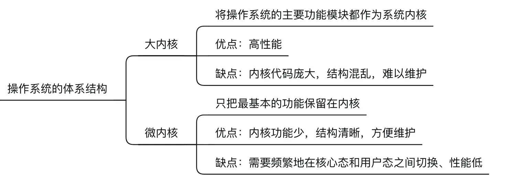
#####3. 操作系统内核：
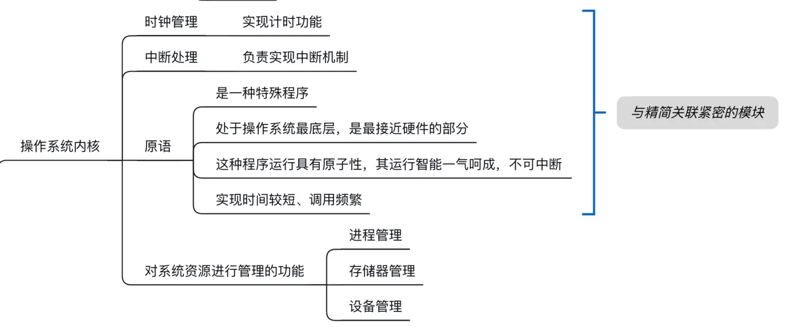

##### 4.操作系统运行机制
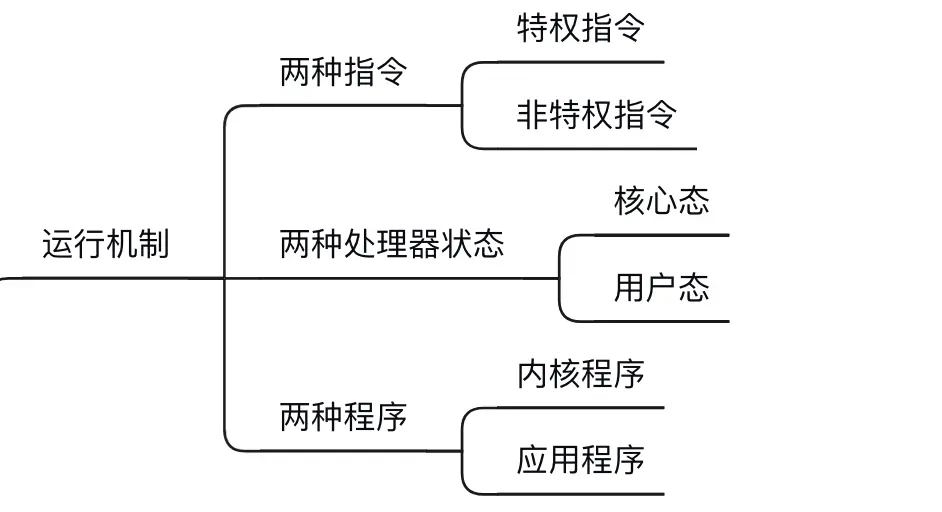

##### 5.本节常考知识点：
(1). 特权指令只能在核心态下执行

(2). 内核程序只能在核心态下执行

(3).用户态到核心态之间的切换是怎么实现的？

答：`用户态`->`核心态`：是通过`中断`实现的，并且中断是`唯一`途径。
`核心态`->`用户态`：是通过执行一个特权指令，将程序状态字（PSW）的标志位设置为`用户态`。

### 四. 中断和异常
知识总览：
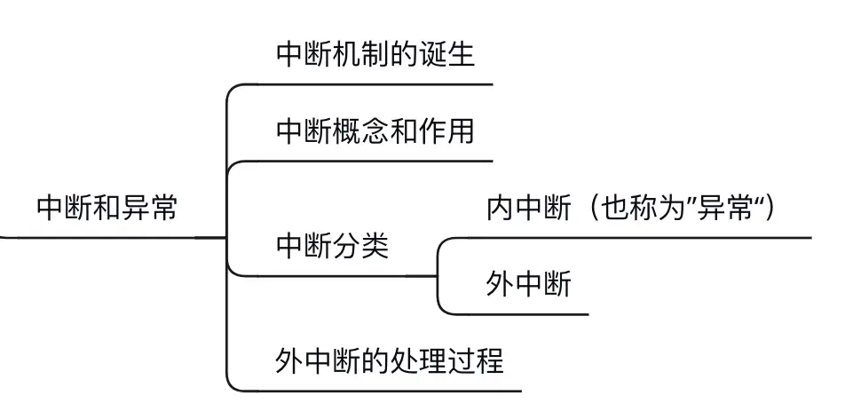
##### 1. 中断的概念和作用

（1）当中断发生时，CPU立即进入核心态

（2）当中断发生后，当前运行的进程暂停进行，并由操作系统内核对中断进行处理

（3）对于不同的中断信号，会进行不同的处理

发生中断，意味着需要操作系统介入，开展管理工作，由于操作系统的管理工作（比如进程切换、分配I/O设备）需要使用特权指令，因此CPU要从用户态转为和核心态。有了中断才能实现多道程序并发执行

##### 2. 中断的分类
根据信号的来源来区分，在CPU内部与当前执行的指令有关的称为内中断，在CPU外部与当前执行的指令无关的称为外中断。
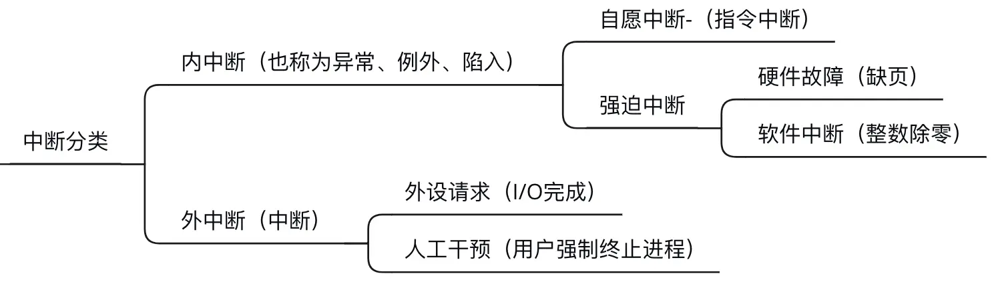
**内部中断常见概念：**

陷入（trap）:有意而为之的异常，如系统调用；

故障（fault）:由错误条件引起的可能被故障处理程序修复的，如缺页中断；

终止（about)：不可恢复发致命错误，即使操作系统介入也无法终止的，如整数除0。

##### 3. 外中断的处理过程

***step1***. CPU每执行完一个指令后，都要检查一下当前是否有外部中断信号，再执行下一个指令；

***step2***. 如果检测到外部中断信号，用户程序暂停运行，保护被中断进程的CPU环境（如程序状态字PSW、程序计数器PC、各种通用寄存器）；

***step3***: 根据中断信号的类型，转入相应的中断处理程序(核心态）；

***step4***. 恢复原进程的CPU环境并退出中断，返回进程继续往下执行。

##### 4. 小结
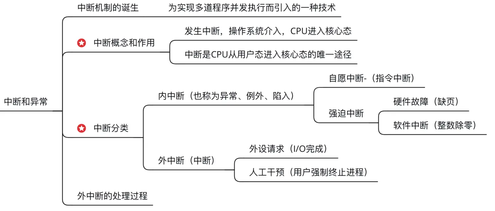

### 五. 系统调用
##### 1. 什么是系统调用，有何作用？
概念：操作系统作为用户与计算机之间的接口，需要向上层提供一些简单易用的程序接口，其中，程序接口由一组系统调用组成。

问题：为什么操作系统需要提供”系统调用“功能？

应用程序通过`系统调用`请求系统服务，系统中的各种共享资源都由操作系统统一掌管，因此在用户程序中，凡是与资源有关的操作（存储分配、I/O操作、文件管理等），都必须通过系统调用的方式向操作系统提出服务请求，由操作系统代为完成。这样可以保证系统的稳定性和安全性，防止用户进行非法操作。
##### 2.系统调用与库函数的区别
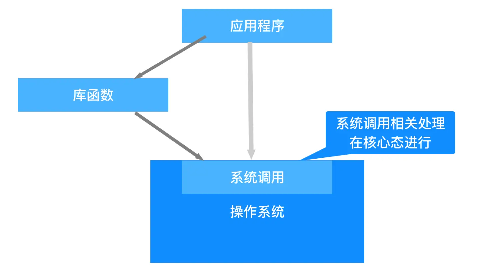

例题：判断库函数是否涉及系统调用：

解题方法：不涉及系统调用的库函数：如”取绝对值“的函数；涉及系统调用的函数：如”创建一个新文件“的函数。

##### 3.系统调用背后的过程
库函数内部封装了系统调用的复杂细节,传递系统调用参数->执行陷入指令（用户态）->执行系统调用相应服务程序（核心态）->返回用户程序

（1）陷入指令是在用户态执行的，执行陷入指令之后立即引发一个内中断，从而CPU进入核心态

（2）发出系统请求是在用户态，而对系统调用的相应处理在核心态下进行。

（3）陷入指令是唯一一个只能在用户态执行，而不能在核心态执行的指令

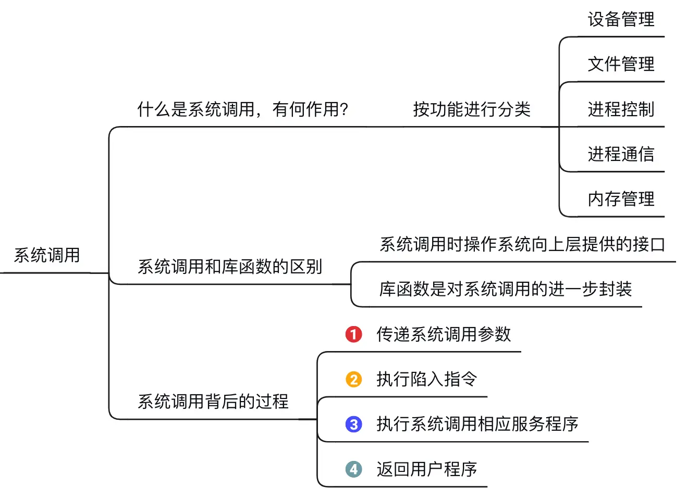
**注意**：系统调用发生在用户态，对系统调用的处理发生在核心态