### 一、进程的定义、组成、组织方式、特征
1.  进程的定义
程序就是一个指令序列，早期计算机只支持单道程序，引入多道程序之后，为了方便操作系统管理，完成各程序并发执行，引入了进程、进程实体的概念。
系统为运行的程序配置了一个数据结构，称为`进程控制块`（PCB）用来描述进程的各种信息（如程序代码存放位置）

**定义**：进程是进程实体的运行过程，是系统进行资源分配和调度的一个独立单位。

**注意：** PCB是进程存在的唯一标志！

2. 进程的组成
由`PCB`、`程序段`、`数据段`三部分构成了`进程实体`（进程映像），我们所说的创建进程，实质上是创建进程实体中的PCB，而撤销进程，实质上是撤销进程实体中的PCB。
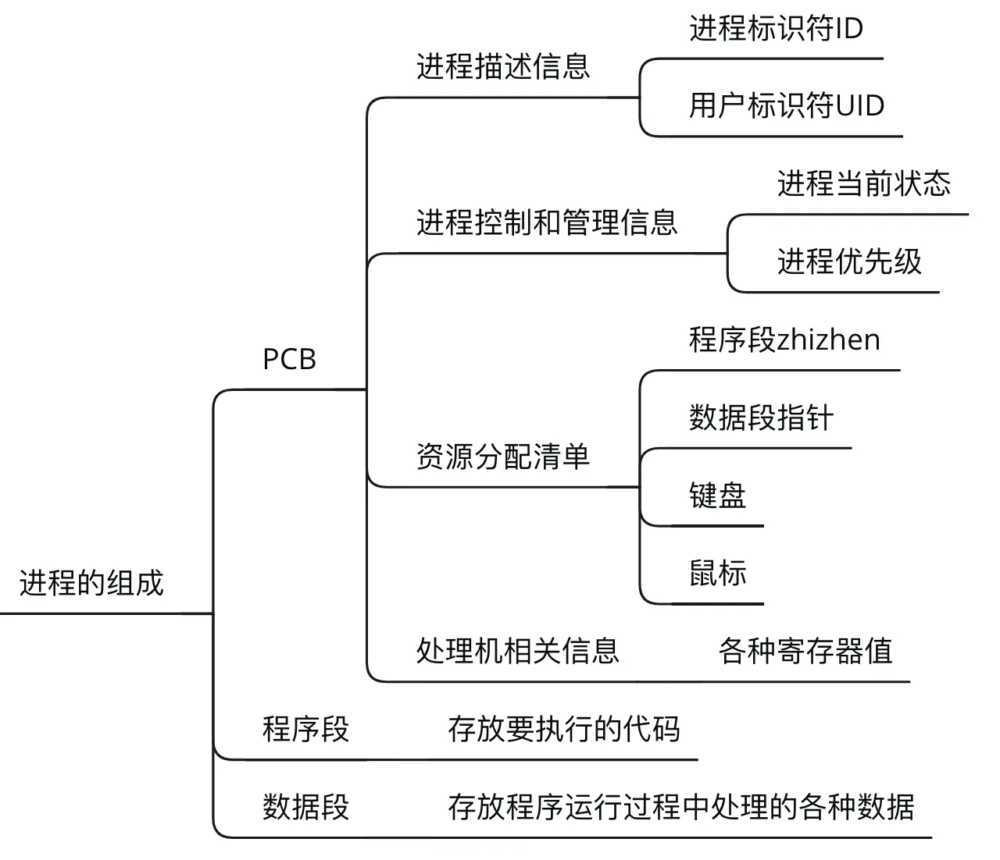
3. 进程的组织方式

系统各个进程之间是如何被组织起来的？
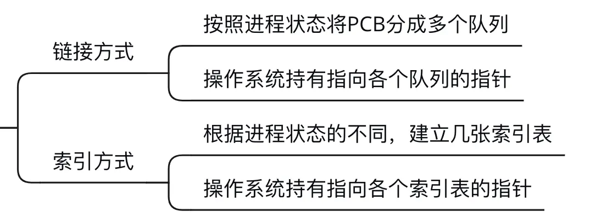

4. 进程的特征

进程和程序是两个截然不同的概念，相比于程序，进程有以下特征：
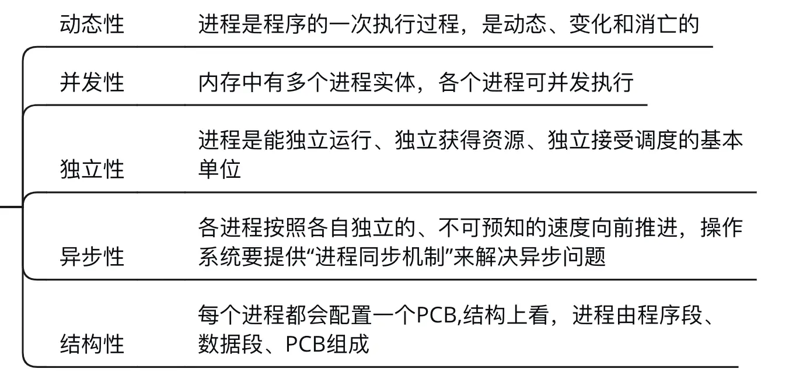

### 二、进程的状态与转换

1. 进程的状态--三种基本状态

进程是程序的一次执行。在这个执行过程中，有时进程正在被CPU处理，有时又需要等待CPU服务，可见，进程的状态是会有各种变化。为了方便对各个进程的管理，操作系统需要将进程合理地划分为几种状态。
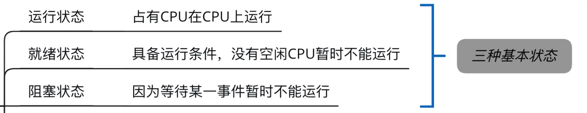

2.进程的状态--另外两只状态

**注意**：单核处理机环境下，每一时刻最多只有一个进程处于运行态（双核环境下可以同时有两个进程处于运行态）

3. 进程状态的转换
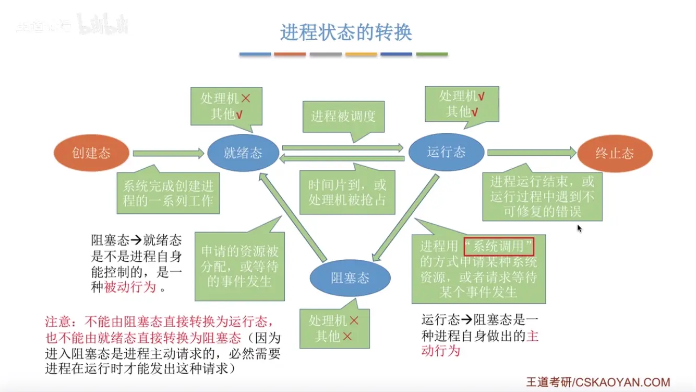

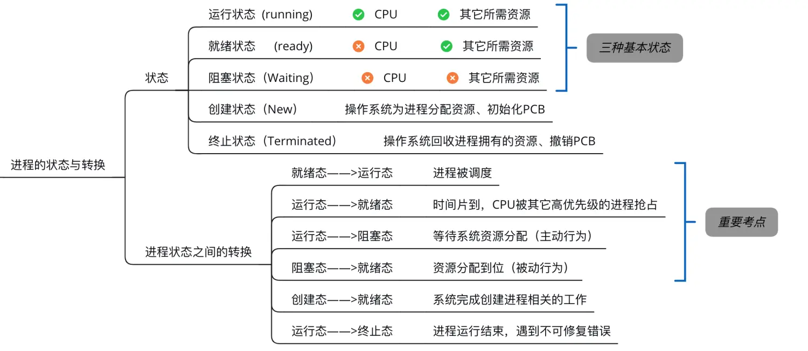

### 三、进程控制

1. 什么是进程控制
进程控制的主要功能是对系统中所有的进程实施有效的管理，它具有创建新进程、撤销已有进程、实现进程状态转换等功能。
简化理解：进程控制就是要实现进程状态转换

2. 如何实现进程控制
用`原语`来实现进程控制，原语的特点是执行期间不允许中断，智能一气呵成。
这种不可被中断的操作即`原子操作`
原语采用`关中断指令`和`开中断指令`实现。
关中断开中断指令权限非常大，只允许在核心态下执行的特权指令
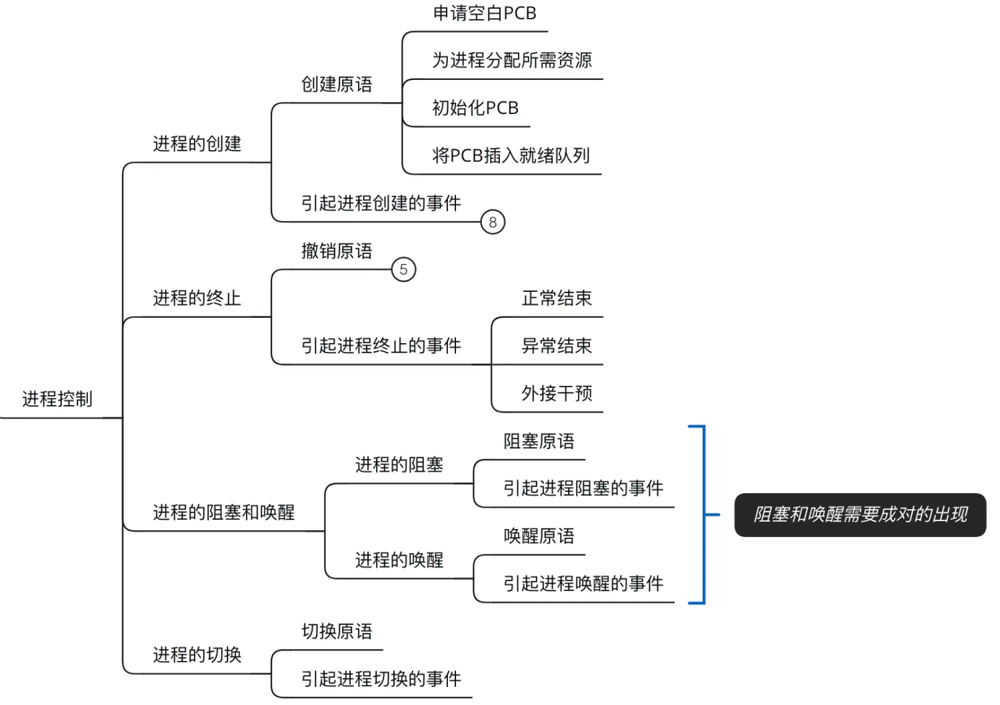

### 四、进程通信
进程通信指的就是进程之间的信息交换

1. 共享存储
进程是分配系统资源的单位，因此各进程拥有的内存地址空间相对独立;
两个进程对共享空间的访问必须是互斥的
操作系统只提供共享空间和同步互斥工具（如P、V操作）

2. 管道通信
用于连续读写进程的一个共享文件，在内存中开辟一个大小固定的缓冲区

（1）一个管道智能实现`半双工通信`，在同一时间内只能单向传输。如果要实现双向同时通信，则需要设置两个管道

（2）进程要互斥地访问管道

（3）数据以字符流的形式写入管道，当管道写满时，写进程阻塞，等待数据被取走；当管道空时，读进程阻塞，等待数据写入；

（4）如果没有写满不允许读，如果没有读空不允许写；

（5）数据一旦被读出，就从管道中被抛弃

3. 消息传递
进程间的数据交换以格式化信息为单位，通过操作系统提供的“发送消息、接收消息”两个原语进行数据交换；

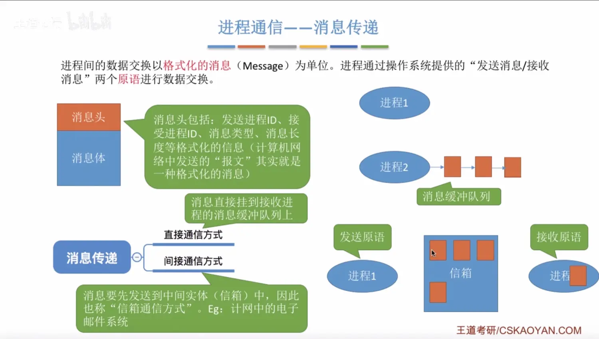

### 五、线程概念与多线程模型

1.什么是线程

进程是程序的一次执行，传统的进程只能串行地执行一系列程序，为此引入了“线程”，来增加并发度。
传统的进程是程序执行流的最小单位，引入线程后，线程成立程序执行流的最小单位。
可以把线程理解为“轻量级进程”，`线程`是一个`基本的CPU执行单元`，也是`程序执行流的最小单位`。
进程内的各线程之间可以并发，从而提高了系统的并发度；
引入线程后，`进程`只作为`除CPU之外的系统资源的分配单元`（如打印、内存地址空间都是分配给进程的）。

2.为什么要引入线程机制

引入线程机制后，有什么变化？
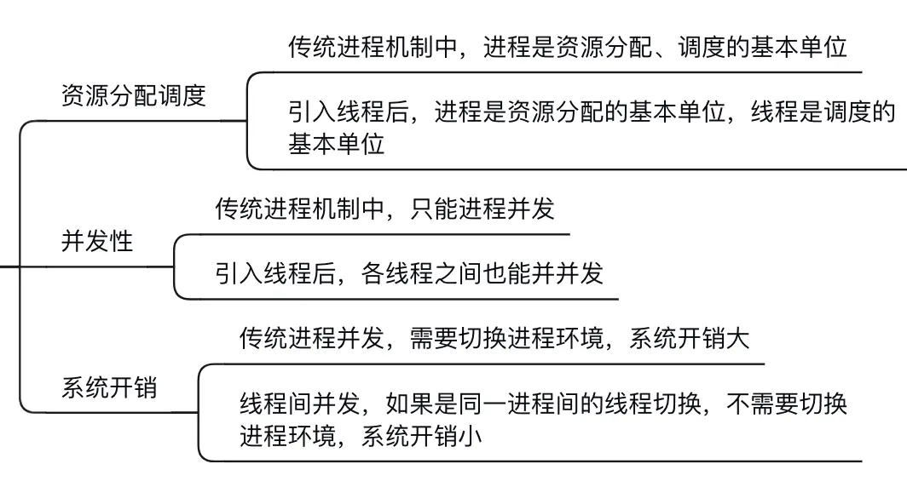

3.线程有哪些重要的属性
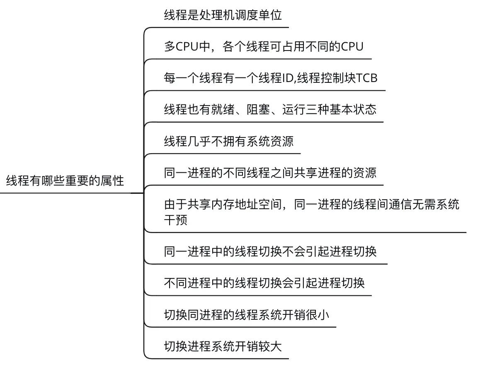

4.线程的实现方式

（1）用户级线程

用户级线程由应用程序库通过线程库实现。
所有线程管理工作都由应用程序负责（包括线程切换）

（2）内核级线程

内核级线程管理工作由操作系统内核完成，线程调度、切换等工作都由内核负责，因此内核级线程切换必须要在核心态下才能完成

**重点**：操作性只“看得见”内核级线程，因此只有内核级线程才是处理机分配的单位

5.多线程模型

（1）多对一模型：

多个用户级线程映射到一个内核级线程，每个用户进程只对应一个内核级线程。

*优点*：用户级线程切换在用户空间即可完成，不需要切换到核心态，线程管理系统开销小，效率高；

*缺点*：当一个用户级线程被阻塞后，整个进程都会被阻塞，并发度不高。多个线程不可在多个处理机上并行运行。
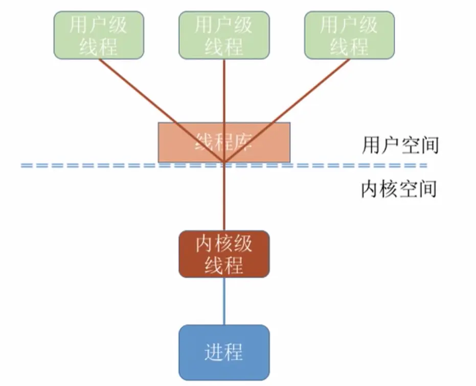

（2）一对一模型：

一个用户级线程映射到一个内核级线程，每个用户进程有与用户级线程同数量的内核级线程

*优点*：当一个线程被阻塞后，别的线程还可以继续执行，并发能力强。多线程可在多核处理机上并行运行。

*缺点*：一个用户进程会占用多个内核级线程，线程切换由操作系统内核完成，需要切换到核心态，线程管理成本太高，开销大

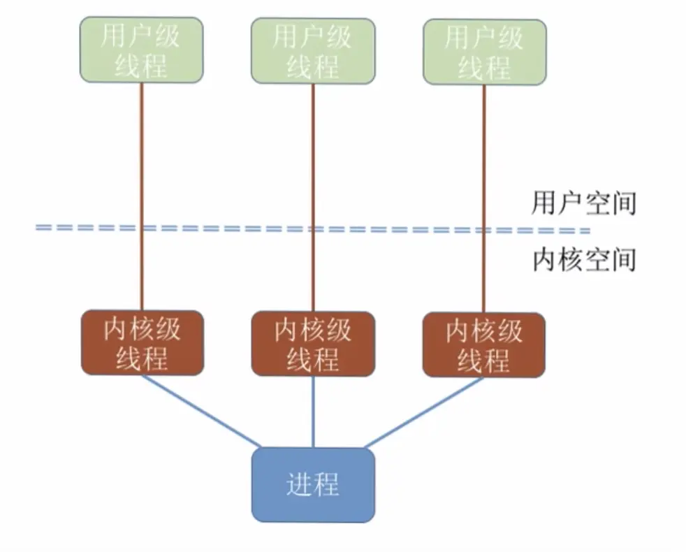

（3）多对多模型

多对多模型：
n个用户级线程映射到m个内核级线程（n>=m）每个用户进程对应m个内核级内核级线程
客服了多对一模型并发度不高的缺点，又客服了一对一模型中一个用户进程占用太多内核级线程开销大的缺点
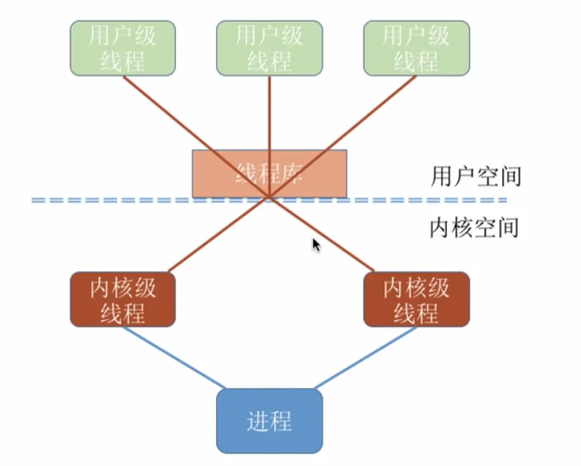